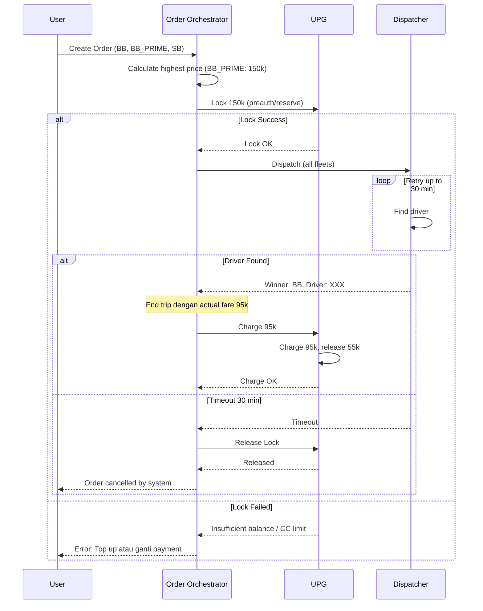

# RFC-004: Payment Flow Multi-fleet

**Status:** Draft  
**Author:** Lukmanul Hakim  
**Created:** 2026-03-18  
**Updated:** 2026-03-18  
**Related:** [[RFC-001-multi-select-fleets-overview]], [[RFC-003-order-orchestrator-multi-fleet]]

---

## 1. Overview

### 1.1. Problem Statement

Pada Multi-select Fleets, user memilih beberapa fleet dengan harga berbeda-beda. Sistem perlu menentukan berapa amount yang di-lock sebelum dispatch, dan bagaimana handle selisih antara lock amount dengan actual charge.

### 1.2. Proposed Solution

Lock balance berdasarkan **harga tertinggi** dari selected fleets. UPG akan charge actual fare saat end trip dan release sisa lock.

### 1.3. Goals

- User eligible untuk dispatch ke semua selected fleets
- Tidak ada case "insufficient balance" di tengah dispatch karena winner lebih mahal
- Support partial charge dan refund sisa

---

## 2. Current Flow (Single Fleet)

```
User pilih 1 fleet (BB, estimasi 100k)
       ↓
Order Orchestrator → UPG: Lock 100k
       ↓
Lock success → forward ke Dispatcher
       ↓
End trip → actual fare 95k
       ↓
UPG charge 95k, release 5k
```

---

## 3. New Flow (Multi-select)

```
User pilih multiple fleet:
  - BB: 100k
  - BB_PRIME: 150k  ← tertinggi
  - SB: 120k
       ↓
Order Orchestrator: Loop effective_fleets (post-upsell), cari harga tertinggi (150k)
       ↓
Order Orchestrator → UPG: Lock 150k
       ↓
Lock success → forward ke Dispatcher dengan semua fleets
       ↓
Dispatcher return winner: BB (100k)
       ↓
End trip → actual fare 95k
       ↓
UPG charge 95k, release 55k
```

---

## 4. Lock Amount Calculation

### 4.1. Logic

Lock amount dihitung dari **`effective_fleets`** (sumber kebenaran fleet hasil VBO, post-upsell), **bukan** dari `selected_fleets` mentah pada request. Alasannya: pada alur Dynamic Fleet List (Fase 2), **upsell yang diterima mengubah fleet** (mis. BB → BB_PRIME) dan disimpan sebagai `effective_fleets` di session. Kalau lock dihitung dari `selected_fleets` mentah, amount jadi **salah** saat upsell diterima.

```go
// SoT = effective_fleets dari VBO state (post-upsell), bukan selected_fleets request.
func (o *OrderOrchestrator) calculateLockAmount(effectiveFleets []string, snapshot *FleetPricingSnapshot) int64 {
    var maxPrice int64 = 0

    for _, fleetCode := range effectiveFleets {
        if fleetPrice := snapshot.Fleets[fleetCode].TotalPrice; fleetPrice > maxPrice {
            maxPrice = fleetPrice
        }
    }

    return maxPrice
}
```

> **Catatan Dynamic Fleet List (Fase 2):** pada flow dengan promo berlapis, basis harga lock = **harga penuh (pra-promo)** — diskon promo direalisasikan saat **redeem** di trip-complete (UPG release selisih). Detail di spec Dynamic Fleet List `endpoints/03-create-order.md` §4.1–§4.2 (keputusan GZ-D). RFC ini tetap memakai `TotalPrice` sebagai konsep "harga yang di-lock"; untuk Fase 2, `TotalPrice` = `price_summary.final_price` (harga penuh).
>
> **Identifier seleksi (Fase 2):** RFC ini mengiterasi `effective_fleets` per **`fleet_code`** (model multi-select dasar). Di Dynamic Fleet List, sumber kebenaran seleksi = **`item_id`** (id per baris harga dari Price Engine, disimpan di `selected_fleet`); lock mengiterasi item_id. Semantik "harga tertinggi" identik, hanya **key beda** (fleet_code vs item_id). Tipe kontrak `selected_fleet` direconcile di SMI-01 (`endpoints/00-session-manager-integration.md` §9).

### 4.2. Argo vs Fixed Price

| Pricing Type | Lock Amount |
|--------------|-------------|
| Fixed Price | Fixed fare (pasti) |
| Argo | Estimasi terbesar dari selected fleets |

Untuk Argo, estimasi per fleet bisa berbeda karena tarif per km berbeda.

### 4.3. Mixed Pricing Type

Jika user pilih BB (Argo, estimasi 100k) dan BB_PRIME (Fixed, 150k):
- Lock amount = 150k (BB_PRIME fixed price, karena lebih besar)

---

## 5. Payment Method Handling

### 5.1. Credit Card (Preauth)

| Event | Action |
|-------|--------|
| Create order | Preauth highest amount |
| End trip | Capture actual fare |
| Cancel/timeout | Void preauth (release) |

### 5.2. Wallet (Reserve)

| Event | Action |
|-------|--------|
| Create order | Reserve highest amount |
| End trip | Deduct actual fare, refund sisa |
| Cancel/timeout | Release reserve |

---

## 6. Error Scenarios

### 6.1. Insufficient Balance

```
User pilih BB (100k) dan BB_PRIME (150k)
User balance: 120k
Lock attempt: 150k
       ↓
FAIL: Insufficient balance
       ↓
Response: Reject order, suruh user top up
```

**Tidak ada fallback** ke fleet yang lebih murah. User harus top up atau pilih ulang fleet.

### 6.2. CC Preauth Failure

```
Preauth 150k → FAIL (limit/expired)
       ↓
Response: Error "CC limit reached", user sadar untuk ubah selection atau ganti kartu
```

**Tidak ada retry** dengan amount lebih kecil.

### 6.3. Argo Actual > Lock

Scenario: User pilih BB (Argo, estimasi 100k) dan BB_PRIME (Argo, estimasi 120k).  
Lock: 120k.  
Winner: BB.  
Actual trip BB: 130k (melebihi estimasi).

**Handling:** Ini sudah di-handle oleh FDS Sequential Preauth. Lihat [[fds-sequential-preauth]].

---

## 7. Price Consistency

### 7.1. Harga Fixed Saat Create Order

Harga yang di-charge adalah harga yang tersimpan di `order_fleet_pricing` saat create order, **bukan** harga terbaru dari Price Engine.

> **Catatan Dynamic Fleet List (Fase 2):** yang disimpan = **price detail lengkap** (breakdown + snapshot promo overlay); basis charge = **harga penuh (pra-promo)**. Diskon promo **tidak** dikurangi saat create order, melainkan saat **redeem di trip-complete** → charge final = harga tersimpan (FIXED) / argo aktual (ESTIMATE) **− diskon promo redeemed**; UPG release selisih lock. **Kalau redeem gagal/tak bisa → OO olah ulang dari price detail tersimpan → charge penuh** (self-contained, tanpa sumber eksternal). Detail: `endpoints/03-create-order.md` §4.1 "Siklus harga".

Ini memastikan:
- User tidak "ditipu" dengan harga yang berubah
- Konsistensi antara yang ditampilkan dan yang di-charge

### 7.2. Dynamic Fare Scenario

```
T+0: User lihat fleet list (BB: 100k, BB_PRIME: 150k)
T+5: User create order, lock 150k, harga disimpan ke DB
T+10: Dynamic fare naik (BB: 120k, BB_PRIME: 180k)
T+25: Dispatcher menemukan driver (winner: BB)
       ↓
Charge: 100k (harga saat create order, bukan 120k)
```

User "untung" dapat harga lama — ini acceptable karena user sudah commit saat create order.

---

## 8. Lock Release Timing

### 8.1. Success Scenario

```
Create order → Lock
       ↓
Driver found → Order proceed
       ↓
End trip → Charge actual fare
       ↓
Release sisa lock
```

### 8.2. Timeout Scenario (30 menit)

```
Create order → Lock
       ↓
Dispatcher retry 30 menit
       ↓
Timeout → Cancel by system
       ↓
Release lock (CC: void preauth, Wallet: release reserve)
```

### 8.3. User Cancel

```
Create order → Lock
       ↓
User cancel order
       ↓
Release lock
```

---

## 9. UPG API Changes

### 9.1. Lock Request (Existing)

Tidak ada perubahan pada UPG API. Order Orchestrator yang menghitung lock amount.

```go
type LockBalanceRequest struct {
    OrderID       string `json:"order_id"`
    BBID          string `json:"bbid"`
    PaymentMethod string `json:"payment_method"`
    Amount        int64  `json:"amount"` // highest price dari effective_fleets (post-upsell, §4.1)
}
```

### 9.2. Charge Request (Existing)

```go
type ChargeRequest struct {
    OrderID string `json:"order_id"`
    Amount  int64  `json:"amount"` // actual fare (bisa lebih kecil dari lock)
}
```

UPG otomatis handle partial charge dan release sisa.

---

## 10. Sequence Diagram



---

## 11. Integration with FDS Sequential Preauth

Untuk Argo pricing, actual fare bisa melebihi estimasi. Ini sudah di-handle oleh FDS Sequential Preauth yang ada.

Lihat: [[fds-sequential-preauth]]

---

## 12. Open Items

| # | Item | Status |
|---|------|--------|
| 1 | Confirm UPG support partial charge | ✅ Already supported |
| 2 | Confirm CC settlement window untuk cancel | Pending |

---

## 13. References

- [[RFC-001-multi-select-fleets-overview]]
- [[RFC-003-order-orchestrator-multi-fleet]]
- [[fds-sequential-preauth]]
