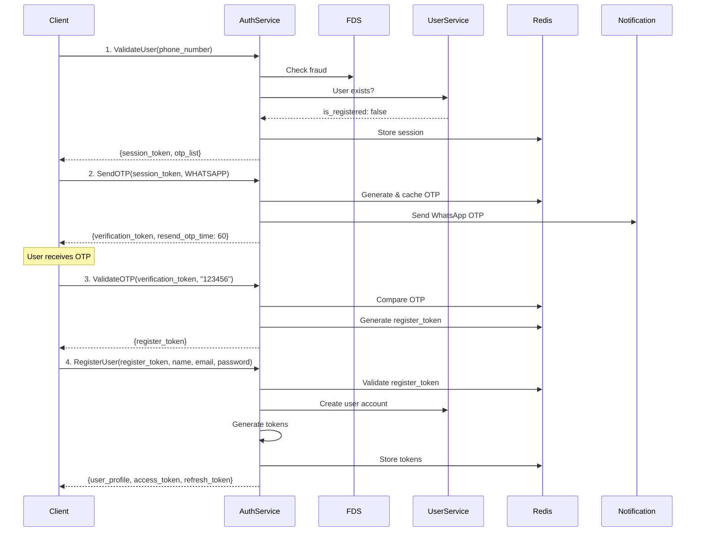
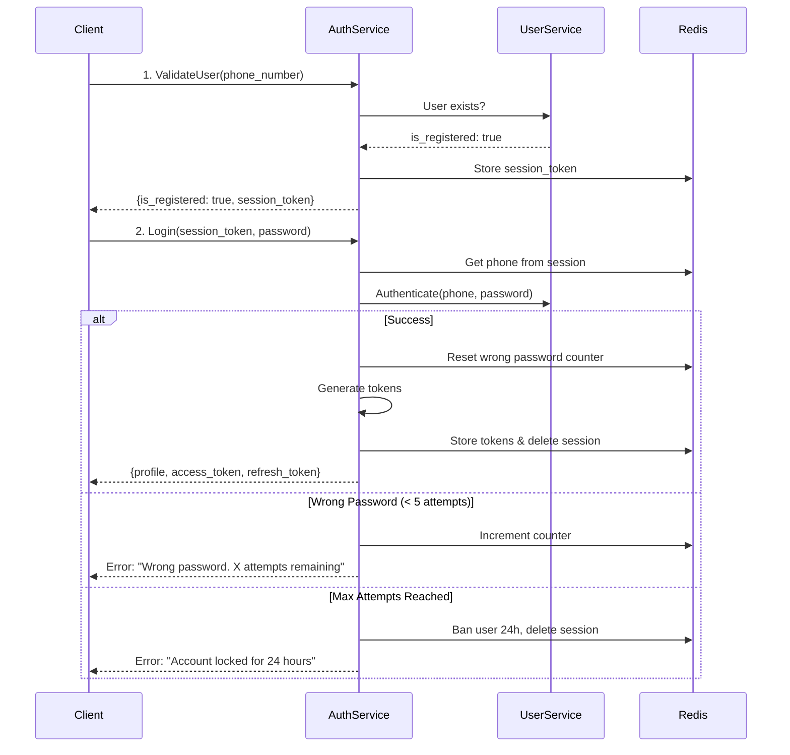
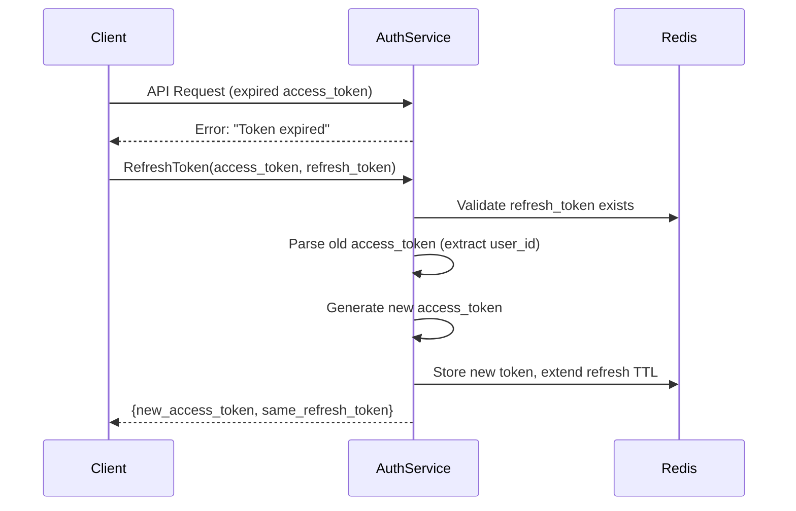
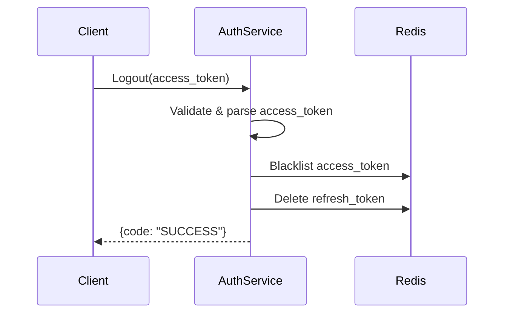
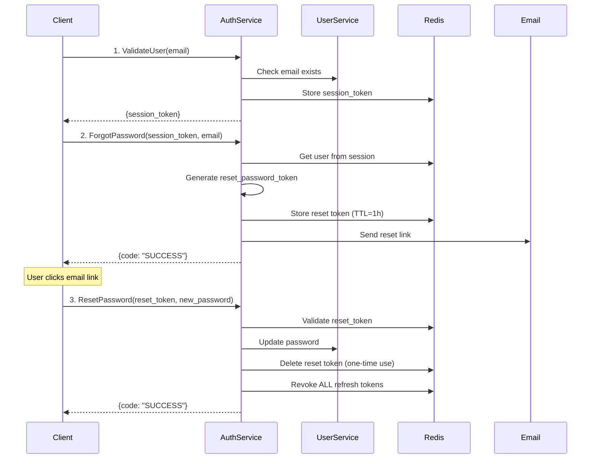
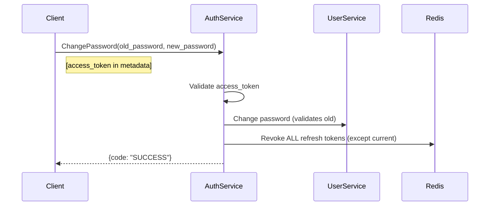
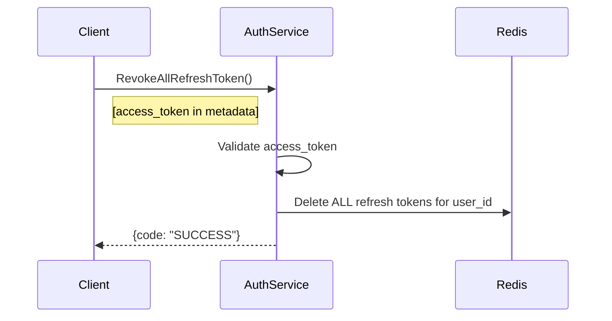

---
tags:
  - authservice
  - authentication
  - flow
  - security
  - mrg
type: flow-documentation
title: Auth Service - Authentication Flows
parent: authservice
---
# Auth Service - Authentication Flows

**Service**: [[README|Auth Service]]  
**Type**: Flow Documentation

---

## 🔄 Flow Overview

AuthService mendukung berbagai authentication flows untuk different user scenarios. Setiap flow dirancang dengan security berlapis dan user experience yang smooth.

---

## 1️⃣ New User Registration Flow

**Scenario**: User baru ingin mendaftar ke aplikasi MyBB

### Sequence Diagram



### Key Points
- **4-step process**: Validate → SendOTP → ValidateOTP → Register
- **Auto-login**: User automatically logged in after registration
- **OTP expiration**: Default 5 minutes
- **Multi-channel OTP**: User can choose WhatsApp, SMS, or Email

---

## 2️⃣ Existing User Login Flow

**Scenario**: User yang sudah terdaftar ingin login

### Sequence Diagram



### Wrong Password Flow
```
Attempt 1: Wrong → "4 attempts remaining"
Attempt 2: Wrong → "3 attempts remaining"
Attempt 3: Wrong → "2 attempts remaining"
Attempt 4: Wrong → "1 attempt remaining"
Attempt 5: Wrong → "Account locked for 24 hours"
```

---

## 3️⃣ Token Refresh Flow

**Scenario**: Access token sudah expired, perlu token baru tanpa login ulang

### Sequence Diagram



### Key Points
- **Seamless experience**: User tidak perlu login ulang
- **Refresh token reuse**: Same refresh token, new access token
- **TTL extension**: Refresh token TTL diperpanjang

---

## 4️⃣ Logout Flow

**Scenario**: User ingin logout dari aplikasi

### Sequence Diagram



---

## 5️⃣ Forgot Password Flow

**Scenario**: User lupa password dan ingin reset

### Sequence Diagram



### Key Points
- **3-step process**: Validate → ForgotPassword → ResetPassword
- **Time-limited**: Reset token expires in 1 hour
- **One-time use**: Token deleted after successful reset
- **Security**: All sessions invalidated after password reset

---

## 6️⃣ Change Password Flow

**Scenario**: Logged-in user ingin ganti password

### Sequence Diagram



### Key Points
- **Authentication required**: Must have valid access_token
- **Partial logout**: All OTHER sessions invalidated, current session remains

---

## 7️⃣ Multi-Device Logout Flow

**Scenario**: User ingin logout dari semua devices

### Sequence Diagram



### Use Cases
- Password changed (security measure)
- Suspicious activity detected
- Device lost/stolen

---

## 📊 Flow Comparison Matrix

| Flow | Steps | Duration | Auth Required | External Services |
|------|-------|----------|---------------|-------------------|
| **Registration** | 4 | ~2-5 min | ❌ | User, FDS, Notification |
| **Login** | 2 | ~5 sec | ❌ | User |
| **Token Refresh** | 1 | ~1 sec | ✅ (refresh) | - |
| **Logout** | 1 | ~1 sec | ✅ | - |
| **Forgot Password** | 3 | ~5-10 min | ❌ | User, Notification |
| **Change Password** | 1 | ~3 sec | ✅ | User |
| **Revoke All** | 1 | ~1 sec | ✅ | - |

---

## 🔒 Security Measures

### Rate Limiting
| Action | Limit | Cooldown |
|--------|-------|----------|
| OTP sends | Max 5 per session | 60 seconds |
| Login attempts | Max 5 wrong | 24 hours ban |

### Token Expiration
| Token Type | TTL |
|------------|-----|
| Access Token | 2 hours |
| Refresh Token | 16 hours |
| Session Token | 15 minutes |
| Reset Token | 1 hour |
| OTP | 5 minutes |

---

## 🏷️ Tags

#authservice #authentication #flow #security #mrg

---

*Last Updated*: 2025-01-05
