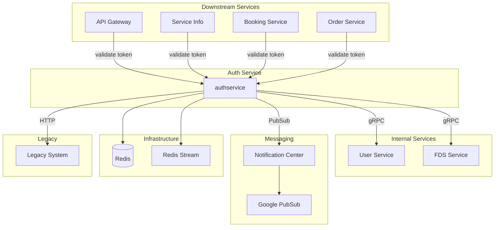

---
tags:
  - dependency
  - authservice
  - architecture
  - mrg
type: dependency-map
title: Auth Service - Dependencies
parent: authservice
---
# Auth Service - Dependencies

**Service**: [[README|Auth Service]]  
**Type**: Dependency Map

---

## 🔄 Dependency Diagram



---

## 📊 Dependencies Detail

### Internal Service Dependencies

| Service | Protocol | Client Library | Version | Purpose |
|---------|----------|----------------|---------|---------|
| **User Service** | gRPC | `userclient` | v0.0.11 | User CRUD, authentication, password management |
| **FDS Service** | gRPC | `fdsclient` | v0.0.5 | Fraud Detection System, phone validation |
| **Notification Center** | PubSub | `commonmessaging` | v0.0.19 | Send OTP via WhatsApp/SMS/Email |
| **Legacy System** | HTTP | (internal) | - | Backward compatibility |

### Infrastructure Dependencies

| Component | Purpose | Configuration |
|-----------|---------|---------------|
| **Redis** | Session storage, token cache, OTP cache, rate limiting | `REDIS_HOST`, `REDIS_PORT`, `REDIS_DATABASE` |
| **Redis Stream** | Event streaming | Same as Redis |
| **Google PubSub** | Message queue for notifications | `NOTIFICATION_CENTER_PROJECT_ID`, `PUBSUB_ENV` |

---

## 🔌 Repository Interfaces

```go
type Repository struct {
    Redis              repoiface.RedisCache
    TokenGenerator     repoiface.TokenGenerator
    FDS                repoiface.FDS
    User               repoiface.User
    NotificationCenter repoiface.Notification
    Legacy             repoiface.Legacy
    RedisStream        repoiface.RedisStream
}
```

### Redis Interface
```go
type RedisCache interface {
    // Session management
    SetSession(key string, data interface{}, ttl time.Duration) error
    GetSession(key string) (interface{}, error)
    DeleteSession(key string) error
    
    // Token management
    StoreToken(userID string, token string, ttl time.Duration) error
    GetToken(userID string) (string, error)
    BlacklistToken(token string, ttl time.Duration) error
    IsBlacklisted(token string) bool
    
    // OTP management
    StoreOTP(key string, otp string, ttl time.Duration) error
    GetOTP(key string) (string, error)
    
    // Rate limiting
    IncrementCounter(key string) (int64, error)
    GetCounter(key string) (int64, error)
}
```

### User Service Interface
```go
type User interface {
    GetUserByPhone(ctx context.Context, phone string) (*UserResponse, error)
    GetUserByEmail(ctx context.Context, email string) (*UserResponse, error)
    CreateUser(ctx context.Context, req *CreateUserRequest) (*UserResponse, error)
    Authenticate(ctx context.Context, phone, password string) (*UserResponse, error)
    ChangePassword(ctx context.Context, userID, oldPass, newPass string) error
    ResetPassword(ctx context.Context, userID, newPass string) error
}
```

### FDS Interface
```go
type FDS interface {
    ValidatePhoneNumber(ctx context.Context, phone string) (*FDSResponse, error)
    CheckFraud(ctx context.Context, phone string) (bool, error)
}
```

### Notification Interface
```go
type Notification interface {
    SendOTPWhatsApp(ctx context.Context, phone, otp string) error
    SendOTPSMS(ctx context.Context, phone, otp string) error
    SendOTPEmail(ctx context.Context, email, otp string) error
    SendPasswordResetEmail(ctx context.Context, email, resetLink string) error
}
```

---

## 📤 Downstream Services (Clients)

Services yang memanggil Auth Service untuk validasi token:

| Service | Purpose |
|---------|---------|
| **API Gateway** | Validate access token untuk semua request |
| **Service Info** | Validate token untuk user-specific operations |
| **Booking Service** | Validate token untuk booking operations |
| **Order Service** | Validate token untuk order operations |
| **Payment Service** | Validate token untuk payment operations |

---

## ⚙️ Configuration

### Service Connections

| Service | Host Env | Port Env |
|---------|----------|----------|
| User Service | `USER_HOST` | `USER_PORT` |
| FDS Service | `FDS_HOST` | `FDS_PORT` |

### Infrastructure

| Component | Configuration |
|-----------|---------------|
| Redis | `REDIS_HOST`, `REDIS_PORT`, `REDIS_DATABASE`, `REDIS_PASSWORD` |
| PubSub | `NOTIFICATION_CENTER_PROJECT_ID`, `GOOGLE_APPLICATION_CREDENTIALS`, `PUBSUB_ENV` |

### Token Configuration

| Setting | Env Variable | Default |
|---------|--------------|---------|
| Access Token TTL | `DURATION_ACCESS_TOKEN_ALIVE` | 2h |
| Refresh Token TTL | `DURATION_REFRESH_TOKEN_ALIVE` | 16h |
| Refresh Token Salt | `SALT_REFRESH_TOKEN` | mybb-auth |
| Private Key Path | `JWT_PRIVATE_KEY_PATH` | cert/private_key.pem |

### OTP Configuration

| Setting | Env Variable | Default |
|---------|--------------|---------|
| Max OTP Attempts | `SEND_OTP_MAX_ATTEMPT` | 5 |
| Resend Cooldown | `RESEND_OTP_AFTER` | 7s |
| OTP Valid Duration | `VALID_OTP_DURATION` | 24h |

---

## 🏷️ Tags

#dependency #authservice #architecture #mrg

---

*Last Updated*: 2025-01-05
