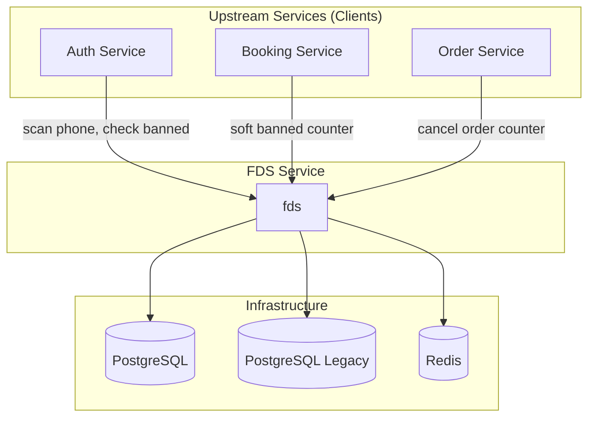

---
tags:
  - dependency
  - fds
  - fraud-detection
  - architecture
  - mrg
type: dependency-map
title: FDS Service - Dependencies
parent: fds
---
# FDS Service - Dependencies

**Service**: [[README|FDS Service]]  
**Type**: Dependency Map

---

## 🔄 Dependency Diagram



---

## 📊 Dependencies Detail

### Infrastructure Dependencies

| Component | Purpose | Configuration |
|-----------|---------|---------------|
| **PostgreSQL (Main)** | Hard banned storage, soft banned configs | `DB_HOST`, `DB_PORT`, `DB_NAME` |
| **PostgreSQL (Legacy)** | Legacy gateway database | `DB_LEGACY_HOST`, `DB_LEGACY_PORT`, `DB_LEGACY_NAME` |
| **Redis** | Counter storage, soft banned cache | `REDIS_HOST`, `REDIS_PORT`, `REDIS_DATABASE` |

---

## 🔌 Repository Interfaces

```go
type Repository struct {
    FDS    repoiface.FraudDetectionSystem
    Redis  repoiface.Redis
    DB     DB
    Legacy repoiface.Legacy
}

type DB struct {
    HardBanned       repoiface.HardBanned
    SoftBannedConfig repoiface.SoftBannedConfig
}
```

### Redis Interface
```go
type Redis interface {
    // Counter operations
    IncrementCounter(ctx context.Context, key string, ttl time.Duration) (int64, error)
    GetCounter(ctx context.Context, key string) (int64, error)
    DeleteKey(ctx context.Context, key string) error
    
    // Soft banned operations
    SetSoftBanned(ctx context.Context, key string, value interface{}, ttl time.Duration) error
    GetSoftBanned(ctx context.Context, key string) (*model.SoftBanned, error)
    DeleteSoftBanned(ctx context.Context, key string) error
    
    // Key pattern operations
    GetKeysByPattern(ctx context.Context, pattern string) ([]string, error)
}
```

### HardBanned Interface
```go
type HardBanned interface {
    Create(ctx context.Context, data *model.HardBanned) error
    GetByID(ctx context.Context, id int64) (*model.HardBanned, error)
    GetByIdentifier(ctx context.Context, identifier string) (*model.HardBanned, error)
    Delete(ctx context.Context, id int64) error  // Soft delete
}
```

### SoftBannedConfig Interface
```go
type SoftBannedConfig interface {
    GetByType(ctx context.Context, bannedType string) (*model.SoftBannedConfig, error)
    GetByTypeAndCity(ctx context.Context, bannedType, city string) (*model.SoftBannedConfig, error)
}
```

### Legacy Interface
```go
type Legacy interface {
    // Legacy database operations for backward compatibility
    GetBannedPhoneNumbers(ctx context.Context) ([]string, error)
    AddWhitelistPhoneNumber(ctx context.Context, phoneNumber string) error
}
```

### FraudDetectionSystem Interface
```go
type FraudDetectionSystem interface {
    ScanPhoneNumber(ctx context.Context, phoneNumber string) (bool, error)
    CheckPrefixDigit(ctx context.Context, phoneNumber string) bool
}
```

---

## 📤 Upstream Services (Clients)

Services yang memanggil FDS:

| Service | Purpose | Methods Used |
|---------|---------|--------------|
| **Auth Service** | Phone fraud check saat login/register | `ScanFraudPhoneNumber`, `CheckHardBanned` |
| **Auth Service** | Wrong password tracking | `SoftBannedCounter(WRONG_PASSWORD)` |
| **Auth Service** | OTP spam prevention | `SoftBannedCounter(OTP_ATTEMPT)` |
| **Booking Service** | Cancel order tracking | `SoftBannedCounter(CANCEL_ORDER)` |
| **Order Service** | Cancel after dispatch tracking | `SoftBannedCounter(CANCEL_ORDER_AFTER_DISPATCH)` |
| **Admin Service** | Hard ban management | `SetHardBanned`, `RevokeHardBanned` |

---

## ⚙️ Configuration

### Database Configuration (Main)

| Setting | Env Variable | Default |
|---------|--------------|---------|
| Host | `DB_HOST` | - |
| Username | `DB_USERNAME` | - |
| Password | `DB_PASSWORD` | - |
| Port | `DB_PORT` | 5432 |
| Database | `DB_NAME` | mybbnew_fraud_detection_system_db |
| SSL Mode | `DB_SSL_MODE` | disable |
| Max Idle Conns | `MAX_IDLE_CONNS` | 10 |
| Max Open Conns | `MAX_OPEN_CONNS` | 100 |

### Database Configuration (Legacy)

| Setting | Env Variable |
|---------|--------------|
| Host | `DB_LEGACY_HOST` |
| Username | `DB_LEGACY_USERNAME` |
| Password | `DB_LEGACY_PASSWORD` |
| Port | `DB_LEGACY_PORT` |
| Database | `DB_LEGACY_NAME` |
| SSL Mode | `DB_LEGACY_SSL_MODE` |

### Redis Configuration

| Setting | Env Variable | Default |
|---------|--------------|---------|
| Host | `REDIS_HOST` | localhost |
| Port | `REDIS_PORT` | 6379 |
| Password | `REDIS_PASSWORD` | - |
| Database | `REDIS_DATABASE` | 0 |

### Soft Ban Thresholds

| Banned Type | Threshold Env | Duration Env | Ban Duration Env |
|-------------|---------------|--------------|------------------|
| Cancel Order | `THRESHOLD_CANCEL_ORDER_ATTEMPT` | `THRESHOLD_CANCEL_ORDER_DURATION` | `BAN_CANCEL_ORDER_DURATION` |
| Cancel After Dispatch | `THRESHOLD_CANCEL_ORDER_AFTER_DISPATCH_ATTEMPT` | `THRESHOLD_CANCEL_ORDER_AFTER_DISPATCH_DURATION` | `BAN_CANCEL_ORDER_AFTER_DISPATCH_DURATION` |
| OTP Attempt | `THRESHOLD_OTP_ATTEMPT` | `THRESHOLD_OTP_ATTEMPT_DURATION` | `BAN_OTP_ATTEMPT_DURATION` |
| Wrong Password | `THRESHOLD_WRONG_PASSWORD_ATTEMPT` | `THRESHOLD_WRONG_PASSWORD_DURATION` | `BAN_WRONG_PASSWORD_DURATION` |

### Phone Fraud Detection

| Setting | Env Variable | Default |
|---------|--------------|---------|
| Max Attempt | `MAX_ATTEMPT` | 2 |
| Prefix Digit Detection | `PREFIX_DIGIT_DETECTION` | 9 |
| Extend Banned | `EXTEND_BANNED` | true |
| Attempt Duration | `ATTEMPT_DURATION` | 20m |
| Banned Duration | `BANNED_DURATION` | 24h |

---

## 🔄 Redis Key Patterns

### Counter Keys
```
COUNTER:{banned_type}:{identifier}
```
- TTL: Based on `threshold_duration` config
- Value: Incremental counter

### Banned Keys
```
BANNED:{banned_type}:{identifier}
```
- TTL: Based on `ban_duration` config
- Value: JSON of SoftBanned struct

### Examples
```
COUNTER:CANCEL_ORDER:BB00123456          → 3
COUNTER:WRONG_PASSWORD:BB00123456        → 2
BANNED:CANCEL_ORDER:BB00123456           → {"banned_type":"CANCEL_ORDER",...}
BANNED:WRONG_PASSWORD:BB00123456         → {"banned_type":"WRONG_PASSWORD",...}
```

---

## 📦 External Libraries

### Core Dependencies

| Library | Version | Purpose |
|---------|---------|---------|
| `grpc` | v1.72.1 | gRPC framework |
| `grpc-gateway` | v2.16.0 | REST gateway |
| `go-redis` | v8.11.5 | Redis client |
| `qb-postgresql` | v1.6.2 | PostgreSQL utilities |

### Bluebird Internal

| Library | Version | Purpose |
|---------|---------|---------|
| `aphrodite` | v1.9.31 | Common framework |

### Monitoring

| Library | Version | Purpose |
|---------|---------|---------|
| `elastic-apm` | v2.6.2 | APM monitoring |
| `prometheus` | v1.21.1 | Metrics |

---

## 🏷️ Tags

#dependency #fds #fraud-detection #architecture #mrg

---

*Last Updated*: 2025-01-05
