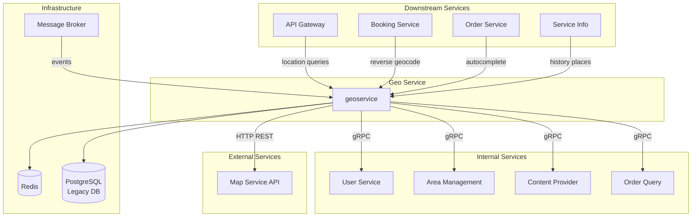

---
tags:
  - dependency
  - geoservice
  - architecture
  - mrg
type: dependency-map
title: Geo Service - Dependencies
parent: geoservice
---
# Geo Service - Dependencies

**Service**: [[README|Geo Service]]  
**Type**: Dependency Map

---

## 🔄 Dependency Diagram



---

## 📊 Dependencies Detail

### Internal Service Dependencies

| Service | Protocol | Client Library | Version | Purpose |
|---------|----------|----------------|---------|---------|
| **User Service** | gRPC | `userclient` | v0.0.23 | Get favorite addresses, user profile |
| **Area Management** | gRPC | (aphrodite) | - | Goldenbird zone mapping, operational areas |
| **Content Provider** | gRPC | `contentproviderclient` | v0.1.0 | Popular places, POI curated data |
| **Order Query** | gRPC | (internal) | - | Trip history untuk frequent location analysis |

### External Service Dependencies

| Service | Protocol | Purpose | Configuration |
|---------|----------|---------|---------------|
| **Map Service** | HTTP REST | Geocoding, reverse geocoding, autocomplete, POI search | `MAP_SERVICE_HOST`, `MAP_SERVICE_TOKEN` |

**Map Service Endpoints**:
- `GET /reverse-geocode` - Convert coordinates to address
- `GET /autocomplete` - Location search by keyword
- `GET /place-details` - Get detailed place information
- `GET /nearby-search` - Search POI within radius

### Infrastructure Dependencies

| Component | Purpose | Configuration |
|-----------|---------|---------------|
| **Redis** | Frequent location cache, geocode result cache | `REDIS_HOST`, `REDIS_PORT`, `REDIS_DATABASE` |
| **PostgreSQL** | Legacy trip data storage, frequent location analysis | `DB_LEGACY_*` configs |
| **Message Broker** | Order state changes event listener | `cert/broker_config.yaml` |

---

## 🔌 Repository Interfaces

```go
type Repository struct {
    Redis           repoiface.IRedis
    MapService      repoiface.MapService
    UserService     repoiface.User
    LegacyDB        repoiface.LegacyDB
    AreaManagement  repoiface.AreaManagement
    ContentProvider repoiface.ContentProvider
    OrderQuery      repoiface.OrderQuery
}
```

### Redis Interface
```go
type IRedis interface {
    // Geocode caching
    GetGeocodeCache(key string) (*GeocodeResult, error)
    SetGeocodeCache(key string, data *GeocodeResult, ttl time.Duration) error
    
    // Frequent location caching
    GetFrequentLocations(userID, locationType string) ([]*FrequentLocation, error)
    SetFrequentLocations(userID, locationType string, locations []*FrequentLocation, ttl time.Duration) error
    
    // History place caching
    GetHistoryPlaces(userID, locationType string) ([]*HistoryPlace, error)
    SetHistoryPlaces(userID, locationType string, places []*HistoryPlace, ttl time.Duration) error
}
```

### Map Service Interface
```go
type MapService interface {
    // Reverse geocoding
    ReverseGeocode(ctx context.Context, lat, long float64) (*MapServiceLocation, error)
    
    // Autocomplete search
    AutoComplete(ctx context.Context, keyword string, lat, long float64) ([]*MapServicePlace, error)
    
    // Place details
    GetPlaceDetails(ctx context.Context, placeID string) (*MapServicePlace, error)
    
    // Nearby search for auto snap
    SearchNearbyPOI(ctx context.Context, lat, long, radius float64, category string) ([]*MapServicePOI, error)
}
```

### User Service Interface
```go
type User interface {
    // Get user's favorite addresses
    GetFavoriteAddresses(ctx context.Context, userID string) ([]*FavoriteAddress, error)
    
    // Get favorite addresses within radius
    GetFavoriteAddressesInRadius(ctx context.Context, userID string, lat, long, radius float64) ([]*FavoriteAddress, error)
    
    // Get user profile
    GetUserProfile(ctx context.Context, userID string) (*UserProfile, error)
}
```

### Area Management Interface
```go
type AreaManagement interface {
    // Get goldenbird areas by coordinate
    GetGoldenbirdAreasByCoordinate(ctx context.Context, lat, long float64) ([]*GoldenbirdArea, error)
    
    // Check if coordinate is in operational area
    IsInOperationalArea(ctx context.Context, lat, long float64) (bool, error)
    
    // Get area details
    GetAreaDetails(ctx context.Context, areaID string) (*AreaDetail, error)
}
```

### Content Provider Interface
```go
type ContentProvider interface {
    // Get popular places
    GetPopularPlaces(ctx context.Context, placeType PopularPlaceType, cityCode string) ([]*PopularPlace, error)
    
    // Get POI by category
    GetPOIByCategory(ctx context.Context, category string) ([]*POI, error)
}
```

### Order Query Interface
```go
type OrderQuery interface {
    // Get user's trip history
    GetUserTripHistory(ctx context.Context, userID string, startDate, endDate time.Time) ([]*TripData, error)
    
    // Get trip details
    GetTripDetails(ctx context.Context, tripID string) (*TripData, error)
}
```

### Legacy DB Interface
```go
type LegacyDB interface {
    // Store trip location data
    StoreTripLocation(ctx context.Context, data *TripLocationData) error
    
    // Query frequent locations
    QueryFrequentLocations(ctx context.Context, userID string, lookbackDays int, minTrips int) ([]*FrequentLocationData, error)
    
    // Delete old trip data
    DeleteOldTripData(ctx context.Context, olderThan time.Time) (int64, error)
    
    // Get trip statistics
    GetTripStatistics(ctx context.Context, userID string) (*TripStats, error)
}
```

---

## 📤 Downstream Services (Clients)

Services yang memanggil Geo Service:

| Service | Purpose | Common Methods |
|---------|---------|----------------|
| **API Gateway** | Route location requests | ReverseGeocodeV3, AutoComplete |
| **Booking Service** | Get pickup/dropoff locations | ReverseGeocodeV3, AutoComplete |
| **Order Service** | Location validation, history | ReverseGeocodeV3, HistoryPlace |
| **Service Info** | Location suggestions | AutoComplete |
| **Mobile App** | All location operations | All public methods |

---

## ⚙️ Configuration

### Service Connections

| Service | Host Env | Port Env | Timeout Env |
|---------|----------|----------|-------------|
| Map Service | `MAP_SERVICE_HOST` | - | `MAP_SERVICE_TIMEOUT` (5s) |
| User Service | `USER_SERVICE_HOST` | `USER_SERVICE_PORT` | - |
| Area Management | `AREA_MANAGEMENT_HOST` | `AREA_MANAGEMENT_PORT` | `AREA_MANAGEMENT_TIMEOUT` (5s) |
| Content Provider | `CONTENT_PROVIDER_HOST` | `CONTENT_PROVIDER_PORT` | - |
| Order Query | `ORDERQUERY_HOST` | `ORDERQUERY_PORT` | - |

### Infrastructure

#### Redis Configuration
```env
REDIS_HOST=172.26.11.40
REDIS_PORT=6379
REDIS_PASSWORD=
REDIS_DATABASE=5
```

**Redis Key Patterns**:
```
geocode:v3:{type}:{lat}:{long}         # Reverse geocode cache
freq_loc:{user_id}:{type}              # Frequent locations
history:{user_id}:{type}               # History places
autosnap:{lat}:{long}                  # Auto snap results
```

#### PostgreSQL Configuration (Legacy DB)
```env
DB_LEGACY_HOST=172.26.11.50
DB_LEGACY_HOST_READ=172.26.11.51      # Read replica
DB_LEGACY_PORT=5432
DB_LEGACY_USERNAME=postgres
DB_LEGACY_PASSWORD=xxx
DB_LEGACY_NAME=legacy_mybb
DB_LEGACY_SSL_MODE=disable
DB_LEGACY_MAX_IDLE_CONNS=10
DB_LEGACY_MAX_OPEN_CONNS=100
DB_LEGACY_CONN_MAX_IDLE_TIME=10m
DB_LEGACY_CONN_MAX_LIFETIME=1h
```

**Database Tables**:
```sql
-- Trip location data
CREATE TABLE legacy_trip_data (
    id SERIAL PRIMARY KEY,
    user_id VARCHAR(255),
    trip_id VARCHAR(255),
    location_type VARCHAR(20),  -- 'pickup' or 'dropoff'
    latitude DOUBLE PRECISION,
    longitude DOUBLE PRECISION,
    address TEXT,
    created_at TIMESTAMP,
    INDEX idx_user_location (user_id, location_type, created_at)
);

-- Frequent location metadata
CREATE TABLE frequent_location_meta (
    user_id VARCHAR(255),
    location_type VARCHAR(20),
    last_analyzed_at TIMESTAMP,
    trip_count INT,
    PRIMARY KEY (user_id, location_type)
);
```

#### Message Broker Configuration
```yaml
# cert/broker_config.yaml
brokers:
  - type: "kafka"
    servers: ["broker1:9092", "broker2:9092"]
    topics:
      - name: "order.state.changes"
        consumer_group: "geoservice-consumer"
        handler: "OrderStateChangesListener"
```

### Radius Settings

| Location Type | Config Key | Default (m) |
|---------------|------------|-------------|
| Non-Landmark Favorite | `RADIUS_NON_LANDMARK_FAVORITE_LOCATION` | 100 |
| Non-Landmark Frequent | `RADIUS_NON_LANDMARK_FREQUENT_LOCATION` | 100 |
| Landmark Without Subplace Favorite | `RADIUS_LANDMARK_WITHOUT_SUBPLACE_FAVORITE_LOCATION` | 100 |
| Landmark Without Subplace Frequent | `RADIUS_LANDMARK_WITHOUT_SUBPLACE_FREQUENT_LOCATION` | 50 |
| Landmark With Subplace Favorite | `RADIUS_LANDMARK_WITH_SUBPLACE_FAVORITE_LOCATION` | 100 |
| Landmark With Subplace Frequent | `RADIUS_LANDMARK_WITH_SUBPLACE_FREQUENT_LOCATION` | 50 |
| Exclude Favorite Setter | `RADIUS_EXCLUDE_FAVORITE_LOCATION_SETTER` | 100 |

### Frequent Location Settings

```env
FREQUENT_LOCATION_MIN_TRIP_THRESHOLD=3
FREQUENT_LOCATION_LOOKBACK_PERIOD_DAYS=30d
FREQUENT_LOCATION_RADIUS_IN_METERS=100
```

**Algorithm Parameters**:
- **Min Trips**: Minimum 3 trips ke same location cluster
- **Lookback Period**: Analyze trips dalam 30 hari terakhir
- **Cluster Radius**: Locations within 100m = same cluster

### Auto Snap Settings

```env
ENABLE_AUTO_SNAP_FEATURE=true
AUTO_SNAP_TIMEOUT=2s
```

**Auto Snap Parameters**:
- **Enabled**: Toggle feature on/off
- **Timeout**: Max time untuk search nearby POI
- **Search Radius**: 50m default (hardcoded)
- **Category Priority**: entrance > pickup_point > landmark

---

## 🔗 Dependency Version Matrix

### Go Modules (go.mod)

| Module | Version | Purpose |
|--------|---------|---------|
| `git.bluebird.id/mybb-ms/aphrodite` | v1.9.47 | Common utilities, logger |
| `git.bluebird.id/mybb-ms/grpc-client` | v1.5.37 | gRPC client helpers |
| `git.bluebird.id/mybb-ms/lib/userclient` | v0.0.23 | User service client |
| `git.bluebird.id/mybb-ms/lib/contentproviderclient` | v0.1.0 | Content provider client |
| `github.com/go-redis/redis/v8` | v8.11.5 | Redis client |
| `github.com/lib/pq` | v1.10.9 | PostgreSQL driver |
| `google.golang.org/grpc` | v1.77.0 | gRPC framework |
| `google.golang.org/protobuf` | v1.36.11 | Protobuf support |
| `go.elastic.co/apm/v2` | v2.6.2 | APM monitoring |

---

## 🎯 Dependency Call Patterns

### Reverse Geocode V3 Call Pattern
```
Client Request
    ↓
GeoService
    ├─→ Redis (cache check)
    ├─→ Map Service (reverse geocode) [timeout: 5s]
    ├─→ User Service (favorites) [timeout: 3s]
    ├─→ Area Management (zones) [timeout: 5s]
    └─→ Auto Snap (optional) [timeout: 2s]
```

### AutoComplete Call Pattern
```
Client Request
    ↓
GeoService
    ├─→ Map Service (search POI) [parallel]
    ├─→ User Service (favorites) [parallel]
    └─→ Content Provider (popular) [parallel]
    ↓
Merge Results
    ↓
    └─→ Area Management (enrich zones)
```

### Frequent Location Analysis Pattern
```
Message Broker Event
    ↓
GeoService
    └─→ Legacy DB (store trip)
    
Cron Job Trigger
    ↓
GeoService
    ├─→ Legacy DB (query trips)
    ├─→ Cluster Analysis (in-memory)
    └─→ Redis (cache results)
```

---

## 🚨 Failure Modes & Fallbacks

| Dependency | Failure Impact | Fallback Strategy |
|------------|----------------|-------------------|
| **Map Service** | Cannot geocode | Return error, no fallback |
| **User Service** | No favorites | Continue without favorite matching |
| **Area Management** | No zones | Continue without goldenbird areas |
| **Content Provider** | No popular places | Continue with map + favorites only |
| **Redis** | No cache | Direct DB/service calls |
| **Legacy DB** | No frequent data | Empty frequent locations |
| **Message Broker** | Events lost | Retry mechanism, dead letter queue |

---

## 📈 Monitoring & Health Checks

### Health Check Dependencies
```go
func (s *Service) HealthCheck() error {
    checks := []struct{
        name string
        check func() error
    }{
        {"redis", s.repo.Redis.Ping()},
        {"legacy_db", s.repo.LegacyDB.Ping()},
        {"map_service", s.repo.MapService.Health()},
        {"user_service", s.repo.UserService.Health()},
        {"area_management", s.repo.AreaManagement.Health()},
    }
    
    for _, c := range checks {
        if err := c.check(); err != nil {
            return fmt.Errorf("%s unhealthy: %w", c.name, err)
        }
    }
    
    return nil
}
```

### Metrics to Monitor
- Map Service API latency & error rate
- Redis cache hit rate
- Legacy DB query performance
- Frequent location detection job duration
- Message broker lag

---

## 🏷️ Tags

#dependency #geoservice #architecture #mrg

---

*Last Updated*: 2025-01-26
