```mermaid
sequenceDiagram
    participant Client
    participant GeoService
    participant Redis
    participant UserService
    participant AreaMgmt

    Client->>GeoService: HistoryPlace(type, lat, long, trip_id)
    GeoService->>GeoService: InputValidator
    
    GeoService->>Redis: Get frequent locations
    Note over Redis: Key: freq_loc:user_id:type
    Redis-->>GeoService: List of frequent locations
    
    GeoService->>UserService: GetFavoriteAddresses(user_id)
    UserService-->>GeoService: User's saved favorites
    
    GeoService->>GeoService: Merge & deduplicate
    GeoService->>GeoService: Calculate distances
    GeoService->>GeoService: Sort by frequency + recency
    
    GeoService->>AreaMgmt: Enrich with areas
    AreaMgmt-->>GeoService: Area info
    
    GeoService->>GeoService: Apply limit (default: 2)
    GeoService-->>Client: Top history places
```

---
tags:
  - geoservice
  - workflow
  - architecture
  - mrg
type: workflow-documentation
title: Geo Service - Workflows
parent: geoservice
---
# Geo Service - Workflows

**Service**: [[README|Geo Service]]  
**Type**: Workflow Documentation

---

## 🔄 Workflow Overview

GeoService mendukung berbagai workflows untuk location-based operations dalam MyBB ecosystem. Setiap workflow dirancang untuk memberikan location data yang akurat dan relevan untuk enhance user booking experience.

---

## 1️⃣ Reverse Geocode V3 Workflow

**Scenario**: User tap pada map untuk set pickup/dropoff location

### Sequence Diagram


### Key Steps

1. **Input Validation**
   - Validate latitude range: -90 to 90
   - Validate longitude range: -180 to 180
   - Validate type: "pickup" or "dropoff"

2. **Cache Check**
   - Key format: `geocode:v3:{type}:{lat}:{long}`
   - Precision: 6 decimal places for lat/long
   - TTL: 1 hour

3. **Map Service Call**
   - External API untuk reverse geocoding
   - Timeout: 5s (configurable)
   - Returns: address, name, coordinate, polygon (if landmark)

4. **Favorite Address Matching**
   - Get user's saved favorite addresses from User Service
   - Match by radius (configurable per location type):
     - Non-landmark: 100m
     - Landmark without subplace: 100m
     - Landmark with subplace: 100m
   - Enrich response dengan favorite address info

5. **Area Management Integration**
   - Get goldenbird operational zones
   - Used untuk routing & pricing
   - Returns: zone_code, city_code, etc.

6. **Auto Snap (Optional)**
   - If enabled: snap coordinate ke nearest landmark
   - Radius check: within 50-100m
   - Returns: `auto_snap_result` field

7. **Response Building**
   - Combine semua data
   - Add timezone info
   - Add distance calculations
   - Cache untuk future requests

---

## 2️⃣ AutoComplete Workflow

**Scenario**: User typing search query untuk find location

### Sequence Diagram


### Key Steps

1. **Input Validation**
   - Validate keyword length: min 2 characters
   - Validate coordinates (user position)
   - Validate type parameter

2. **Parallel Data Fetching**
   
   **From Map Service**:
   - Search POI/addresses by keyword
   - Filter by place_category if specified
   - Radius search from user location
   
   **From User Service**:
   - Get user's favorite addresses
   - Match by name/notes containing keyword
   - Already have coordinates
   
   **From Content Provider** (if enabled):
   - Get popular places list
   - Filter by PopularPlaceType (CITIES/LOCATION/POI)
   - Pre-defined curated list

3. **Merge & Deduplication**
   - Combine results from all sources
   - Deduplicate by external_id
   - Priority: Favorites > Popular Places > Map Service

4. **Distance Calculation**
   - Calculate distance from user's current location
   - Use Haversine formula
   - Store in `radius_from_current_location_in_meters`

5. **Sorting Logic**
   ```
   Sort by:
   1. Is Favorite? (favorites first)
   2. Is Popular Place? (popular second)
   3. Distance from user (nearest first)
   4. Relevance score (exact match vs partial)
   ```

6. **Area Enrichment**
   - Add goldenbird_areas untuk each result
   - Bulk query ke Area Management
   - Used untuk operational zone check

7. **Response Filtering**
   - If `area_only=true`: return only area-type locations
   - If `include_city=true`: include city-level results
   - Apply result limit (default: 10-20)

---

## 3️⃣ Frequent Location Detection Workflow

**Scenario**: Background job untuk detect frequently visited locations

### Sequence Diagram


### Key Steps

1. **Event Listening**
   - Listen to order state changes via message broker
   - Filter: Only completed/cancelled orders
   - Extract: pickup & dropoff coordinates + timestamps

2. **Trip Data Storage**
   ```sql
   INSERT INTO legacy_trip_data (
     user_id, 
     trip_id, 
     location_type,  -- 'pickup' or 'dropoff'
     latitude, 
     longitude, 
     address,
     created_at
   )
   ```

3. **Background Job (Cron)**
   - Scheduled run: Daily atau configurable
   - Query trips dalam lookback period:
   ```sql
   SELECT user_id, location_type, latitude, longitude, COUNT(*) as trip_count
   FROM legacy_trip_data
   WHERE created_at >= NOW() - INTERVAL 'lookback_days'
   GROUP BY user_id, location_type, latitude, longitude
   HAVING COUNT(*) >= min_trip_threshold
   ```

4. **Clustering Algorithm**
   ```go
   for each trip_location {
     find_cluster_within_radius(100m)
     if cluster_found {
       add_to_cluster()
     } else {
       create_new_cluster()
     }
   }
   ```

5. **Frequent Location Criteria**
   - Minimum trips: 3 (configurable)
   - Within period: 30 days (configurable)
   - Within radius: 100m (configurable)
   - Same location_type (pickup vs dropoff tracked separately)

6. **Redis Caching**
   - Key: `freq_loc:{user_id}:{type}` (pickup/dropoff)
   - Value: JSON array of frequent locations
   - TTL: Based on lookback period
   - Updated after each analysis run

7. **Cleanup Old Data**
   - Delete trips older than lookback period
   - Remove stale frequent location entries
   - Return count of deleted records

---

## 4️⃣ History Place Workflow

**Scenario**: User opens booking screen, shows recent/frequent places

### Sequence Diagram



### Key Steps

1. **Get Frequent Locations**
   - Load from Redis cache
   - Fallback: Query from LegacyDB if cache miss
   - Filter by location_type (pickup/dropoff)

2. **Get Favorite Addresses**
   - From User Service
   - Already have names & custom notes
   - Tagged by user explicitly

3. **Merge Logic**
   ```
   Priority:
   1. Favorites (user-saved)
   2. High-frequency locations (>5 trips)
   3. Recent locations (<7 days)
   4. Distance from current location
   ```

4. **Deduplication**
   - Same location dalam 100m radius = duplicate
   - Keep the one dengan highest priority

5. **Distance Calculation**
   - From user's current position
   - Real-time calculation (not cached)

6. **Sorting**
   ```go
   sort.Slice(historyPlaces, func(i, j int) bool {
     // Priority 1: Is Favorite?
     if historyPlaces[i].IsFavorite != historyPlaces[j].IsFavorite {
       return historyPlaces[i].IsFavorite
     }
     // Priority 2: Trip frequency
     if historyPlaces[i].TripCount != historyPlaces[j].TripCount {
       return historyPlaces[i].TripCount > historyPlaces[j].TripCount
     }
     // Priority 3: Distance
     return historyPlaces[i].Distance < historyPlaces[j].Distance
   })
   ```

7. **Apply Limit**
   - Default: 2 places
   - Configurable via `HISTORY_PLACE_LIMIT`
   - Return top N results

---

## 5️⃣ Auto Snap Workflow

**Scenario**: Improve coordinate accuracy by snapping to landmarks

### Sequence Diagram


### Key Steps

1. **Eligibility Check**
   ```go
   if !config.EnableAutoSnapFeature {
     return originalCoordinate
   }
   
   if !location.IsLandmark {
     return originalCoordinate
   }
   ```

2. **Search Nearby POI**
   - Radius: 50m default
   - Categories priority:
     ```
     1. Entrance (main entrance, gate)
     2. Pickup point (designated pickup area)
     3. Landmark feature (monument, building main)
     4. Other POI
     ```

3. **Distance Calculation**
   - Calculate distance ke each POI
   - Use Haversine formula
   - Sort by distance

4. **Category Filtering**
   ```go
   preferredCategories := []string{
     "entrance", 
     "pickup_point", 
     "building_main",
   }
   
   for _, category := range preferredCategories {
     if poi := findPOIByCategory(nearbyPOI, category) {
       return poi
     }
   }
   ```

5. **Snap Decision**
   - If POI found: Return POI coordinate
   - If no POI: Return original coordinate
   - Set `auto_snap_result` field untuk debugging

6. **Benefits**
   - More accurate pickup/dropoff points
   - Reduce driver-customer confusion
   - Better ETA calculation
   - Improve success rate

---

## 📊 Workflow Comparison Matrix

| Workflow | Trigger | Duration | External Calls | Caching |
|----------|---------|----------|----------------|---------|
| **Reverse Geocode V3** | User action | ~500ms | Map, User, AreaMgmt | ✅ 1h |
| **AutoComplete** | User typing | ~300ms | Map, User, Content | ❌ |
| **History Place** | App open | ~200ms | Redis, User, AreaMgmt | ✅ 24h |
| **Frequent Location** | Background | ~5min | LegacyDB | ✅ 30d |
| **Auto Snap** | Part of geocode | ~100ms | Map | ❌ |

---

## 🔒 Performance Optimizations

### Caching Strategy
| Data Type | TTL | Key Pattern |
|-----------|-----|-------------|
| Reverse Geocode | 1 hour | `geocode:v3:{type}:{lat}:{long}` |
| Frequent Locations | 30 days | `freq_loc:{user_id}:{type}` |
| History Place | 24 hours | `history:{user_id}:{type}` |

### Parallel Processing
- AutoComplete: Parallel queries ke multiple services
- History Place: Parallel fetch frequent + favorite
- Reverse Geocode: Sequential dengan early cache return

### Timeout Protection
| Service Call | Timeout | Fallback |
|--------------|---------|----------|
| Map Service | 5s | Return error |
| User Service | 3s | Empty favorites |
| Area Management | 5s | Empty areas |
| Auto Snap | 2s | Original coordinate |

---

## 🏷️ Tags

#geoservice #workflow #architecture #mrg

---

*Last Updated*: 2025-01-26
