---
tags:
  - dependency
  - api-gateway
  - architecture
  - mrg
  - legacy
type: dependency-map
title: MyBB API Gateway - Dependencies
parent: mybb-api-gateway-go
---
# MyBB API Gateway - Dependencies

**Service**: [[README|MyBB API Gateway]]  
**Type**: Dependency Map

---

## 🔄 Dependency Diagram

```mermaid
graph TB
    subgraph "API Gateway"
        GW[mybb-api-gateway-go]
    end
    
    subgraph "Mobile Clients"
        AND[Android App]
        IOS[iOS App]
    end
    
    subgraph "Core Microservices"
        AUTH[Auth Service]
        USER[User Service]
        OO[Order Orchestrator]
        PP[Payment Processor]
        SI[Service Info]
    end
    
    subgraph "Supporting Services"
        LR[Location Registry]
        FS[Fare Service]
        MS[Maps Service]
        DS[Dispatcher Service]
    end
    
    subgraph "Marketing & Business"
        MG[Marketing Gateway]
        GB[Golden Bird]
        CP[Corporate Portal]
        BB[Big Bird]
        SB[School Bus]
        PROMO[Promo Portal]
    end
    
    subgraph "Infrastructure"
        PG[(PostgreSQL)]
        RD[(Redis)]
        RD_FDS[(Redis FDS)]
        KF[Kafka]
        FB[Firebase]
        GCS[Google Cloud Storage]
        GM[Google Maps API]
    end
    
    AND --> GW
    IOS --> GW
    
    GW --> AUTH
    GW --> USER
    GW --> OO
    GW --> PP
    GW --> SI
    
    GW --> LR
    GW --> FS
    GW --> MS
    GW --> DS
    
    GW --> MG
    GW --> GB
    GW --> CP
    GW --> BB
    GW --> SB
    GW --> PROMO
    
    GW --> PG
    GW --> RD
    GW --> RD_FDS
    GW --> KF
    GW --> FB
    GW --> GCS
    GW --> GM
    
    subgraph "gRPC Clients"
        ODRD[ODRD Service]
        LOC[Location Consumers]
    end
    
    ODRD -.->|gRPC| GW
    LOC -.->|gRPC| GW
```



---

## 📊 Upstream Dependencies (Clients)

### Mobile Applications

| Client | Protocol | Description |
|--------|----------|-------------|
| **MyBB Android** | REST, gRPC | Main Android application |
| **MyBB iOS** | REST, gRPC | Main iOS application |

### Internal Consumers

| Service | Protocol | Purpose |
|---------|----------|---------|
| **ODRD Service** | gRPC | Location token generation |
| **Location Consumers** | gRPC | Real-time location streaming |
| **Event Consumers** | gRPC | Order event subscription |

---

## 📊 Downstream Dependencies (Services)

### Core Microservices

| Service | Protocol | Purpose | Config |
|---------|----------|---------|--------|
| **Auth Service** | gRPC | Token validation, OTP (new flow) | `authclient` library |
| **User Service** | gRPC | User CRUD, profile management | `userclient` library |
| **Order Orchestrator** | HTTP | Order creation, management | `MICROSERVICE_URL` |
| **Payment Processor** | HTTP | Payment processing | `payment-processor` package |
| **Service Info** | HTTP | Service type information | Part of microservice |

### Supporting Services

| Service | Protocol | Purpose | Config |
|---------|----------|---------|--------|
| **Location Registry** | HTTP | City/area lookup by coordinates | `LOCATION_REGISTRY_URL` |
| **Fare Service** | HTTP | Fare estimation & calculation | `FARE_SERVICE_URL` |
| **Maps Service (GMO)** | HTTP | Directions, distance matrix | `MAPS_SERVICE_URL` |
| **Dispatcher Service** | HTTP | ETA calculation, dispatch | `DISPATCHER_SERVICE_URL` |
| **MyBB Autocomplete** | HTTP | Custom autocomplete service | `MYBB_AUTOCOMPLETE_SERVICE_URL` |

### Marketing & Business Services

| Service | Protocol | Purpose | Config |
|---------|----------|---------|--------|
| **Marketing Gateway** | HTTP | Loyalty, subscriptions, referral | `MARKETING_LOYALTY_GATEWAY_SERVER` |
| **Golden Bird** | HTTP | GB order management | `GOLDENBIRD_URL` |
| **Corporate Portal** | HTTP | ECV policy, corporate voucher | `CORPORATE_PORTAL_SERVER` |
| **Big Bird** | HTTP | Big Bird reservations | `BIG_BIRD_URL` |
| **School Bus** | HTTP | School bus service | `SCHOOL_BUS_URL` |
| **Promo Portal** | HTTP | Promotion validation | `PROMO_PORTAL_URL` |
| **BB One Area** | HTTP | Area service | `BBONE_AREA_SERVER` |

### External APIs

| Service | Protocol | Purpose | Config |
|---------|----------|---------|--------|
| **Google Maps** | HTTP | Geocoding, directions, places | `GOOGLE_API_KEY` |
| **Google Places** | HTTP | Place search, autocomplete | `GOOGLE_PLACE_API_KEY` |
| **Facebook Graph** | HTTP | Social login validation | `FACEBOOK_GRAPH_API_URL` |
| **Peduli Lindungi** | HTTP | COVID protocol (deprecated) | `PEDULI_LINDUNGI_URL` |

---

## 🏗️ Infrastructure Dependencies

### Databases

| Component | Purpose | Config |
|-----------|---------|--------|
| **PostgreSQL** | User data, devices, addresses, settings | `DB_HOST`, `DB_PORT`, etc. |

**Tables managed by this service:**
- `users` - User accounts
- `devices` - Device tokens
- `favorite_addresses` - User saved locations
- `recent_locations` - Location history
- `feedbacks` - User feedback
- `announcements` - App announcements
- `app_versions` - Version management
- `cs_numbers` - Customer service numbers
- `cancellation_reasons` - Order cancellation reasons
- `file_resources` - Uploaded files
- `user_verifications` - Phone/email verification
- (50+ tables via migrations)

### Caching & Session

| Component | Purpose | Config |
|-----------|---------|--------|
| **Redis (Main)** | Token cache, session, general cache | `REDIS_SERVER_IP`, `REDIS_SELECT_DB` |
| **Redis (FDS)** | Fraud detection cache | `REDIS_SERVER_IP_FDS`, `REDIS_SELECT_DB_FDS` |
| **Redis (Replicas)** | Read replicas | `REDIS_REPLICAS_SERVER_IP` |
| **Redis (gRPC)** | gRPC streaming cache | `REDIS_GRPC_SERVER_IP` |

### Messaging

| Component | Purpose | Config |
|-----------|---------|--------|
| **Kafka** | Async message dispatching | `KAFKA_BROKER_LIST` |
| **PubSub (MRG)** | Marketing events | `PUBSUB_SERVICE_URL` |

### Realtime & Storage

| Component | Purpose | Config |
|-----------|---------|--------|
| **Firebase RTDB** | Realtime order updates | `FIREBASE_URL`, `FIREBASE_DATABASE_URL` |
| **Firebase Auth** | Push notification tokens | `FIREBASE_SERVICE_ACCOUNT_FILE` |
| **Google Cloud Storage** | Profile image storage | `GCS_BUCKET_IMAGE_PROFILE` |

### Monitoring & Feature Flags

| Component | Purpose | Config |
|-----------|---------|--------|
| **Elastic APM** | Application performance monitoring | `ELASTIC_APM_SERVER_URL` |
| **Unleash** | Feature flag management | `UNLEASH_URL` |

---

## 🔌 Client Libraries Used

### Internal Libraries

| Library | Version | Purpose |
|---------|---------|---------|
| `mybb-common` | local | Common utilities, errors, messages |
| `mybb-common/lib/authclient` | local | Auth service gRPC client |
| `mybb-common/lib/googlemaps` | local | Google Maps wrapper |

### External Libraries (Key)

| Library | Purpose |
|---------|---------|
| `github.com/astaxie/beego` | REST framework |
| `google.golang.org/grpc` | gRPC server/client |
| `github.com/go-redis/redis/v8` | Redis client |
| `github.com/jinzhu/gorm` | ORM |
| `firebase.google.com/go` | Firebase SDK |
| `cloud.google.com/go/storage` | GCS SDK |
| `go.elastic.co/apm` | APM agent |
| `github.com/Unleash/unleash-client-go` | Feature flags |

---

## 🔧 Service Interfaces

### Base Controller Dependencies

```go
// Injected via global singletons
type BaseController struct {
    beego.Controller
    CurrentUser   models.User
    CurrentDevice models.Device
    RequestHeader models.RequestHeader
}

// Key service dependencies
- repository.GetUserRepository()
- repository.GetDeviceRepository()
- services.GetBannedUsersService()
- services.GetAutoBannedPrefixService()
- rds.GetClient() // Redis
- kafka.GetProducer() // Kafka
- locationregistry.GetAreaByLocation() // Location Registry
```

### gRPC Server Services

```go
// cmd/grpc.go
grpcImpl.AddLocationService(grpcServer)      // Car location streaming
grpcImpl.AddOdrdLocationService(grpcServer)  // ODRD location
grpcImpl.AddOrderService(grpcServer)         // Order events
grpcImpl.AddSchoolBusService(grpcServer)     // School bus tracking
grpcImpl.AddFailoverOTPInfoService(grpcServer)
grpcImpl.AddEventService(grpcServer)         // Feature flagged
```

---

## ⚙️ Configuration Reference

### Service URLs

| Service | Environment Variable | Default |
|---------|---------------------|---------|
| Location Registry | `LOCATION_REGISTRY_URL` | `http://location_registry:3002` |
| Fare Service | `FARE_SERVICE_URL` | `http://fare_service:4000` |
| Maps Service | `MAPS_SERVICE_URL` | `https://stg-mybb-mapsvc.bluebird.id` |
| Dispatcher | `DISPATCHER_SERVICE_URL` | `https://dev-apis.bluebird.id/v1/mock-mybb` |
| Marketing | `MARKETING_LOYALTY_GATEWAY_SERVER` | - |
| Golden Bird | `GOLDENBIRD_URL` | - |
| Corporate Portal | `CORPORATE_PORTAL_SERVER` | - |
| Promo Portal | `PROMO_PORTAL_URL` | `https://apistg-promo.bluebird.id` |

### Database Configuration

| Setting | Environment Variable | Default |
|---------|---------------------|---------|
| Host | `DB_HOST` | `database` |
| Port | `DB_PORT` | `5432` |
| Username | `DB_USERNAME` | `postgres` |
| Password | `DB_PASSWORD` | - |
| Database | `DB_NAME` | `mybb_gateway_db` |
| SSL Mode | `DB_SSL_MODE` | `disable` |
| Max Idle Conns | `DB_MAX_IDLE_TIME_CONNS` | `3m` |
| Max Life Conns | `DB_MAX_LIFE_TIME_CONNS` | `3m` |

### Redis Configuration

| Setting | Environment Variable | Default |
|---------|---------------------|---------|
| Main Server | `REDIS_SERVER_IP` | `redis:6379` |
| Main Password | `REDIS_SERVER_PASSWORD` | - |
| Main DB | `REDIS_SELECT_DB` | `2` |
| FDS Server | `REDIS_SERVER_IP_FDS` | `localhost:6379` |
| FDS DB | `REDIS_SELECT_DB_FDS` | `4` |
| Token Duration | `TOKEN_DURATION` | `720h` (30 days) |

### Authentication Configuration

| Setting | Environment Variable | Default |
|---------|---------------------|---------|
| JWT Signature | `JWT_SIGNATURE` | - |
| JWT Key Path | `JWT_KEY_PATH` | `/var/cert/jwt_public_key.pem` |
| OTT Tolerance | `OTT_TOLERANCE` | `30s` |
| OTT Switcher | `OTT_SWITCHER` | `true` |
| Public Key Protection | `PUBLIC_KEY_PROTECTION` | - |

---

## 🚨 Dependency Issues

### Tight Coupling

1. **Direct DB Access** - Controllers bypass service layer
2. **Multiple Redis Instances** - 4 different Redis connections
3. **Mixed Protocol** - HTTP and gRPC in same service
4. **Legacy Libraries** - Some deprecated packages still in use

### Migration Recommendations

1. **Use Auth Service** - Replace token validation with Auth Service gRPC
2. **Use User Service** - Migrate user CRUD to User Service
3. **Consolidate Redis** - Use single Redis cluster
4. **Remove direct DB** - Use service clients only

---

## 🏷️ Tags

#dependency #api-gateway #architecture #mrg #legacy

---

*Last Updated*: 2026-01-29
