---
tags:
  - technical-debt
  - legacy
  - migration
  - architecture
  - mrg
type: technical-debt-documentation
title: MyBB API Gateway - Legacy Flows & Technical Debt
parent: mybb-api-gateway-go
---
# MyBB API Gateway - Legacy Flows & Technical Debt

**Service**: [[README|MyBB API Gateway]]  
**Type**: Technical Debt Documentation

---

## 🔄 Key Legacy Flows

### 1. Legacy Authentication Flow

**Problem**: Tidak menggunakan JWT seperti Auth Service baru.


**Tech Debt Issues**:
1. Direct DB access di controller
2. Token tidak memiliki expiration built-in
3. Tidak ada refresh token mechanism
4. User data di-cache dalam token object
5. Singleflight untuk prevent thundering herd (workaround)

### 2. OTT (One-Time Token) Flow

**Problem**: Custom encryption untuk password, bukan standard.

```mermaid
sequenceDiagram
    participant App
    participant Gateway
    participant AuthService
    
    App->>Gateway: GET /api/timesync
    Gateway-->>App: {epoch_server_time: 1234567890}
    
    App->>App: Generate encrypted password with timestamp
    
    App->>Gateway: POST /api/auth/validate-user
    Note right of App: Headers: OTT=encrypted_password
    
    Gateway->>Gateway: Decrypt OTT, validate timestamp (±30s tolerance)
    Gateway->>AuthService: ValidateUser (gRPC)
    AuthService-->>Gateway: User validation result
    Gateway-->>App: {session_token, is_registered}
```



**Tech Debt Issues**:
1. Custom crypto implementation
2. Timestamp tolerance (30s) dapat di-abuse
3. Tidak menggunakan standard HTTPS + TLS handshake

### 3. Multi-Version API Handling

**Problem**: 6 versi API dengan duplicated logic.

```
/api/v1/users/:id          → controllers/api/v1/users
/api/v2/users/:id/verify   → controllers/api/v2/users
/api/v3/me/change_email    → controllers/api/v3
/api/v4/me/*               → controllers/api/v4
/api/v5/me/*               → controllers/api/v5
/api/v6/me/*               → controllers/api/v6
```

**Example Duplication**:
- `v4.GeolocationController.Geocode()`
- `v5.GeolocationController.Geocode()` 
- `v6.GeolocationController.Geocode()`

Semua melakukan hal yang sama dengan minor differences.

### 4. Order Creation Flow


**Tech Debt Issues**:
1. Mixed sync/async pattern
2. 30s timeout yang arbitrary
3. Kafka sebagai request-response (anti-pattern)
4. Firebase polling untuk response

---

## 🚨 Critical Technical Debt

### 1. God Object: `base.go`

**Location**: `controllers/api/base.go`  
**Lines**: 1100+

**Problems**:
- Semua authentication logic
- Request parsing
- Response writing
- File upload handling
- Error handling
- Pagination
- Language parsing
- Feature flag checking
- Google API interaction

**Impact**: 
- Susah di-test
- Tight coupling
- Perubahan kecil impact besar

### 2. Giant Router: `router.go`

**Location**: `routers/router.go`  
**Lines**: 1000+

**Problems**:
- Single file untuk semua routes
- Deeply nested namespaces
- No grouping by domain
- Copy-paste untuk versi baru

**Example Bad Pattern**:
```go
beego.NSNamespace("/v6",
    beego.NSNamespace("/me",
        beego.NSNamespace("/orders",
            beego.NSNamespace("/:product_type",
                beego.NSNamespace("/:order_id",
                    beego.NSRouter("/", &v6.OrderController{}, "..."),
                    // 20+ more routes
                ),
            ),
        ),
    ),
),
```

### 3. Database Access Pattern

**Problem**: Direct DB access di controller layer.

```go
// Bad pattern yang tersebar di codebase
func (ctrl *BaseController) Authenticate() {
    // Direct repository access
    ctrl.CurrentUser, err = repository.GetUserRepository().Get(ctx, userId)
    
    // Direct Redis access
    dvcRedis, err := rds.GetClient().Get(ctx, token)
    
    // Direct banned check
    services.GetBannedUsersService().IsExistBannedData(ctx, userId)
}
```

**Impact**:
- No transaction management
- No retry logic
- Scattered error handling
- Untestable

### 4. Multiple Redis Connections

**Current State**:
```go
// 4 different Redis instances!
REDIS_SERVER_IP          // Main cache (DB 2)
REDIS_SERVER_IP_FDS      // Fraud detection (DB 4)
REDIS_REPLICAS_SERVER_IP // Read replicas
REDIS_GRPC_SERVER_IP     // gRPC streaming
```

**Problems**:
- Connection pool overhead
- Inconsistent error handling
- No centralized configuration
- Hard to monitor

### 5. Legacy Password Handling

**Location**: `models/user.go`, `services/hash.go`

**Problems**:
```go
// User model masih support legacy password
type User struct {
    LegacyPassword string // Plain MD5 hash dari sistem lama
    Password       string // bcrypt hash
}

// Hash comparison harus check both
func CheckPassword(user User, password string) bool {
    if user.LegacyPassword != "" {
        return md5Compare(password, user.LegacyPassword)
    }
    return bcryptCompare(password, user.Password)
}
```

### 6. Inconsistent Error Handling

**Pattern 1** - Return error response:
```go
ctrl.WriteErrorResponse(commonErrors.InvalidParam)
```

**Pattern 2** - Return custom error:
```go
ctrl.WriteErrorResponseOverrideErrorMessage("Custom", commonErrors.InvalidParam)
```

**Pattern 3** - Return with language:
```go
ctrl.WriterErrorResponseInLanguage(lang, commonErrors.InvalidParam)
```

**Pattern 4** - Direct JSON:
```go
ctrl.Data["json"] = &response.Error{...}
ctrl.ServeJSON()
```

---

## 📋 Technical Debt Registry

| ID | Description | Severity | Effort | Status |
|----|-------------|----------|--------|--------|
| TD-001 | God object base.go | 🔴 Critical | High | Open |
| TD-002 | Giant router.go | 🔴 Critical | High | Open |
| TD-003 | Legacy token auth | 🟠 High | High | In Progress |
| TD-004 | Multiple API versions | 🟠 High | Medium | Open |
| TD-005 | Direct DB access | 🟠 High | High | Open |
| TD-006 | Multiple Redis instances | 🟡 Medium | Medium | Open |
| TD-007 | Legacy password support | 🟡 Medium | Low | Open |
| TD-008 | Inconsistent error handling | 🟡 Medium | Medium | Open |
| TD-009 | Kafka request-response | 🟡 Medium | High | Open |
| TD-010 | No API versioning strategy | 🟡 Medium | Low | Open |

---

## 🎯 Migration Recommendations

### Phase 1: Authentication Migration

1. **Implement JWT validation** via Auth Service
2. **Deprecate legacy token** dengan grace period
3. **Add refresh token** support
4. **Remove direct user/device DB access**

```go
// Target pattern
func (ctrl *BaseController) Authenticate() error {
    token := ctrl.GetHeader("Authorization")
    
    // Use Auth Service gRPC client
    result, err := authClient.ValidateToken(ctx, token)
    if err != nil {
        return err
    }
    
    ctrl.CurrentUser = result.User
    return nil
}
```

### Phase 2: Router Refactoring

1. **Split router by domain**:
   - `routers/auth.go`
   - `routers/users.go`
   - `routers/orders.go`
   - `routers/geolocation.go`
   - `routers/payments.go`

2. **Create version middleware**:
```go
func VersionMiddleware(minVersion string) beego.FilterFunc {
    return func(ctx *context.Context) {
        if !isVersionSupported(ctx, minVersion) {
            ctx.Abort(410, "Version deprecated")
        }
    }
}
```

### Phase 3: Service Layer Introduction

1. **Create proper service layer**:
```go
// services/user_service.go
type UserService interface {
    GetProfile(ctx context.Context, userID string) (*User, error)
    UpdateProfile(ctx context.Context, userID string, data UpdateData) error
}

// Implementation uses gRPC clients
type userService struct {
    userClient  userclient.Client
    authClient  authclient.Client
}
```

2. **Remove repository direct access from controllers**

### Phase 4: API Consolidation

1. **Freeze v1-v4 APIs** - maintenance only
2. **Merge v5 into v6** where possible
3. **Create deprecation timeline**:
   - v1-v3: Sunset Q2 2026
   - v4: Sunset Q4 2026
   - v5: Merge to v6 by Q3 2026

---

## 🔗 Related Documentation

- [[README|MyBB API Gateway Overview]]
- [[dependencies|Dependencies]]
- [[api-reference|API Reference]]
- [[../authservice/README|Auth Service (target architecture)]]

---

## 🏷️ Tags

#technical-debt #legacy #migration #architecture #mrg

---

*Last Updated*: 2026-01-29  
*Assessment by*: Architecture Team
