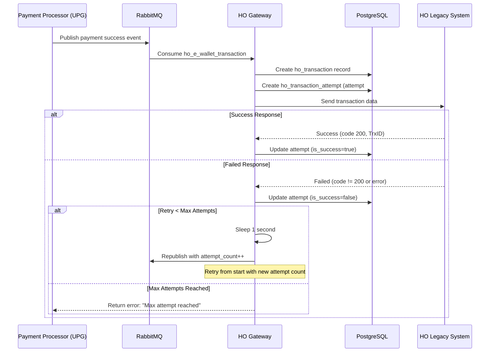
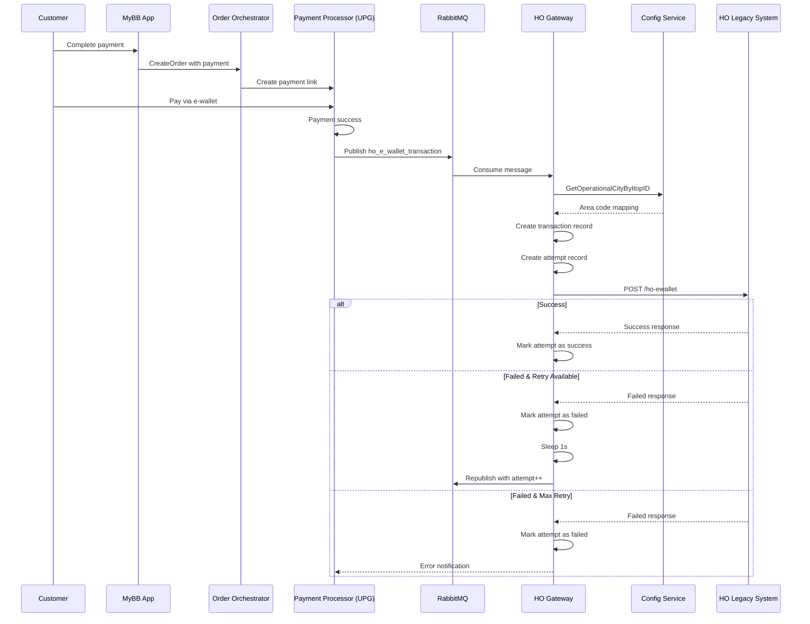
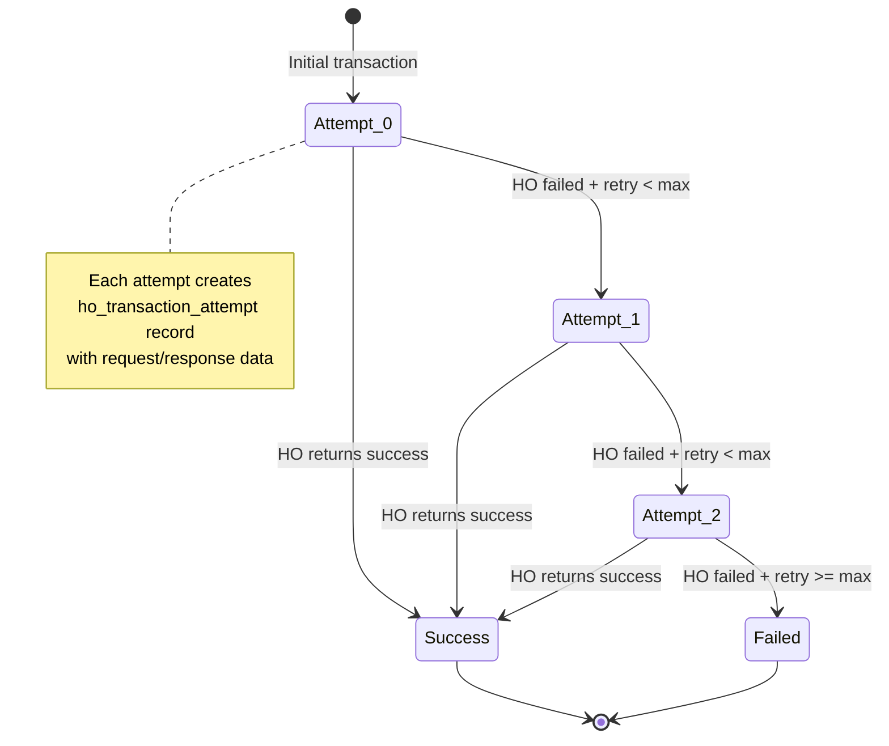

---
tags:
  - mrg
  - service
  - ho-gateway
  - head-office
  - e-wallet
  - payment
  - integration
  - grpc
  - documentation
team: MRG
type: service-documentation
title: HO Gateway (Head Office Gateway)
status: production
created: '2025-01-08'
updated: '2025-01-08'
grpc_port: 50052
rest_port: 8082
repository: git.bluebird.id/mybb-ms/mybb-ho-gateway
tech_stack:
  - go
  - grpc
  - postgresql
  - rabbitmq
  - rest-api
---
# HO Gateway (Head Office Gateway)

**Team**: MRG (Meta Reservation Gateway)  
**Status**: ✅ Production  
**Repository**: `git.bluebird.id/mybb-ms/mybb-ho-gateway`

---

## 📋 Overview

HO Gateway adalah **integration service** yang menjembatani transaksi pembayaran e-wallet dari sistem modern MyBB ke sistem **Head Office (HO) legacy** Bluebird. Service ini memastikan setiap transaksi e-wallet yang sukses di Payment Gateway (UPG) ter-sinkronisasi dengan sistem legacy untuk proses akuntansi dan pelaporan keuangan.

### Masalah yang Diselesaikan

**Tanpa HO Gateway:**
- Transaksi e-wallet tidak tercatat di sistem legacy HO
- Manual reconciliation antara sistem baru dan lama
- Data tidak konsisten antara MyBB platform dan HO
- Proses akuntansi tertunda dan error-prone

**Dengan HO Gateway:**
- ✅ Automatic sync transaksi e-wallet ke HO system
- ✅ Retry mechanism untuk reliability
- ✅ Transaction attempt tracking untuk audit trail
- ✅ Real-time integration dengan zero data loss
- ✅ Consistent data across systems

### Fungsi Utama

- **E-Wallet Transaction Sync** - Sync transaksi Gopay, OVO, Dana, ShopeePay, LinkAja ke HO
- **Retry Mechanism** - Auto-retry dengan configurable max attempts
- **Transaction Tracking** - Track setiap attempt dengan request/response data
- **Message Publishing** - Publish/subscribe messages via RabbitMQ
- **Operational City Mapping** - Map iTOP ID ke area code HO system

---

## 🛠️ Tech Stack

| Component | Technology |
|-----------|------------|
| Language | Go 1.25 |
| Protocol | gRPC + REST (gRPC-Gateway) |
| Database | PostgreSQL |
| Message Broker | RabbitMQ |
| Monitoring | Elastic APM, Prometheus |
| Container | Docker, Kubernetes |

---

## 🔑 Konsep Utama

### 1. E-Wallet Transaction Flow

Service ini handle transaksi dari berbagai payment method:

| Payment Method | Pay Gateway Code | HO System Code |
|----------------|------------------|----------------|
| **GoPay** | `gopay` | `MIDGPY` |
| **OVO** | `ovo` | `OVO` |
| **DANA** | `dana` | `DANA` |
| **ShopeePay** | `shopeepay` | `SHOPAY` |
| **LinkAja** | `tcash` | `TCASH` |

### 2. Transaction Lifecycle



### 3. Retry Strategy

**Configuration:**
- Default max attempts: Configurable via `ho_max_attempt`
- Retry delay: 1 second between attempts
- Each retry creates new `ho_transaction_attempt` record

**Retry Logic:**
```go
if !isSuccess && attemptCount < maxAttempt {
    time.Sleep(1 * time.Second)
    attemptCount++
    republishToRabbitMQ(message)
} else if !isSuccess && attemptCount >= maxAttempt {
    return error("Max attempt reached")
}
```

### 4. Transaction Types

| Type | Code | Description |
|------|------|-------------|
| **Reservation Deposit** | `RSV_DP` | Initial payment/deposit untuk reservasi |
| **Cancellation** | `RSV_CANC` | Pembatalan order dengan refund |
| **Adjustment** | `RSV_UPD` | Adjustment amount order |

### 5. Amount Calculation

```go
// Calculate amounts sent to HO system
JumlahDP = Amount  // Original payment amount
Amount = Amount - DiscountAmount + PlatformFee + Sustainability
```

---

## 🔌 Dependencies

### Internal Services

| Service | Purpose |
|---------|---------|
| **Config Service** | Get operational city mapping (iTOP ID → Area Code) |
| **HO Legacy Service** | Target system untuk sync transaksi |
| **Payment Processor (UPG)** | Source of payment success events |

### Infrastructure

| Component | Purpose |
|-----------|---------| 
| **PostgreSQL** | Store transaction records and attempt logs |
| **RabbitMQ** | Message queue untuk async processing |
| **Elastic APM** | Performance monitoring & tracing |
| **Prometheus** | Metrics collection |

### External Libraries

- **Aphrodite** - Internal common library (logger, lang, etc)
- **Config Service Client** - Client untuk config service
- **Bluebird Chassis** - gRPC utilities & middleware

---

## 📡 API Contracts

### gRPC Service

**Package**: `hogateway`  
**Proto File**: `contract/ho_gateway.proto`  
**Ports**: gRPC `50052`, REST `8082`

### Methods Overview

| Method | Description | Usage |
|--------|-------------|-------|
| `HealthCheck` | Service health status | Health monitoring |
| `HoEWalletTransaction` | Process e-wallet transaction to HO | Called via RabbitMQ consumer |
| `PublishMessage` | Publish message to topic | Internal message publishing |
| `SendMessage` | Send direct message | Direct messaging |

### Key Request: HoEWalletRequest

```protobuf
message HoEWalletRequest {
    string payment_method = 1;      // gopay, ovo, dana, shopeepay, tcash
    string trx_date_time = 2;       // RFC3339 format
    string itop_id = 3;             // Operational city ID
    string external_order_id = 4;   // External order reference
    int64 order_id = 5;             // Internal order ID
    string currency = 6;            // Currency code (IDR)
    double amount = 7;              // Total amount
    double discount_amount = 8;     // Discount if any
    string promo_code = 9;          // Promo code applied
    string bbid = 10;               // Customer phone number
    string transaction_id = 11;     // Payment transaction ID
    string bank = 12;               // Bank/payment provider
    double platform_fee = 13;       // Platform fee
    double sustainability = 14;     // Sustainability fee
    int32 attempt_count = 15;       // Current retry attempt
}
```

---

## ⚙️ Configuration

### Environment Variables

```env
# Application
APP_NAME=mybb-ho-gateway
GRPC_PORT=50052
REST_PORT=8082
LOG_LEVEL=info
POD_NAME=mybb-ho-gateway
NAMESPACE=microservices

# Database
DB_HOST=
DB_USERNAME=
DB_PASSWORD=
DB_SSL_MODE=disable
DB_PORT=5432
DB_NAME=ho_gateway
MAX_IDLE_CONNS=10
MAX_OPEN_CONNS=100

# Service Connections
CONFIGSERVICE_HOST=
CONFIGSERVICE_PORT=

# HO Service
HO_SERVICE_URL=
HO_SERVICE_TIMEOUT=30s

# Message Broker
RABBITMQ_URI=
RABBITMQ_HO_E_WALLET_TOPIC=ho_e_wallet_transaction

# Retry Configuration
HO_MAX_ATTEMPT=3  # Maximum retry attempts

# Monitoring
ELASTIC_APM_SERVICE_NAME=mybb-ho-gateway
ELASTIC_APM_SERVER_URL=
ELASTIC_APM_ENVIRONMENT=production
```

---

## 📂 Project Structure

```
mybb-ho-gateway/
├── main.go                    # Entry point
├── go.mod                     # Dependencies
├── Dockerfile                 # Container build
├── Jenkinsfile                # CI/CD pipeline
│
├── config/                    # Configuration
│   ├── default.go
│   ├── logger/                # Logger setup
│   └── repository/            # Repository initialization
│
├── constant/                  # Constants
│   ├── ho_e_wallet.go         # Payment method constants
│   └── topic.go               # Message topic names
│
├── contract/                  # API contracts
│   ├── ho_gateway.proto       # gRPC proto definition
│   ├── ho_gateway.pb.go       # Generated proto code
│   ├── ho_gateway_grpc.pb.go  # Generated gRPC code
│   ├── ho_gateway.pb.gw.go    # Generated REST gateway
│   └── ho_gateway.broker.yaml # Broker config
│
├── model/                     # Domain models
│   └── ho_ewallet.go          # HO e-wallet request/response
│
├── repository/                # Data access layer
│   ├── base_repository.go
│   ├── configservice/         # Config service client
│   ├── ho_gateway_db/         # Database repository
│   │   ├── entity/            # DB entities
│   │   │   ├── ho_transaction.go
│   │   │   ├── ho_transaction_attempt.go
│   │   │   └── user.go
│   │   ├── ho_transaction.go
│   │   └── ho_transaction_attempt.go
│   ├── ho_service/            # HO service client
│   ├── publisher/             # Message publisher
│   └── repoiface/             # Repository interfaces
│
├── usecase/                   # Business logic
│   ├── base_usecase.go
│   ├── health_check.go
│   ├── ho_e_wallet_transaction.go
│   ├── publish_message.go
│   └── send_message.go
│
├── transport/                 # Transport layer
│   ├── base_transport.go
│   ├── health_check.go
│   ├── ho_e_wallet_transaction.go
│   ├── publish_message.go
│   └── send_message.go
│
├── server/                    # Server setup
│   ├── grpc.go                # gRPC server
│   ├── rest.go                # REST server
│   ├── broker.go              # Message broker
│   └── metric.go              # Metrics server
│
├── util/                      # Utilities
│   ├── server.go              # Server utilities
│   ├── interceptor/           # gRPC interceptors
│   └── rest/                  # REST utilities
│
├── cert/                      # Certificates
│   └── broker_config.yaml     # Broker configuration
│
└── k8s/                       # Kubernetes manifests
    ├── deployment.yaml
    ├── service.yaml
    └── huawei-application.yaml
```

---

## 🔄 Integration Flows

### Main Flow: E-Wallet Transaction Processing



### Retry Flow Detail



---

## 📊 Database Schema

### Tables

#### ho_transactions

**Purpose**: Main transaction record

| Column | Type | Description |
|--------|------|-------------|
| `id` | UUID | Primary key |
| `order_id` | INTEGER | Order ID from Order Orchestrator |
| `bbid` | VARCHAR | Customer phone number |
| `approval_code` | VARCHAR | Payment transaction ID |
| `bank` | VARCHAR | Payment provider/bank |
| `amount` | NUMERIC | Payment amount |
| `discount_amount` | NUMERIC | Discount applied |
| `promo_code` | VARCHAR | Promo code used (nullable) |
| `created_at` | TIMESTAMP | Record creation time |
| `updated_at` | TIMESTAMP | Last update time |

**Indexes:**
- Primary key on `id`
- Unique index on `order_id`

#### ho_transaction_attempts

**Purpose**: Track each retry attempt with full request/response

| Column | Type | Description |
|--------|------|-------------|
| `id` | UUID | Primary key |
| `order_id` | INTEGER | Foreign key to order |
| `retry_count` | INTEGER | Current attempt number (0-based) |
| `request_data` | TEXT | JSON request sent to HO |
| `response_data` | TEXT | JSON response from HO |
| `is_success` | BOOLEAN | Whether attempt succeeded |
| `created_at` | TIMESTAMP | Attempt creation time |
| `updated_at` | TIMESTAMP | Last update time |

**Indexes:**
- Primary key on `id`
- Index on `order_id`
- Index on `is_success`

---

## 🏷️ Tags

#mrg #service #ho-gateway #head-office #e-wallet #payment #integration #grpc #documentation

---

## 📝 Notes

### Special Considerations

1. **Testing Mode**: When `transaction_id == "TEST"`, service bypasses actual HO call for testing
2. **Idempotency**: Each order_id can only have one transaction record
3. **Audit Trail**: All attempts stored with full request/response for debugging
4. **Async Processing**: Uses RabbitMQ for retry mechanism to avoid blocking

### Common Issues

**Issue**: Transaction marked as failed but actually succeeded in HO
**Solution**: Check `ho_transaction_attempts` table for response_data and verify with HO system

**Issue**: Max retry reached but need to retry again
**Solution**: Manually republish message to RabbitMQ with attempt_count reset to 0

### Related Services

- [[orderorchestrator]] - Initiates payment flow
- [[paymentprocessor]] - Triggers HO Gateway via webhook
- [[configservice]] - Provides operational city mapping

---

*Last Updated*: 2025-01-08  
*Generated from*: Repository analysis & code review
