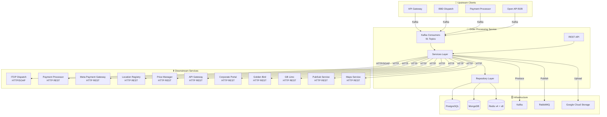

---
tags:
  - mrg
  - service
  - dependencies
  - order-processing
parent: '[[README]]'
created: '2026-01-29'
updated: '2026-01-29'
---
# Order Processing - Dependencies

**Parent**: [[README|Order Processing Service]]

---

## 🔄 Dependency Diagram



---

## 📥 Upstream Services (Memanggil Order Processing)

| Service | Protocol | Topics | Description |
|---------|----------|--------|-------------|
| **API Gateway** | Kafka | REQUEST_BOOKING, CANCEL_BOOKING, GET_TRIP_HISTORY, dll | Mobile app requests |
| **BBD Dispatch** | Kafka | ORDER_CALLBACK, UPDATE_CURRENT_BOOKING, END_TRIP | Driver updates |
| **Payment Processor** | Kafka | UPDATE_CHARGE_STATUS, UPDATE_REFUND_STATUS | Payment callbacks |
| **Open API** | Kafka | OPEN_API_* topics | B2B merchant requests |

---

## 📤 Downstream Services (Dipanggil Order Processing)

### ITOP Dispatch
```go
// itop/webservice/client.go
type ITOPClient interface {
    QueryTaxiLocation(server *ItopServer, req *QueryTaxiLocationRequest) (*QueryTaxiLocationResponse, error)
    CreateNewJob(server *ItopServer, req *CreateNewJobRequest) (*CreateNewJobResponse, error)
    CancelBooking(server *ItopServer, req *CancelBookingRequest) (*CancelBookingResponse, error)
    GetOrderDetail(server *ItopServer, req *GetOrderDetailRequest) (*GetOrderDetailResponse, error)
}
```

**Configuration:**
```env
ITOP_SERVER=http://192.168.0.206:8111/mobile/mobileService?wsdl
ITOP_MAX_IDLE_CONNS=400
ITOP_CONN_TIMEOUT=30s
```

### Payment Processor
```go
// payment-processor/webservices/payment_processor.go
type PaymentProcessorService interface {
    ChargeWallet(ctx context.Context, req *ChargeWalletRequest) (*ChargeWalletResponse, error)
    RefundWallet(ctx context.Context, req *RefundWalletRequest) (*RefundWalletResponse, error)
    GetWalletBalance(ctx context.Context, req *GetWalletBalanceRequest) (*GetWalletBalanceResponse, error)
    RequestPreAuth(ctx context.Context, req *PreAuthRequest) (*PreAuthResponse, error)
}
```

**Configuration:**
```env
PAYMENT_PROCESSOR_SERVER=http://payment_processor:9090
```

### Meta Payment Gateway
```go
// meta-payment-gateway/webservices/mpg.go
type MPGService interface {
    GetPaymentMethods(ctx context.Context, req *GetPaymentMethodsRequest) (*GetPaymentMethodsResponse, error)
    ValidateECV(ctx context.Context, req *ValidateECVRequest) (*ValidateECVResponse, error)
    StartTripVoucherTrx(ctx context.Context, req *StartTripVoucherTrxRequest) error
}
```

**Configuration:**
```env
PAYMENT_GATEWAY_SERVER_V2=http://meta_payment_gateway_v2_go:3009
PAYMENT_GATEWAY_SERVER_V2_TOKEN=Basic xxx
```

### Location Registry
```go
// location-registry/webservices/location_registry.go
type LocationRegistryService interface {
    GetAreaByLocation(ctx context.Context, params GetAreaParams) (*Area, error)
    GetServiceTypeByID(ctx context.Context, areaID, serviceTypeID int) (*ServiceType, error)
    GetAirportByLocation(ctx context.Context, lat, lng float64) (*Airport, error)
}
```

**Configuration:**
```env
LOCATION_REGISTRY_URL=http://location_registry:3002
```

### Golden Bird Service
```go
// goldenbird/webservices/goldenbird.go
type GoldenBirdService interface {
    CreateOrder(ctx context.Context, req *GBOrderRequest) (*GBOrderResponse, error)
    GetOrderDetail(ctx context.Context, orderID int) (*GBOrderDetail, error)
    CancelOrder(ctx context.Context, orderID int) error
}
```

**Configuration:**
```env
GOLDENBIRD_URL=http://gb_order_processor:3004
GOLDENBIRD_TOKEN=xxx
```

### Maps Service (GMO)
```go
// lib/gmo/gmo.go
type GMOService interface {
    ReverseGeocode(ctx context.Context, lat, lng float64) (*ReverseGeocodeResponse, error)
    GetDirections(ctx context.Context, req *DirectionsRequest) (*DirectionsResponse, error)
    GetStaticMap(ctx context.Context, req *StaticMapRequest) ([]byte, error)
}
```

**Configuration:**
```env
MAPS_SERVICE_URL=https://stg-mybb-mapsvc.bluebird.id
MAPS_SERVICE_TOKEN=xxx
```

### PubSub Service
```go
// pubsub/webservice/pubsub.go
type PubSubService interface {
    SendDataAppsflyerMKT(ctx context.Context, order *Order, event string) error
    PublishEvent(ctx context.Context, topic string, data interface{}) error
}
```

**Configuration:**
```env
PUBSUB_SERVICE_URL=http://stg-mybb-pubsub-mrg.gcp.bluebird.id
PUBSUB_MRG_TOKEN=xxx
```

---

## 🗄️ Repository Interfaces

### Base Repository
```go
// repository/repository.go
type BaseRepository interface {
    GetDatabase() *gorm.DB
    GetDatabaseNative() *sql.DB
    BeginTransaction() (tx *gorm.DB)
    EndTransaction(tx *gorm.DB)
    ScanRow(rows *sql.Rows, obj interface{}) error
    UpdateModel(models interface{}, tableName string) (string, []interface{})
}
```

### Order Repository
```go
// repository/order.go
type OrderRepository interface {
    // Create & Update
    Create(ctx context.Context, tx *sql.DB, order Order) (Order, error)
    CreateQB(ctx context.Context, qbi QueryBuilder, order Order) (Order, error)
    UpdateQB(ctx context.Context, qbi QueryBuilder, order Order) (Order, error)
    UpdateNative(ctx context.Context, tx *sql.DB, order Order) (Order, error)
    
    // Query by ID
    FindQB(ctx context.Context, qbi QueryBuilder, id int) (Order, error)
    FindByIdAndUserQB(ctx context.Context, id int, userID string) (Order, error)
    FindByTripIdAndUserIdQB(ctx context.Context, tripID, userID string) (Order, error)
    GetByExternalOrderIDWithItopIDWithTransactionQB(ctx context.Context, qbi QueryBuilder, extOrderID int, itopID string) (Order, error)
    
    // Trip History
    GetTripHistory(userID string, limit, offset int) []Order
    GetAllTripHistoryByServiceTypeNative(ctx context.Context, userID string, limit, cursor int64, serviceType string) []Order
    
    // Active Orders
    GetActiveBookings(userID string) []Order
    GetOngoingByProductType(productType, userID string, limit, offset int) []Order
    GetCurrentBooking(userID string) Order
    GetFutureBookingsQB(ctx context.Context, qbi QueryBuilder, userID string) []Order
    
    // Payment Related
    QueryFailedToChargeBookingsQB(ctx context.Context, qbi QueryBuilder, userID string, limit, offset int) ([]Order, error)
    QueryPartiallyPaidBookingsQB(ctx context.Context, qbi QueryBuilder, userID string, limit, offset int) ([]Order, error)
    GetDailyBookingByCreditCardQB(ctx context.Context, qbi QueryBuilder, userID, epaymentToken string) ([]Order, error)
    
    // Trip Not Ended
    GetNotTripEndedOrders() []Order
    GetTNEPaymentNotSuccess(ctx context.Context, qbi QueryBuilder, start, end time.Time) ([]Order, error)
    GetTNEStateNotEndTrip(ctx context.Context, qbi QueryBuilder, start, end time.Time) ([]Order, error)
    
    // Rating
    GetRatingOrder(ctx context.Context, qbi QueryBuilder, userID string, limit int64) ([]Order, error)
    CountPointsByUserIDQB(ctx context.Context, qbi QueryBuilder, userID string) (int64, error)
    
    // Cancellation
    CountCancelledOrderByUserQB(ctx context.Context, qbi QueryBuilder, userID string) (int, error)
    
    // Updates
    UpdateRouteImage(ctx context.Context, qbi QueryBuilder, order Order) (int64, error)
    UpdateTips(ctx context.Context, qbi QueryBuilder, orderID int, tips float64) error
    UpdatePassCodeAndExternalOrderID(ctx context.Context, qbi QueryBuilder, order Order) error
}
```

### MongoDB Repositories
```go
// repository/mongo/order_info.go
type OrderInfoRepository interface {
    Create(ctx context.Context, orderInfo OrderInfo) error
    Update(ctx context.Context, orderInfo OrderInfo) error
    GetByOrderID(ctx context.Context, orderID int) (*OrderInfo, error)
}

// repository/mongo/order_state.go
type OrderStateRepository interface {
    Create(ctx context.Context, orderState OrderState) error
    Update(ctx context.Context, orderState OrderState) error
    GetByOrderID(ctx context.Context, orderID int) (*OrderState, error)
}
```

---

## 🔧 Infrastructure Configuration

### PostgreSQL
```env
DB_USERNAME=postgres
DB_NAME=mybb_order_processing_db
DB_PASSWORD=xxx
DB_PORT=5432
DB_HOST=database
DB_SSL_MODE=disable
DB_MAX_OPEN_CONNS=1024
DB_MAX_IDLE_CONNS=10
DB_MAX_IDLE_TIME_CONNS=3m
DB_MAX_LIFE_TIME_CONNS=3m
```

### Redis
```env
# Legacy Redis v4
REDIS_SERVER_IP=redis:6379
REDIS_POOL_SIZE=1000

# Redis v8 (Gorooster)
REDIS_SERVER_IP_GOROOSTER=localhost:6379
REDIS_DATABASE_GOROOSTER=14

# Session Manager
SESSION_ADDRESS=172.26.11.40:6379
SESSION_DB=0
```

### Kafka
```env
KAFKA_BROKER_LIST=kafka:9092
KAFKA_PARTITION_LIST=0
```

### Google Cloud Storage
```env
IMAGE_STORAGE=cloud
PROJECT_ID=mybluebird-dev-1202
GCS_BUCKET_IMAGE_TRIP=mybb-images-dev-00
GOOGLE_APPLICATION_CREDENTIALS=/var/conf/storage.json
IMAGE_CLOUD_SERVER=https://storage.googleapis.com
```

---

## 🔗 Related Documentation

- [[README|Order Processing Service]]
- [[order-flows|Order Flows]]
- [[kafka-topics|Kafka Topics Reference]]
- [[api-reference|API Reference]]

---

#mrg #service #dependencies #order-processing

---

*Last Updated*: 2026-01-29
