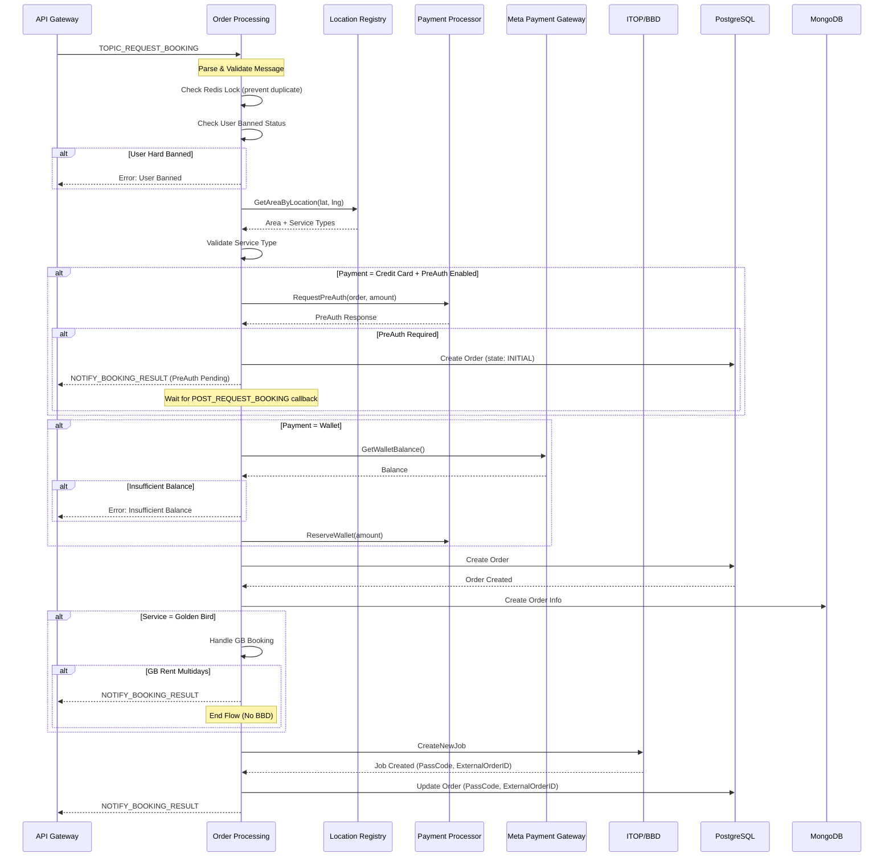
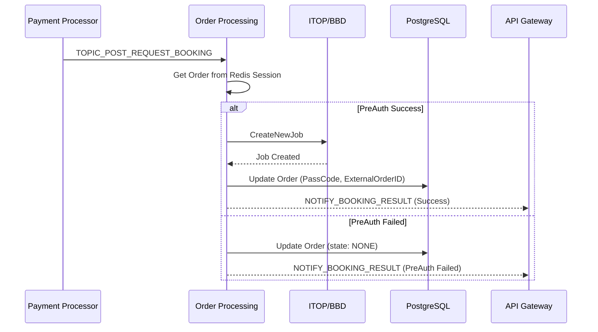
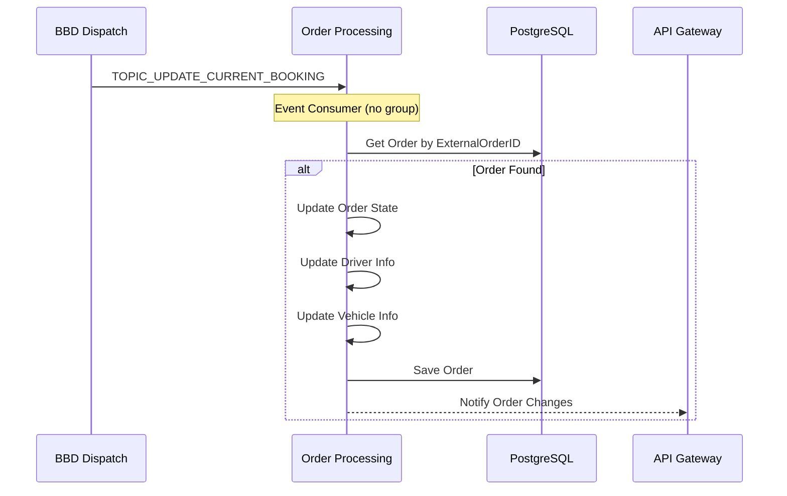
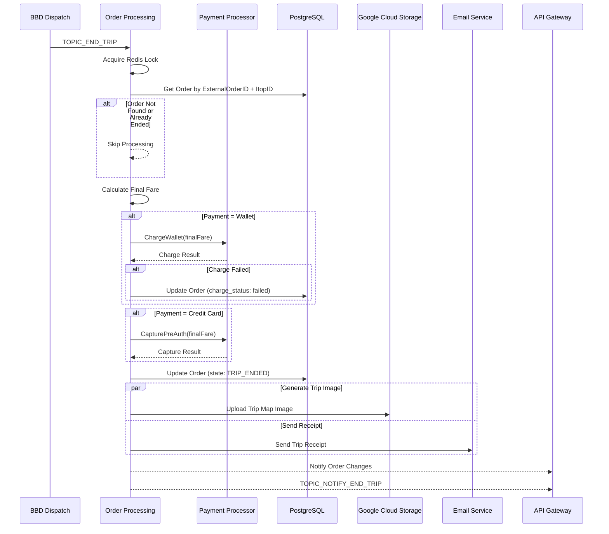
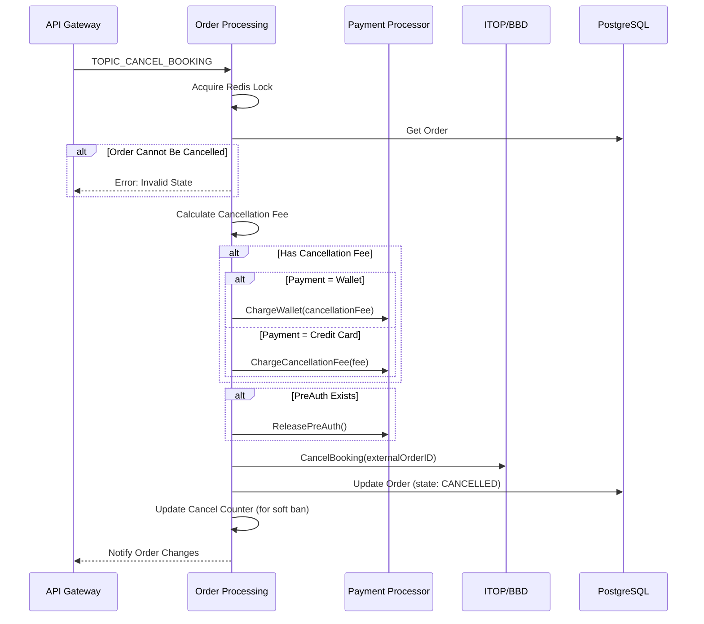
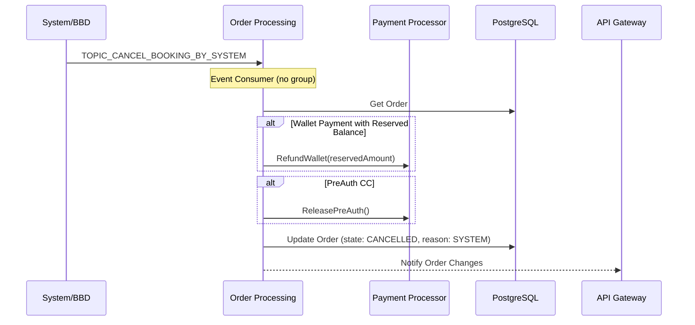
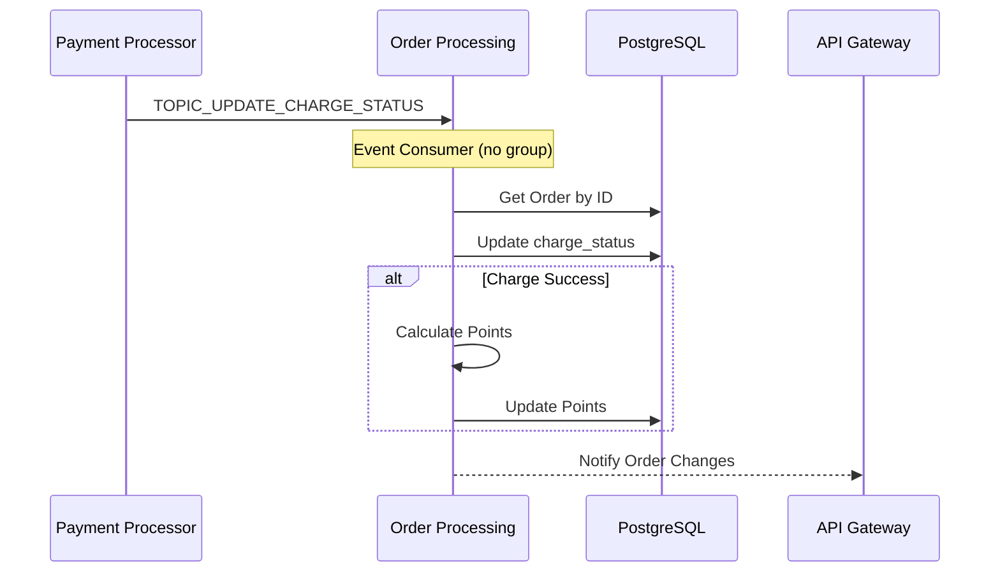
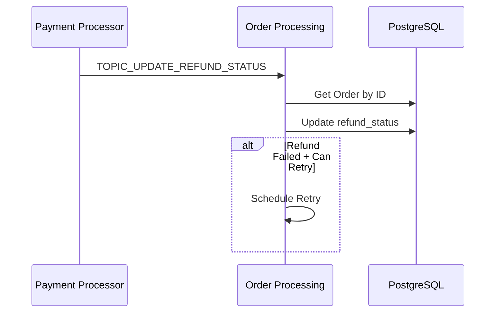
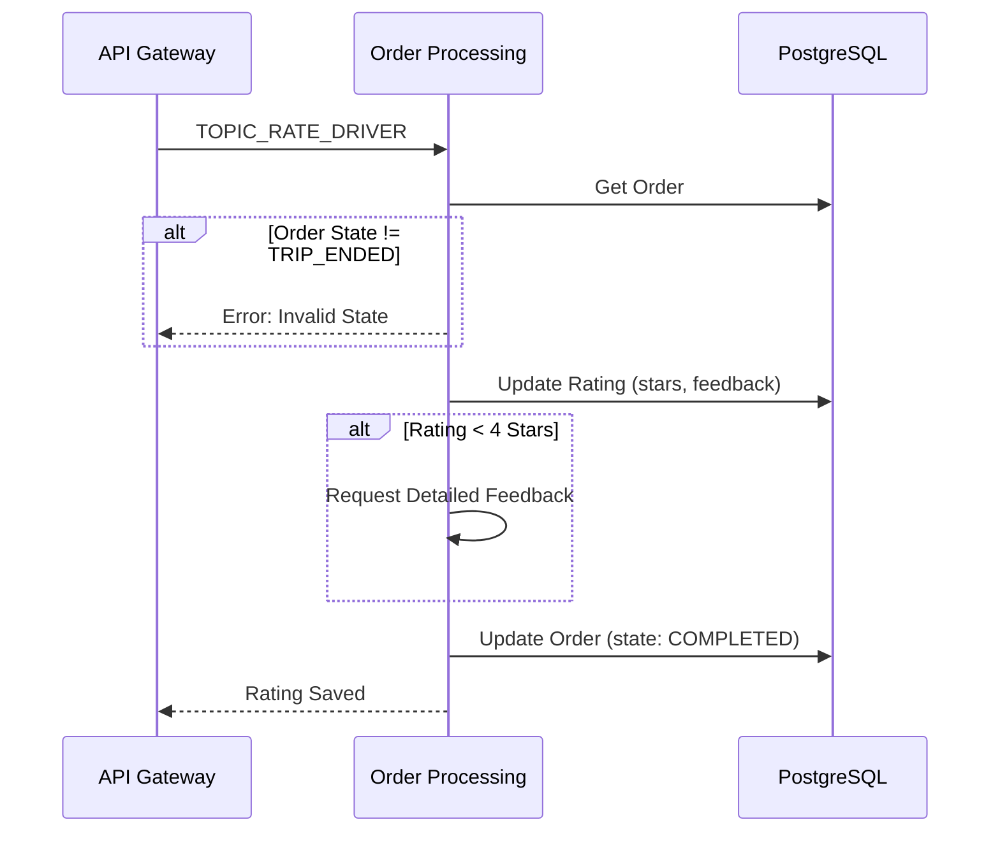
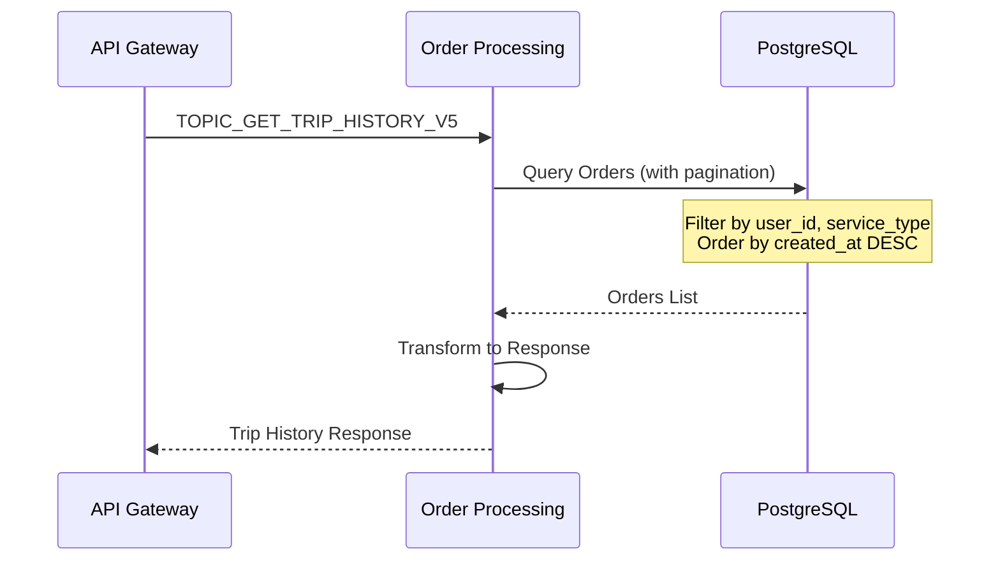

---
tags:
  - mrg
  - service
  - flows
  - order-processing
parent: '[[README]]'
created: '2026-01-29'
updated: '2026-01-29'
---
# Order Processing - Order Flows

**Parent**: [[README|Order Processing Service]]

---

## 🔄 Request Booking Flow

### Sequence Diagram



### Key Components

1. **Redis Lock** - Prevent duplicate order creation
2. **Soft Ban Check** - User dengan banyak cancel
3. **Hard Ban Check** - User blacklist
4. **Area Validation** - Validasi lokasi pickup
5. **PreAuth Flow** - Credit card pre-authorization
6. **Wallet Reserve** - E-wallet balance reservation
7. **BBD Integration** - ITOP dispatch

---

## 🔄 Post Request Booking Flow (PreAuth Callback)



---

## 🔄 Update Current Booking Flow



### State Transitions
| From State | To State | Trigger |
|------------|----------|---------|
| INITIAL | LOOKING_FOR_DRIVER | BBD accepted job |
| LOOKING_FOR_DRIVER | DRIVER_FOUND | Driver assigned |
| DRIVER_FOUND | ON_TRIP | Trip started |
| ON_TRIP | TRIP_ENDED | Driver end trip |

---

## 🔄 End Trip Flow



### Fare Calculation
```go
// Fare calculation components
FinalFare = TripFare + ServicesFee + Tips - PromoDiscount

// Where:
// TripFare = Metered fare atau Fixed fare
// ServicesFee = Handling fee, platform fee, etc.
// Tips = Optional driver tips
// PromoDiscount = Promo/voucher discount
```

---

## 🔄 Cancel Booking Flow



### Cancellation Rules
| State | Can Cancel | Fee |
|-------|------------|-----|
| INITIAL | ✅ Yes | No |
| LOOKING_FOR_DRIVER | ✅ Yes | No |
| DRIVER_FOUND | ✅ Yes | Maybe |
| ON_TRIP | ❌ No | - |
| TRIP_ENDED | ❌ No | - |

---

## 🔄 Cancel Booking by System Flow



---

## 🔄 Payment Callback Flows

### Update Charge Status



### Update Refund Status



---

## 🔄 Rating Flow



---

## 🔄 Trip History Flow



---

## 🔗 Related Documentation

- [[README|Order Processing Service]]
- [[dependencies|Dependencies]]
- [[kafka-topics|Kafka Topics Reference]]
- [[api-reference|API Reference]]

---

#mrg #service #flows #order-processing

---

*Last Updated*: 2026-01-29
