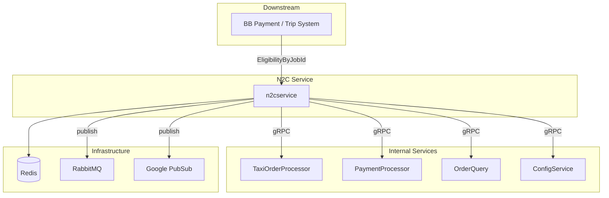

# N2C Service - Dependencies

**Service**: [[README|N2C Service]]

---

## 🔄 Dependency Diagram



---

## 📊 Upstream Dependencies Detail

| Service | Protocol | Library | Version | Purpose |
|---------|----------|---------|---------|---------|
| **TaxiOrderProcessor** | gRPC | `grpc-client` | v1.7.7 | Get order by job ID, get pre-auth info, update locked fare |
| **PaymentProcessor** | gRPC | `grpc-client` | v1.7.7 | Re-preauth, cancel preauth, get e-wallet balance, cancel transaction |
| **OrderQuery** | gRPC | `grpc-client` | v1.7.7 | Cek eligibility preauth increment, get order info |
| **ConfigService** | gRPC | `grpc-client` | v1.7.7 | Get konfigurasi preauth (cycle_charge, amount) per product type |
| **Redis** | TCP | `go-redis/v8` | v8.11.5 | Cache order detail + balance notif state per job_id |
| **MessageBroker** | AMQP/PubSub | `watermill` | v1.4.2 | Publish push notification ke user |


---

## 🔌 Repository Interfaces

### TaxiOrderProcessor
```go
type TaxiOrderProcessor interface {
    HealthCheck(ctx context.Context) error
    GetOrderByJobId(ctx context.Context, request *taxiorderprocessor.GetOrderByJobIdRequest) (*taxiorderprocessor.OrderDetail, error)
    GetOrderPreAuth(ctx context.Context, request *taxiorderprocessor.GetOrderPreAuthRequest) (*taxiorderprocessor.GetOrderPreAuthResponse, error)
    UpdateLockedFare(ctx context.Context, request *taxiorderprocessor.UpdateLockedFareRequest) (*taxiorderprocessor.DefaultMessage, error)
}
```

### PaymentProcessor
```go
type PaymentProcessor interface {
    HealthCheck(ctx context.Context) error
    RePreAuth(ctx context.Context, request *paymentprocessor.RePreAuthRequest) (*paymentprocessor.RePreAuthResponse, error)
    PreAuthCancellation(ctx context.Context, request *paymentprocessor.PreAuthCancellationRequest) (*paymentprocessor.PreAuthCancellationResponse, error)
    GetEwalletBalance(ctx context.Context, request *paymentprocessor.GetEwalletBalanceRequest) (*paymentprocessor.GetEwalletBalanceResponse, error)
    CancelTx(ctx context.Context, request *paymentprocessor.CancelTxRequest) (*paymentprocessor.CancelTxResponse, error)
    CancelSyncTransaction(ctx context.Context, request *paymentprocessor.CancelSyncTransactionRequest) (*paymentprocessor.CancelSyncTransactionResponse, error)
    GetPaymentMethod(ctx context.Context, request *paymentprocessor.GetPaymentMethodRequest) (*paymentprocessor.GetPaymentMethodResponse, error)
}
```

### OrderQuery
```go
type OrderQuery interface {
    HealthCheck(ctx context.Context) error
    GetOrderInfoByOrderId(ctx context.Context, request *orderquery.GetOrderInfoByOrderIdRequest) (*orderquery.GetOrderInfoByOrderIdResponse, error)
}
```

### ConfigService
```go
type ConfigService interface {
    HealthCheck(ctx context.Context) error
    GetPaymentEligiblePreauthIncrement(ctx context.Context, request *configservice.GetPaymentEligiblePreauthIncrementRequest) (*configservice.GetPaymentEligiblePreauthIncrementResponse, error)
    GetPreauthAmount(ctx context.Context, request *configservice.GetPreauthAmountRequest) (*configservice.GetPreauthAmountResponse, error)
}
```

### Redis
```go
type Redis interface {
    HealthCheck(ctx context.Context) error
    StoreOrderDetail(ctx context.Context, orderDetail *taxiorderprocessor.OrderDetail) error
    GetOrderDetail(ctx context.Context, jobId string) (*taxiorderprocessor.OrderDetail, error)
    DeleteOrderDetail(ctx context.Context, jobId string) error
    StoreBalanceNotif(ctx context.Context, jobId string, balanceNotif *model.BalanceNotif) error
    GetBalanceNotif(ctx context.Context, jobId string) (*model.BalanceNotif, error)
    DeleteBalanceNotif(ctx context.Context, jobId string) error
}
```

### MessageBroker
```go
type MessageBroker interface {
    HealthCheck(ctx context.Context) error
    PublishMessage(ctx context.Context, topicName string, value string) error
}
```

---

## ⚙️ Configuration per Dependency

| Dependency | Host Config Key | Port Config Key |
|------------|----------------|----------------|
| TaxiOrderProcessor | `taxiorderprocessor_host` | `taxiorderprocessor_port` |
| PaymentProcessor | `paymentprocessor_host` | `paymentprocessor_port` |
| OrderQuery | `orderquery_host` | `orderquery_port` |
| ConfigService | `configservice_host` | `configservice_port` |
| Redis | `redis_url` | - |
| RabbitMQ | `rabbitmq_client_uri` | - |
| PubSub | `pubsub_env` | - |

---

## 📤 Downstream Services (Clients)

| Service | Method yang Dipanggil | Keterangan |
|---------|-----------------------|------------|
| **BB Payment / Trip System** | `EligibilityByJobId` | Dipanggil periodik selama trip untuk cek eligibility pembayaran |

---

#dependency #n2cservice #architecture #mrg

*Last Updated*: 2026-04-08
*Generated from*: Repository analysis — D:\code\go\mybb-ms\n2cservice
