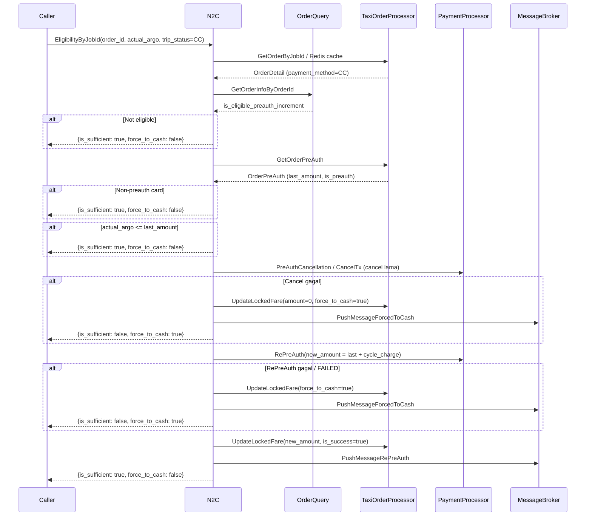
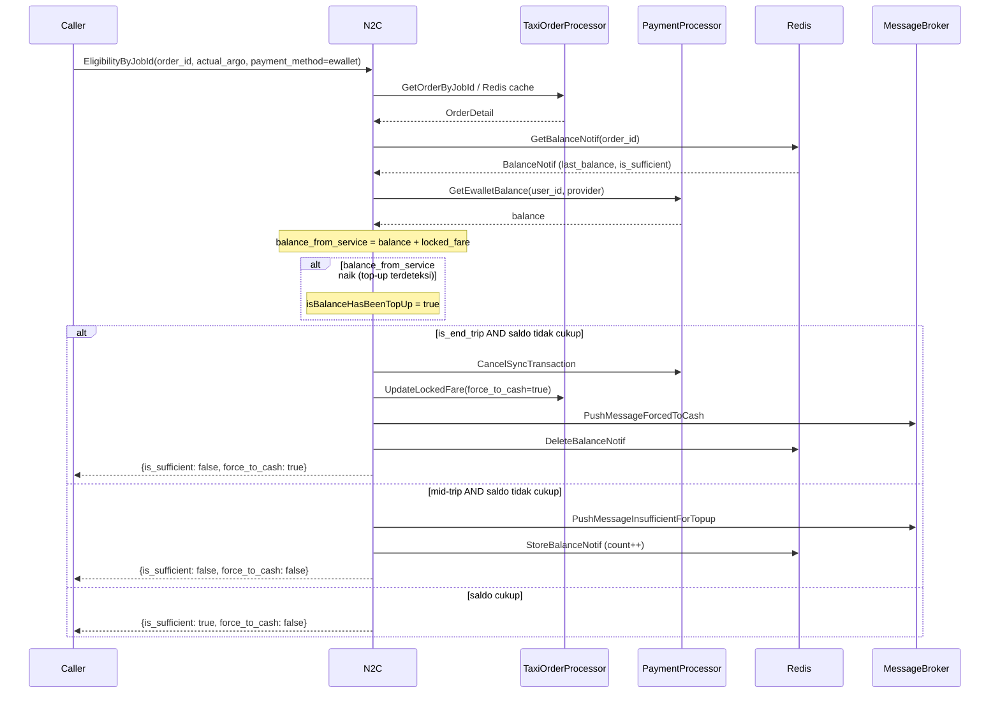

# N2C Service - Business Flows

**Service**: [[README|N2C Service]]

---

## 1️⃣ CC Pre-auth Increment Flow

**Skenario**: Argo aktual melebihi jumlah pre-auth kartu kredit yang ada

---

## 2️⃣ E-wallet Eligibility Flow

**Skenario**: Cek saldo e-wallet selama trip berlangsung

---

## 📊 Flow Comparison Matrix

| Flow | Payment Type | Dependencies | End-trip Behavior |
|------|-------------|--------------|-------------------|
| **Fixed Fare** | Any | Redis (order cache) | Selalu eligible |
| **CC Pre-auth** | Credit Card | TaxiOP, OrderQuery, PayProc, Config, MsgBroker | Increment atau force-to-cash |
| **E-wallet** | GoPay, OVO, dll | TaxiOP, PayProc, Redis, MsgBroker | Force-to-cash jika kurang |
| **Cash** | Cash | Redis (order cache) | Selalu eligible |

---

## 🔒 Key Points

- **Order detail di-cache** di Redis untuk mengurangi load ke TaxiOrderProcessor
- **Balance notif di-cache** untuk mendeteksi apakah user sudah top-up sejak pengecekan terakhir
- **Legacy vs new preauth**: `CancelTx` untuk preauth lama (tanpa `LastPreAuthAt`), `PreAuthCancellation` untuk preauth baru
- **End-trip** selalu memicu evaluasi final — tidak ada retry, langsung force-to-cash jika gagal

---

#n2cservice #flow #payment #preauth #mrg

*Last Updated*: 2026-04-08
*Generated from*: Repository analysis — D:\code\go\mybb-ms\n2cservice
