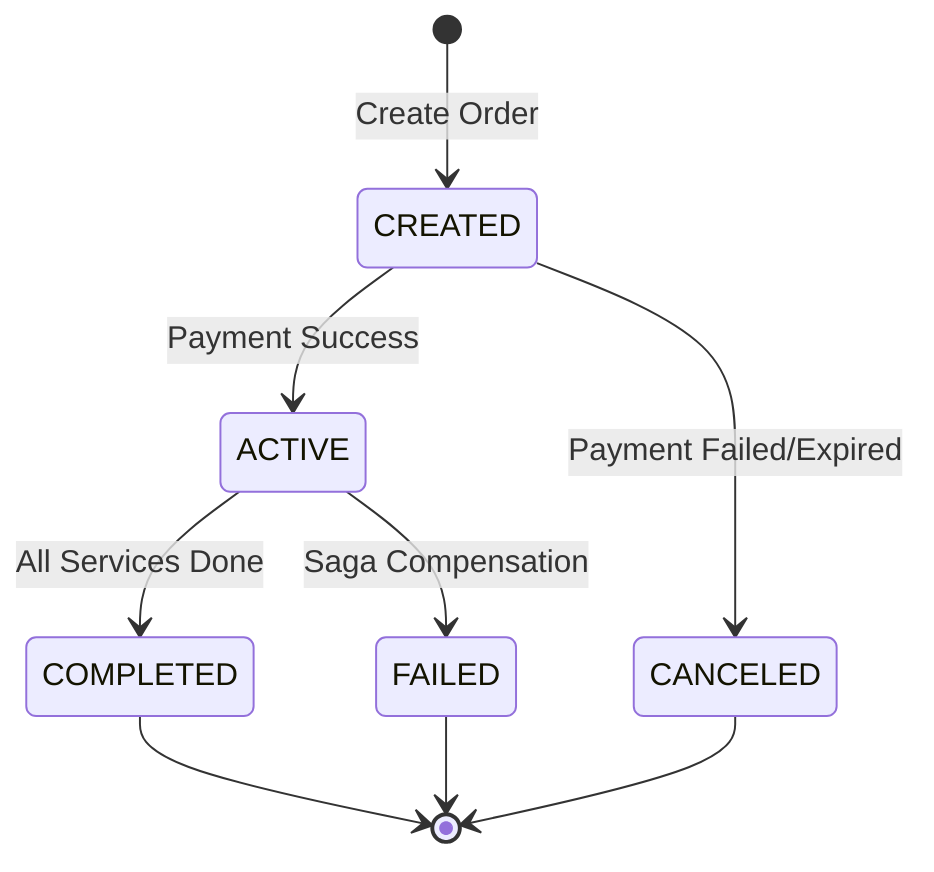
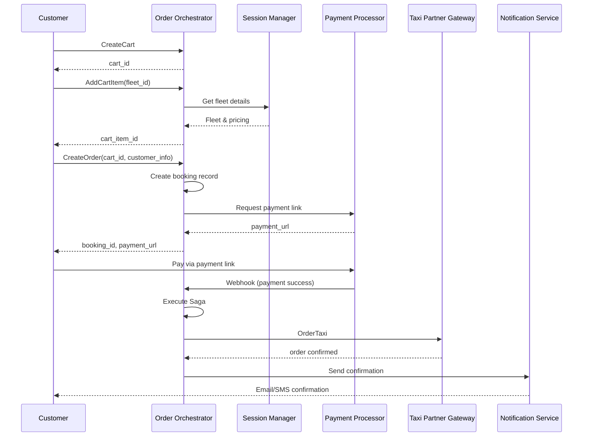
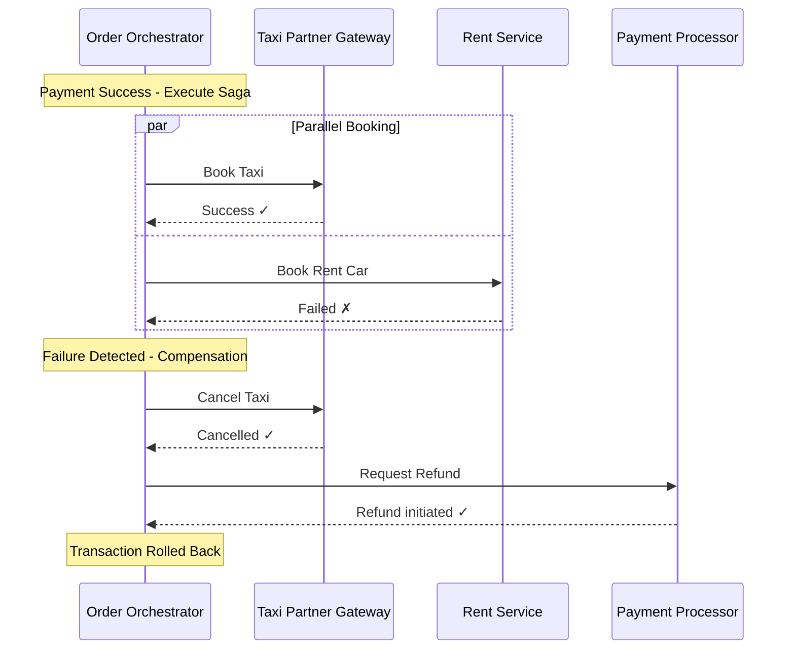

---
tags:
  - mrg
  - service
  - orderorchestrator
  - order
  - booking
  - saga
  - payment
  - grpc
  - documentation
team: MRG
type: service-documentation
title: Order Orchestrator
status: production
created: '2025-01-05'
updated: '2025-01-05'
grpc_port: 6000
rest_port: 8000
repository: git.bluebird.id/mybb-ms/orderorchestrator
tech_stack:
  - go
  - grpc
  - postgresql
  - redis
  - rabbitmq
  - pubsub
---
# Order Orchestrator

**Team**: MRG (Meta Reservation Gateway)  
**Status**: ✅ Production  
**Repository**: `git.bluebird.id/mybb-ms/orderorchestrator`

---

## 📋 Overview

Order Orchestrator adalah **otak pusat** dari sistem pemesanan MyBB yang mengelola seluruh lifecycle pemesanan multi-layanan transportasi. Service ini bertindak sebagai **konduktor orkestra** yang mengkoordinasikan berbagai layanan (Taxi, Rent Car, Delivery, Shuttle) untuk menciptakan pengalaman pemesanan yang seamless dalam satu transaksi terpadu.

### Masalah yang Diselesaikan

**Sebelum Order Orchestrator:**
- Customer harus buka 3 aplikasi berbeda untuk 3 layanan
- 3x proses pembayaran dengan 3x risk gagal
- Tidak ada koordinasi antar layanan

**Dengan Order Orchestrator:**
- Satu aplikasi untuk semua layanan
- Satu pembayaran untuk semua
- Atomic transaction (all-or-nothing) dengan Saga Pattern

### Fungsi Utama

- **Shopping Cart Management** - Create, add, update, delete cart items
- **Order Creation** - Convert cart to booking dengan payment link
- **Payment Orchestration** - Handle multiple payment methods & webhooks
- **Saga Pattern** - Distributed transaction dengan automatic rollback
- **Multi-Business Type** - Support Taxi, Rent, Delivery, Shuttle
- **Promo Management** - Validate, calculate, dan apply promo codes

---

## 🛠️ Tech Stack

| Component | Technology |
|-----------|------------|
| Language | Go 1.24 |
| Protocol | gRPC + REST (gRPC-Gateway) |
| Database | PostgreSQL |
| Cache | Redis |
| Message Broker | RabbitMQ, Google PubSub |
| Monitoring | Elastic APM, Prometheus |
| Container | Docker, Kubernetes |

---

## 🔑 Konsep Utama

### 1. Shopping Cart

Workspace sementara untuk customer merakit pesanan sebelum checkout.

**Features:**
- Cart dengan unique ID dan TTL 15 menit
- Add multiple items dari berbagai business type
- Apply promo code dan calculate discount
- Real-time price calculation

### 2. Order Lifecycle



### 3. Saga Pattern (Distributed Transaction)

Memastikan konsistensi transaksi across multiple services:

```
Payment Success
    └─> Saga Executes (Parallel)
        ├─> [Taxi Service] Book Taxi #1 ✓
        ├─> [Taxi Service] Book Taxi #2 ✓
        └─> [Rent Service] Book Rent Car ✗ (Failed)

Compensation Triggered
    ├─> Cancel Taxi #2 ✓
    ├─> Cancel Taxi #1 ✓
    └─> Initiate Refund ✓
```

### 4. Payment States

| Status | Description |
|--------|-------------|
| `REQUEST_PAYMENT_LINK` | Requesting payment URL |
| `WAITING_FOR_PAYMENT` | Waiting customer payment |
| `PAID` | Payment successful |
| `CANCELED` | Payment cancelled |
| `FAILED` | Payment failed |
| `REQUEST_REFUND` | Refund requested |
| `REFUND_SUCCESS` | Refund completed |

### 5. Business Types

| Type | Description | Example |
|------|-------------|---------|
| **Taxi (Ride)** | Point-to-point transport | "Antar dari rumah ke kantor" |
| **Rent Car** | Vehicle rental | "Sewa mobil 3 hari" |
| **Delivery** | Package delivery | "Kirim paket 20kg" |
| **Shuttle** | Fixed route transport | "Shuttle airport jam 10" |

---

## 🔌 Dependencies

### Internal Services

| Service | Client Library | Purpose |
|---------|----------------|---------|
| **Session Manager** | `grpc-client` | Fleet search session & pricing |
| **Payment Processor (UPG)** | `paymentprocessorclient` | Payment link, webhooks |
| **Taxi Partner Gateway** | `taxipartnergatewayclient` | Book taxi via BBD |
| **Promo Gateway** | `grpc-client` | Promo validation & calculation |
| **Notification Service** | `grpc-client` | Email/SMS/Push notifications |
| **Config Service** | `grpc-client` | Dynamic configuration |
| **Geo Service** | `grpc-client` | Location services |

### Infrastructure

| Component | Purpose |
|-----------|---------|
| **PostgreSQL** | Booking, payment, order items storage |
| **Redis** | Cart cache, session data |
| **RabbitMQ** | Event publishing (booking events) |
| **Google PubSub** | Async messaging |

### Repository Structure

```go
type Repository struct {
    SessionManager     repoiface.SessionManager
    Redis              repoiface.Redis
    DB                 DB
    Notification       repoiface.Notification
    PromoGateway       repoiface.PromoGateway
    ConfigService      repoiface.ConfigService
    PaymentProcessor   repoiface.PaymentProcessor
    TaxiPartnerGateway repoiface.TaxiPartnerGateway
    MessageBroker      repoiface.MessageBroker
    GeoService         repoiface.GeoService
}

type DB struct {
    Trx              repoiface.Trx
    Booking          repoiface.Booking
    Payment          repoiface.Payment
    Promo            repoiface.Promo
    OrderItem        repoiface.OrderItem
    RideDetail       repoiface.RideDetail
    RentDetail       repoiface.RentDetail
    VehicleInfo      repoiface.VehicleInfo
    FareComponent    repoiface.FareComponent
    PassengerInfo    repoiface.PassengerInfo
    ServicesFee      repoiface.ServicesFee
    ServicesFeeRules repoiface.ServicesFeeRules
    OrderServiceFees repoiface.OrderServiceFees
}
```

---

## 📡 API Contracts

### gRPC Service

**Package**: `orderorchestrator`  
**Proto File**: `contract/order_orchestrator.proto`  
**Ports**: gRPC `6000`, REST `8000`

### Methods Overview

#### Cart Operations

| Method | Description |
|--------|-------------|
| `CreateCart` | Create new shopping cart |
| `AddCartItem` | Add item to cart |
| `DeleteCartItem` | Remove item from cart |
| `SetQuantity` | Update item quantity |
| `GetCart` | Get cart with items & pricing |

#### Order Operations

| Method | Description |
|--------|-------------|
| `CreateOrder` | Create order from cart (MyBB App) |
| `CreateOrderWeb` | Create order (Web Reservation) |
| `GetBookingDetail` | Get booking details |
| `GetPayment` | Get payment info |
| `GetOrderReceipt` | Get order receipt URL |

#### Order Item Details

| Method | Description |
|--------|-------------|
| `GetRideDetail` | Get taxi/ride order details |
| `GetRentDetail` | Get rental order details |
| `GetDeliveryDetail` | Get delivery order details |

#### Callbacks

| Method | Description |
|--------|-------------|
| `CallbackPaymentInformation` | Handle payment webhook |
| `CallbackOrderItem` | Handle order item status update |
| `CallbackReceipt` | Handle receipt generation callback |

#### Web Reservation

| Method | Description |
|--------|-------------|
| `GetOrderDetailWeb` | Get order for web display |
| `PromoValidate` | Validate promo code |

#### Internal

| Method | Description |
|--------|-------------|
| `GetInternalBookingDetail` | Get full booking for internal use |
| `HealthCheck` | Service health check |

---

## ⚙️ Configuration

### Environment Variables

```env
# Application
APP_NAME=orderorchestrator
GRPC_PORT=6000
REST_PORT=8000
LOG_LEVEL=info
POD_NAME=orderorchestrator
NAMESPACE=microservices

# Database
DB_HOST=
DB_USERNAME=
DB_PASSWORD=
DB_SSL_MODE=
DB_PORT=
DB_NAME=
MAX_IDLE_CONNS=
MAX_OPEN_CONNS=

# Redis
REDIS_HOST=
REDIS_PORT=
REDIS_PASSWORD=
REDIS_DB=

# Service Connections
SESSION_MANAGER_HOST=
SESSION_MANAGER_PORT=
NOTIFICATION_HOST=
NOTIFICATION_PORT=
PROMOGATEWAY_HOST=
PROMOGATEWAY_PORT=
CONFIGSERVICE_HOST=
CONFIGSERVICE_PORT=
PAYMENTPROCESSOR_HOST=
PAYMENTPROCESSOR_PORT=
TAXIPARTNERGATEWAY_HOST=
TAXIPARTNERGATEWAY_PORT=
GEOSERVICE_HOST=
GEOSERVICE_PORT=

# Message Broker
PUBSUB_EMULATOR_HOST_PORT=
PUBSUB_CREDENTIAL=
PUBSUB_PROJECT_ID=
RABBITMQ_URI=
RABBITMQ_GOROOSTER_TOPIC_NAME=
RABBITMQ_SEND_EMAIL_V2_TOPIC_NAME=

# Document Generator
DOCUMENT_GENERATOR_HOST=
DOCUMENT_GENERATOR_CLIENT_ID=
DOCUMENT_GENERATOR_PDF_DOCUMENT_TYPE=
DOCUMENT_GENERATOR_CALLBACK_URL=

# Payment Settings
DURATION_WAITING_FOR_PAYMENT=30m
PAYMENT_CHECKOUT_TIMEOUT=120

# Concurrent Booking Limits
MAX_CREDIT_CARD_CONCURRENT_BOOKINGS=2
MAX_CREDIT_CARD_DAILY_BUDGET=2000000
MAX_LINKAJA_CONCURRENT_BOOKING=2
MAX_DANA_CONCURRENT_BOOKING=2
MAX_ISAKU_CONCURRENT_BOOKING=2
MAX_GOPAY_CONCURRENT_BOOKING=2
MAX_SHOPEEPAY_CONCURRENT_BOOKING=2
MAX_OVO_CONCURRENT_BOOKING=2
MINIMUM_REMAINING_BUDGET=20000
```

---

## 📂 Project Structure

```
orderorchestrator/
├── main.go                    # Entry point
├── go.mod                     # Dependencies
├── Dockerfile                 # Container build
├── Jenkinsfile                # CI/CD pipeline
│
├── config/                    # Configuration
│   ├── default.go
│   ├── logger/
│   └── repository/
│
├── constants/                 # Constants
│   ├── status.go              # Booking/Payment status
│   ├── payment.go             # Payment types
│   ├── service_line.go        # Service line codes
│   ├── business_code.go       # Business type codes
│   └── fare_component.go      # Fare components
│
├── contract/                  # API contracts
│   ├── order_orchestrator.proto
│   ├── order_orchestrator.pb.go
│   ├── order_orchestrator_grpc.pb.go
│   └── order_orchestrator.pb.gw.go
│
├── model/                     # Domain models
│   ├── database/              # DB entities
│   │   ├── booking.go
│   │   ├── order_item.go
│   │   ├── payment.go
│   │   ├── promo.go
│   │   ├── order_ride_detail.go
│   │   ├── order_rent_detail.go
│   │   ├── order_passenger_info.go
│   │   ├── order_vehicle_info.go
│   │   ├── fare_component.go
│   │   └── order_service_fees.go
│   ├── event.go
│   ├── dto_payment.go
│   └── dto_notification.go
│
├── pkg/                       # Core packages
│   ├── cart/                  # Cart logic
│   │   ├── base_cart.go
│   │   ├── taxi.go
│   │   └── cititrans.go
│   ├── orderorchestrator/     # Order orchestration
│   │   ├── base_order_orchestrator.go
│   │   ├── taxi.go
│   │   └── cititrans.go
│   ├── sagaprocess/           # Saga pattern
│   │   ├── base.go
│   │   ├── process_implementor.go
│   │   └── sync_process_implementor.go
│   ├── paymentstate/          # Payment state machine
│   │   ├── base.go
│   │   ├── waiting_for_payment.go
│   │   ├── paid.go
│   │   ├── canceled.go
│   │   └── failed.go
│   ├── paymentstrategy/       # Payment strategies
│   │   ├── base.go
│   │   ├── payment_cash.go
│   │   ├── payment_cc.go
│   │   ├── payment_e_wallet.go
│   │   ├── payment_ecv.go
│   │   └── payment_nicepay.go
│   ├── promo/                 # Promo handling
│   ├── sendemail/             # Email utilities
│   ├── timezone/              # Timezone conversion
│   └── documentgenerator/     # Receipt generation
│
├── repository/                # Data access layer
│   ├── base_repository.go
│   ├── db/                    # Database repos
│   ├── redis/                 # Redis repo
│   ├── sessionmanager/        # Session manager client
│   ├── paymentprocessor/      # Payment processor client
│   ├── taxipartnergateway/    # TPG client
│   ├── promogateway/          # Promo gateway client
│   ├── notification/          # Notification client
│   ├── configservice/         # Config service client
│   ├── geoservice/            # Geo service client
│   └── messagebroker/         # Message broker
│
├── usecase/                   # Business logic
│   ├── base_usecase.go
│   ├── create_cart.go
│   ├── add_cart_item.go
│   ├── create_order.go
│   ├── create_order_web.go
│   ├── callback_payment_information.go
│   ├── request_booking_saga.go
│   ├── get_booking_detail.go
│   ├── get_ride_detail.go
│   ├── get_rent_detail.go
│   └── promo_validate.go
│
├── transport/                 # Transport layer
│   └── ... (one file per endpoint)
│
├── server/                    # Server setup
│   ├── grpc.go
│   ├── rest.go
│   ├── broker.go
│   └── metric.go
│
├── util/                      # Utilities
│   ├── converter.go
│   ├── booking_helper.go
│   └── errors/
│
├── _doc/                      # Documentation
│   ├── BUSINESS_PURPOSE_AND_FUNCTIONS.md
│   ├── ARCHITECTURE_ASSESSMENT.md
│   ├── flow_id.md
│   ├── flow_en.md
│   └── changes_history/
│
└── k8s/                       # Kubernetes manifests
    └── huawei-application.yaml
```

---

## 🔄 Key Flows

### Order Creation Flow (Happy Path)



### Saga Compensation Flow



---

## 📊 Database Schema

### Core Tables

| Table | Description |
|-------|-------------|
| `bookings` | Main booking/transaction record |
| `payments` | Payment information |
| `promos` | Applied promo codes |
| `order_items` | Individual order items |
| `order_ride_details` | Taxi/ride specific details |
| `order_rent_details` | Rental specific details |
| `order_passenger_info` | Passenger information |
| `order_vehicle_info` | Assigned vehicle/driver info |
| `fare_components` | Fare breakdown |
| `order_service_fees` | Service fees applied |
| `services_fees` | Fee configuration |
| `services_fee_rules` | Fee calculation rules |

---

## 🏷️ Tags

#mrg #service #orderorchestrator #order #booking #saga #payment #grpc #documentation

---

*Last Updated*: 2025-01-05  
*Generated from*: Repository analysis
