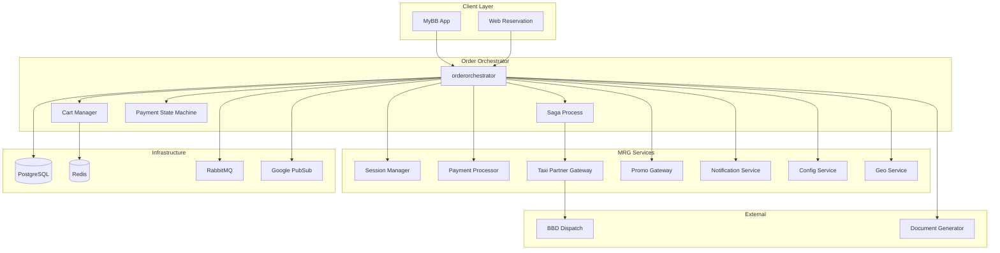

---
tags:
  - dependency
  - orderorchestrator
  - architecture
  - saga
  - mrg
type: dependency-map
title: Order Orchestrator - Dependencies
parent: orderorchestrator
---
# Order Orchestrator - Dependencies

**Service**: [[README|Order Orchestrator]]  
**Type**: Dependency Map

---

## 🔄 Dependency Diagram



---

## 📊 Dependencies Detail

### Internal Services

| Service | Client | Version | Purpose |
|---------|--------|---------|---------|
| **Session Manager** | `grpc-client` | v1.5.41 | Fleet search session, pricing data |
| **Payment Processor** | `paymentprocessorclient` | v1.0.0 | Payment link, status, refund |
| **Taxi Partner Gateway** | `taxipartnergatewayclient` | v1.0.0 | Order taxi via BBD |
| **Promo Gateway** | `grpc-client` | v1.5.41 | Promo validation, calculation |
| **Notification Service** | `grpc-client` | v1.5.41 | Email/SMS/Push notifications |
| **Config Service** | `grpc-client` | v1.5.41 | Dynamic configuration |
| **Geo Service** | `grpc-client` | v1.5.41 | Location services |

### Infrastructure Dependencies

| Component | Purpose | Configuration |
|-----------|---------|---------------|
| **PostgreSQL** | Booking, payment, order storage | `DB_HOST`, `DB_PORT`, `DB_NAME` |
| **Redis** | Cart cache, session data | `REDIS_HOST`, `REDIS_PORT` |
| **RabbitMQ** | Event publishing | `RABBITMQ_URI` |
| **Google PubSub** | Async messaging | `PUBSUB_PROJECT_ID` |

### External Services

| Service | Purpose | Configuration |
|---------|---------|---------------|
| **Document Generator** | Receipt PDF generation | `DOCUMENT_GENERATOR_HOST` |

---

## 🔌 Repository Interfaces

### Main Repository
```go
type Repository struct {
    SessionManager     repoiface.SessionManager
    Redis              repoiface.Redis
    DB                 DB
    Notification       repoiface.Notification
    PromoGateway       repoiface.PromoGateway
    ConfigService      repoiface.ConfigService
    PaymentProcessor   repoiface.PaymentProcessor
    TaxiPartnerGateway repoiface.TaxiPartnerGateway
    MessageBroker      repoiface.MessageBroker
    GeoService         repoiface.GeoService
}
```

### Database Repositories
```go
type DB struct {
    Trx              repoiface.Trx              // Transaction management
    Booking          repoiface.Booking          // Booking CRUD
    Payment          repoiface.Payment          // Payment CRUD
    Promo            repoiface.Promo            // Promo CRUD
    OrderItem        repoiface.OrderItem        // Order items
    RideDetail       repoiface.RideDetail       // Taxi/ride details
    RentDetail       repoiface.RentDetail       // Rental details
    VehicleInfo      repoiface.VehicleInfo      // Vehicle/driver info
    FareComponent    repoiface.FareComponent    // Fare breakdown
    PassengerInfo    repoiface.PassengerInfo    // Passenger data
    ServicesFee      repoiface.ServicesFee      // Fee config
    ServicesFeeRules repoiface.ServicesFeeRules // Fee rules
    OrderServiceFees repoiface.OrderServiceFees // Applied fees
}
```

### Session Manager Interface
```go
type SessionManager interface {
    GetSession(ctx context.Context, sessionID string) (*Session, error)
    GetFleetDetail(ctx context.Context, sessionID, fleetID string) (*Fleet, error)
}
```

### Payment Processor Interface
```go
type PaymentProcessor interface {
    RequestPaymentLink(ctx context.Context, req *PaymentLinkRequest) (*PaymentLinkResponse, error)
    GetPaymentStatus(ctx context.Context, paymentID string) (*PaymentStatus, error)
    RequestRefund(ctx context.Context, paymentID string) error
    CancelPayment(ctx context.Context, paymentID string) error
}
```

### Taxi Partner Gateway Interface
```go
type TaxiPartnerGateway interface {
    OrderTaxi(ctx context.Context, req *OrderTaxiRequest) (*OrderTaxiResponse, error)
    CancelOrder(ctx context.Context, orderID int64, reason string) error
    GetOrderDetail(ctx context.Context, orderID int64) (*Order, error)
}
```

### Promo Gateway Interface
```go
type PromoGateway interface {
    ValidatePromo(ctx context.Context, code string, amount float64) (*PromoValidation, error)
    ReservePromo(ctx context.Context, code, bookingID string) error
    RedeemPromo(ctx context.Context, code, bookingID string) error
    ReleasePromo(ctx context.Context, code, bookingID string) error
}
```

### Notification Interface
```go
type Notification interface {
    SendEmail(ctx context.Context, req *EmailRequest) error
    SendSMS(ctx context.Context, req *SMSRequest) error
    SendPush(ctx context.Context, req *PushRequest) error
}
```

### Message Broker Interface
```go
type MessageBroker interface {
    Publish(ctx context.Context, topic string, message interface{}) error
    Subscribe(topic string, handler MessageHandler) error
}
```

---

## 📤 Upstream Services (Clients)

Services/channels yang memanggil Order Orchestrator:

| Client | Purpose | Methods Used |
|--------|---------|--------------|
| **MyBB App** | Mobile app booking | `CreateCart`, `AddCartItem`, `CreateOrder`, `GetBookingDetail` |
| **Web Reservation** | Web booking | `CreateOrderWeb`, `GetOrderDetailWeb`, `PromoValidate` |
| **Payment Processor** | Payment webhooks | `CallbackPaymentInformation` |
| **Partner Services** | Order updates | `CallbackOrderItem` |
| **Document Generator** | Receipt callback | `CallbackReceipt` |

---

## ⚙️ Configuration

### Service Connections

| Service | Host Env | Port Env |
|---------|----------|----------|
| Session Manager | `SESSION_MANAGER_HOST` | `SESSION_MANAGER_PORT` |
| Payment Processor | `PAYMENTPROCESSOR_HOST` | `PAYMENTPROCESSOR_PORT` |
| Taxi Partner Gateway | `TAXIPARTNERGATEWAY_HOST` | `TAXIPARTNERGATEWAY_PORT` |
| Promo Gateway | `PROMOGATEWAY_HOST` | `PROMOGATEWAY_PORT` |
| Notification | `NOTIFICATION_HOST` | `NOTIFICATION_PORT` |
| Config Service | `CONFIGSERVICE_HOST` | `CONFIGSERVICE_PORT` |
| Geo Service | `GEOSERVICE_HOST` | `GEOSERVICE_PORT` |

### Database Configuration

| Setting | Env Variable |
|---------|--------------|
| Host | `DB_HOST` |
| Username | `DB_USERNAME` |
| Password | `DB_PASSWORD` |
| Port | `DB_PORT` |
| Database | `DB_NAME` |
| SSL Mode | `DB_SSL_MODE` |
| Max Idle Conns | `MAX_IDLE_CONNS` |
| Max Open Conns | `MAX_OPEN_CONNS` |

### Redis Configuration

| Setting | Env Variable |
|---------|--------------|
| Host | `REDIS_HOST` |
| Port | `REDIS_PORT` |
| Password | `REDIS_PASSWORD` |
| Database | `REDIS_DB` |

### Message Broker Configuration

| Setting           | Env Variable                        |
| ----------------- | ----------------------------------- |
| RabbitMQ URI      | `RABBITMQ_URI`                      |
| Gorooster Topic   | `RABBITMQ_GOROOSTER_TOPIC_NAME`     |
| Email V2 Topic    | `RABBITMQ_SEND_EMAIL_V2_TOPIC_NAME` |
| PubSub Host       | `PUBSUB_EMULATOR_HOST_PORT`         |
| PubSub Credential | `PUBSUB_CREDENTIAL`                 |
| PubSub Project    | `PUBSUB_PROJECT_ID`                 |

### Payment Limits

| Setting | Env Variable | Default |
|---------|--------------|---------|
| Payment Wait Duration | `DURATION_WAITING_FOR_PAYMENT` | 30m |
| Checkout Timeout | `PAYMENT_CHECKOUT_TIMEOUT` | 120s |
| CC Concurrent Limit | `MAX_CREDIT_CARD_CONCURRENT_BOOKINGS` | 2 |
| CC Daily Budget | `MAX_CREDIT_CARD_DAILY_BUDGET` | 2000000 |
| E-Wallet Limits | `MAX_*_CONCURRENT_BOOKING` | 2 |
| Min Remaining Budget | `MINIMUM_REMAINING_BUDGET` | 20000 |

---

## 📦 External Libraries

### Core Dependencies

| Library | Version | Purpose |
|---------|---------|---------|
| `grpc` | v1.77.0 | gRPC framework |
| `grpc-gateway` | v2.27.3 | REST gateway |
| `go-redis` | v8.11.5 | Redis client |
| `qb-postgresql` | v1.6.4 | PostgreSQL utilities |
| `watermill` | v1.4.2 | Message broker abstraction |

### Bluebird Internal

| Library | Version | Purpose |
|---------|---------|---------|
| `aphrodite` | v1.10.1 | Common framework |
| `grpc-client` | v1.5.41 | gRPC client utilities |
| `commonmessaging` | v0.1.35 | Message broker helpers |
| `bluebird-chassis` | v0.3.6 | Service chassis |

### Message Brokers

| Library | Purpose |
|---------|---------|
| `watermill-amqp` | RabbitMQ integration |
| `watermill-googlecloud` | PubSub integration |
| `watermill-kafka` | Kafka integration |

### Monitoring

| Library | Version | Purpose |
|---------|---------|---------|
| `elastic-apm` | v2.7.2 | APM monitoring |
| `prometheus` | v1.23.2 | Metrics |

---

## 🔄 Event Publishing

### Published Events

| Topic | Event | Description |
|-------|-------|-------------|
| `gorooster` | `transaction.created` | New booking created |
| `gorooster` | `payment.status_updated` | Payment status change |
| `gorooster` | `booking.confirmed` | All services confirmed |
| `gorooster` | `booking.failed` | Saga compensation triggered |
| `send_email_v2` | Email payload | Email notifications |

---

## 🏷️ Tags

#dependency #orderorchestrator #architecture #saga #mrg

---

*Last Updated*: 2025-01-05
