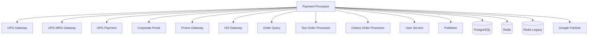

---
tags:
  - mrg
  - dependencies
  - integration
  - payment
  - architecture
type: technical-documentation
title: Payment Processor Dependencies
created: '2025-01-07'
updated: '2025-01-07'
---
# Payment Processor - Dependencies

Dokumentasi lengkap dependencies dan integrasi Payment Processor service.

---

## 🔗 Internal Service Dependencies

### UPG Gateway
**Type**: gRPC Client  
**Purpose**: Universal payment gateway untuk credit card dan e-wallet integration  
**Client Library**: `upggatewayclient v0.0.23`

**Used For**:
- Credit card tokenization
- Credit card charging
- E-wallet payment processing
- Payment method registration
- Payment token generation

**Key Methods**:
```go
- RegisterCreditCard()
- ChargeCreditCard()
- VoidTransaction()
- GetPaymentStatus()
- ProcessEwalletPayment()
```

---

### UPG MRG Gateway
**Type**: gRPC Client  
**Purpose**: UPG gateway khusus untuk MRG domain dengan signature verification

**Used For**:
- MRG-specific payment processing
- Signature-based request validation
- MRG payment method handling

**Key Methods**:
```go
- ProcessMRGPayment()
- VerifySignature()
- GetMRGPaymentStatus()
```

**Signature Implementation**:
```go
// repository/upgmrggateway/signature.go
func GenerateSignature(payload string, timestamp int64) string
```

---

### UPG Payment
**Type**: gRPC Client  
**Purpose**: Core UPG payment processing service

**Used For**:
- Direct payment processing
- Payment completion
- Payment cancellation
- Refund processing

**Endpoints**:
```go
// repository/upgpayment/endpoints.go
- CompletePayment
- CancelPayment
- RefundPayment
- GetPaymentDetails
```

---

### Corporate Portal (CP)
**Type**: gRPC Client  
**Purpose**: Corporate voucher and employee benefit management  
**Client Library**: `cpclient v1.1.1`

**Used For**:
- ECV (E-Corporate Voucher) verification
- Corporate policy validation
- Employee benefit checking
- Company code validation
- Cost center verification

**Key Methods**:
```go
- VerifyECV()
- GetCompanyPolicy()
- ValidatePolicy()
- CheckBalance()
- ReserveAmount()
- CompleteTransaction()
- VoidTransaction()
```

**Endpoints**:
```go
// repository/corpportal/endpoints.go
- /api/v1/ecv/verify
- /api/v1/policy/get
- /api/v1/policy/validate
- /api/v1/balance/check
```

---

### Promo Gateway
**Type**: gRPC Client  
**Purpose**: Promo code management dan redemption  
**Client Library**: `promogatewayclient v1.1.16`

**Used For**:
- Promo code validation
- Promo redemption
- Discount calculation
- Budget reservation
- Promo eligibility check
- Marketing promo validation

**Key Methods**:
```go
- ValidatePromo()
- RedeemPromo()
- CalculateDiscount()
- ReserveBudget()
- RemoveReservedBudget()
- CheckEligibility()
```

---

### HOGateway
**Type**: gRPC Client  
**Purpose**: Hold-on gateway untuk payment yang tertunda

**Used For**:
- HO transaction processing
- Payment hold management
- Delayed payment completion
- HO transaction cancellation

**Endpoints**:
```go
// repository/hogateway/endpoints.go
- ProcessHOTransaction
- CompleteHOTransaction
- CancelHOTransaction
- GetHOStatus
```

---

### Order Query
**Type**: gRPC Client  
**Purpose**: Query order information dan history  
**Client Library**: `orderqueryclient v1.0.4`

**Used For**:
- Get order details
- Order history lookup
- Order status check
- Trip information retrieval

**Key Methods**:
```go
- GetOrderByID()
- GetOrderHistory()
- GetOrderStatus()
- GetTripDetails()
```

---

### Taxi Order Processor (TOP)
**Type**: gRPC Client  
**Purpose**: Taxi order processing dan driver management  
**Client Library**: `topclient v0.0.15`

**Used For**:
- Driver information
- Order processing status
- Driver payout information
- Trip completion data

**Key Methods**:
```go
- GetDriverInfo()
- GetOrderStatus()
- UpdatePaymentStatus()
```

---

### Citrans Order Processor (COP)
**Type**: gRPC Client  
**Purpose**: Citrans (city transport) order processing  
**Client Library**: `copclient v0.0.9`

**Used For**:
- Citrans order information
- Citrans payment processing
- Service-specific validation

---

### User Service
**Type**: gRPC Client  
**Purpose**: User profile dan payment method management  
**Client Library**: `userclient v0.0.20`

**Used For**:
- Get user profile
- Get user payment methods
- Update payment method
- Payment method validation

**Key Methods**:
```go
- GetUserProfile()
- GetPaymentMethods()
- UpdateDefaultPayment()
- ValidatePaymentMethod()
```

---

### Publisher
**Type**: gRPC Client  
**Purpose**: Event publishing ke PubSub

**Used For**:
- Publish payment events
- Transaction status updates
- Notification triggers
- Event broadcasting

**Key Methods**:
```go
- PublishPaymentEvent()
- PublishTransactionStatus()
- PublishNotification()
```

---

## 📦 Infrastructure Dependencies

### PostgreSQL
**Type**: Database  
**Purpose**: Main data storage

**Tables**:
```sql
-- transactions
- Core transaction data
- Payment information
- Transaction status
- Amount details

-- tx_error_log_detail  
- Transaction error logs
- Debugging information
- Gateway responses
- Retry attempts
```

**Configuration**:
```env
DB_HOST=
DB_HOST_READ=              # Read replica
DB_USERNAME=
DB_PASSWORD=
DB_SSL_MODE=
DB_PORT=5432
DB_NAME=payment_processor
```

---

### Redis (Primary)
**Type**: Cache  
**Purpose**: Session cache, rate limiting, temporary data

**Use Cases**:
- Payment token caching
- Session management
- Rate limiting counters
- Temporary reservation data
- Quick status lookup

**Configuration**:
```env
REDIS_HOST=
REDIS_PORT=6379
REDIS_PASSWORD=
REDIS_DB=0
REDIS_URL=redis://...
```

**Repository Interface**:
```go
type Redis interface {
    Set(key string, value interface{}, ttl time.Duration) error
    Get(key string) (string, error)
    Delete(key string) error
    Exists(key string) bool
    SetNX(key string, value interface{}, ttl time.Duration) bool
}
```

---

### Redis Legacy
**Type**: Cache  
**Purpose**: Legacy redis untuk backward compatibility

**Use Cases**:
- Legacy data format support
- Migration transition period
- Old system integration

**Configuration**:
```env
REDIS_LEGACY_URL=redis://...
```

---

### Google PubSub
**Type**: Message Queue  
**Purpose**: Asynchronous event processing

**Topics**:
- `payment.transaction.completed`
- `payment.transaction.cancelled`
- `payment.transaction.refunded`
- `payment.ho.transaction`
- `payment.ecv.transaction`

**Subscriptions**:
- `payment-processor-ho-transaction-sub`
- `payment-processor-ecv-transaction-sub`
- `payment-processor-refund-webhook-sub`

**Configuration**:
```env
PROJECT_ID=mybluebird
PUBSUB_EMULATOR_HOST=        # For local dev
GOOGLE_APPLICATION_CREDENTIALS=cert/pubsub.json
BROKER_CONFIG=cert/broker_config.yaml
```

**PubSub Clients**:
```go
// repository/pubsub/
- payment_client.go       // Payment events
- order_client.go         // Order events
- user_client.go          // User events
- notif_client.go         // Notification events
```

---

## 📚 Go Module Dependencies

### Core Dependencies

```go
// Framework & Infrastructure
git.bluebird.id/mybb-ms/aphrodite v1.9.32
git.bluebird.id/golang-core/bluebird-chassis v0.3.2
git.bluebird.id/mybb-ms/commonmessaging v0.1.28

// gRPC & Protocol
google.golang.org/grpc v1.75.1
google.golang.org/protobuf v1.36.10
github.com/grpc-ecosystem/grpc-gateway/v2 v2.15.2
github.com/grpc-ecosystem/go-grpc-middleware/v2 v2.1.0

// Database
github.com/lib/pq v1.10.9                      // PostgreSQL driver
git.bluebird.id/mybb/qb-posgresql v1.6.2       // Query builder

// Redis
github.com/go-redis/redis/v8 v8.11.5

// Cloud
cloud.google.com/go/pubsub v1.50.1

// Monitoring
go.elastic.co/apm/v2 v2.6.2                    // Elastic APM
go.elastic.co/apm/module/apmgrpc/v2 v2.6.2
go.elastic.co/apm/module/apmhttp/v2 v2.6.2

// Metrics
github.com/prometheus/client_golang v1.21.0

// Testing
go.uber.org/mock v0.2.0

// Utilities
github.com/google/uuid v1.6.0
github.com/joho/godotenv v1.5.1
github.com/hashicorp/go-version v1.7.0
golang.org/x/exp v0.0.0-20250106191152-7588d65b2ba8
```

---

## 🔄 Service Integration Flow

### Payment Completion Flow

```
1. Client Request
   ↓
2. Payment Processor (ValidateInput)
   ↓
3. Check Redis Cache (balance, payment method)
   ↓
4. UPG Gateway (process payment)
   ↓
5. Save to PostgreSQL (transaction record)
   ↓
6. Publish Event (PubSub)
   ↓
7. Update Order Query (order status)
   ↓
8. Notify User Service (payment status)
   ↓
9. Response to Client
```

### Promo Redemption Flow

```
1. Client Request (promo code)
   ↓
2. Promo Gateway (validate promo)
   ↓
3. Promo Gateway (calculate discount)
   ↓
4. Promo Gateway (reserve budget)
   ↓
5. Payment Processor (reserve balance)
   ↓
6. Payment Processor (complete transaction)
   ↓
7. Promo Gateway (redeem promo)
   ↓
8. Response to Client
```

### ECV Payment Flow

```
1. Client Request
   ↓
2. Corporate Portal (verify ECV)
   ↓
3. Corporate Portal (get policy)
   ↓
4. Corporate Portal (validate policy)
   ↓
5. Corporate Portal (reserve balance)
   ↓
6. Payment Processor (start transaction)
   ↓
7. Corporate Portal (complete transaction)
   ↓
8. Save to PostgreSQL
   ↓
9. Publish Event (PubSub)
   ↓
10. Response to Client
```

---

## 🔧 Repository Structure

```go
type Repository struct {
    // Database
    DB PaymentDB
    
    // Cache
    Redis       repoiface.Redis
    RedisLegacy repoiface.RedisLegacy
    
    // Payment Gateways
    UPGGateway      repoiface.UPGGateway
    UPGMRGGateway   repoiface.UPGMRGGateway
    UPGPayment      repoiface.UPGPayment
    
    // Corporate
    CorpPortal      repoiface.CorpPortal
    
    // Business Logic Services
    PromoGateway    repoiface.PromoGateway
    HOGateway       repoiface.HOGateway
    
    // Domain Services
    OrderQuery            repoiface.OrderQuery
    TaxiOrderProcessor    repoiface.TaxiOrderProcessor
    CitransOrderProcessor repoiface.CitransOrderProcessor
    UserService           repoiface.UserService
    
    // Messaging
    Publisher repoiface.Publisher
    PubSub    repoiface.PubSub
}

type PaymentDB struct {
    Transactions     repoiface.PaymentDB
    TxErrorLogDetail repoiface.PaymentDB
}
```

---

## 📊 Dependency Graph



---

## 🔗 Related Documentation

- [[README|Payment Processor Overview]]
- [[api-reference|API Reference]]
- [[02-Work/Teams/MRG/00-overview/README|MRG Team Overview]]

---

## 🏷️ Tags

#mrg #dependencies #integration #payment #architecture

---

*Last Updated*: 2025-01-07
