# Service Info - Dependencies

**Service**: [[README|Service Info]]  
**Type**: Dependency Map

---

## 🔄 Dependency Diagram

```mermaid
graph TB
    subgraph "Service Info"
        SI[serviceinfo]
    end
    
    subgraph "Location & Area Services"
        LR[Location Registry]
        BBL[BB Location]
        GEO[Geo Service]
        AM[Area Management]
    end
    
    subgraph "Booking & Trip Services"
        GB[GB Gateway]
        TPG[Taxi Partner Gateway]
        SM[Session Manager]
        ODRD[ODRD]
        ETA[ETA ODRD]
    end
    
    subgraph "Pricing & Payment Services"
        PG[Promo Gateway]
        PM[Price Manager]
        PE[Price Engine]
        UPG[UPG Gateway]
        PP[Payment Processor]
        FS[Fare Service]
    end
    
    subgraph "Partner Integration"
        CT[Cititrans]
        COP[COP]
    end
    
    subgraph "Content & Config"
        CP[Content Provider]
        CS[Config Service]
        US[User Service]
    end
    
    subgraph "Infrastructure"
        DB[(PostgreSQL)]
        DBL[(PostgreSQL Legacy)]
        RD[(Redis)]
        RDL[(Redis Legacy)]
    end
    
    SI --> LR
    SI --> BBL
    SI --> GEO
    SI --> AM
    SI --> GB
    SI --> TPG
    SI --> SM
    SI --> ODRD
    SI --> ETA
    SI --> PG
    SI --> PM
    SI --> PE
    SI --> UPG
    SI --> PP
    SI --> FS
    SI --> CT
    SI --> COP
    SI --> CP
    SI --> CS
    SI --> US
    SI --> DB
    SI --> DBL
    SI --> RD
    SI --> RDL
```



---

## 📊 Dependencies Detail

### Internal Services

| Service | Client Library | Version | Purpose |
|---------|----------------|---------|---------|
| GB Gateway | `gbgatewayclient` | v0.0.20 | Goldenbird booking gateway |
| Taxi Partner Gateway | `taxipartnergatewayclient` | v1.0.20 | Partner taxi integration |
| Session Manager | `sessionmanagerclient` | v0.0.52 | User session management |
| Promo Gateway | `promogatewayclient` | v1.1.16 | Promo & discount |
| Price Manager | `pricemanagerclient` | v0.0.7 | Price management |
| UPG Gateway | `upggatewayclient` | v0.0.23 | Payment gateway |
| Cititrans | `cititransclient` | v0.0.32 | Shuttle service |
| COP | `copclient` | v0.0.7 | Central operation |
| Content Provider | `contentproviderclient` | v0.1.0 | Content/assets |
| Config Service | `configseviceclient` | v0.1.3 | Configuration |
| User Service | `userclient` | v0.0.23 | User management |
| Geo Service | `geoclient` | v0.0.8 | Geocoding |
| Payment Processor | `paymentprocessorclient` | v1.1.35 | Payment processing |

### Repository Interfaces

Dari `repository/base_repository.go`:

```go
type Repository struct {
    // External Service Clients
    GBGateway              repoiface.GBGateway
    LocationRegistryClient repoiface.LocationRegistryClientIface
    TaxiPartnerGateway     repoiface.TaxiPartnerGateway
    SessionManager         repoiface.SessionManager
    PromoGateway           repoiface.PromoGateway
    ODRD                   repoiface.ODRD
    ETAODRD                repoiface.ETAODRD
    PriceManager           repoiface.PriceManager
    FareService            repoiface.FareService
    UPGGateway             repoiface.UPGGateway
    Cititrans              repoiface.Cititrans
    Cop                    repoiface.Cop
    ContentProvider        repoiface.ContentProvider
    PriceEngine            repoiface.PriceEngine
    ConfigService          repoiface.ConfigService
    BBLocation             repoiface.BBLocation
    UserService            repoiface.UserService
    GeoService             repoiface.GeoService
    PaymentProcessor       repoiface.PaymentProcessor
    AreaManagement         repoiface.AreaManagement
    
    // Database
    DB                     DB
    DBLegacy               DBLegacy
    
    // Cache
    Redis                  repoiface.Redis
    RedisLegacy            repoiface.RedisLegacy
}
```

### Database Repositories

```go
type DB struct {
    Close              func() error
    CallCenter         repoiface.CallCenterIface
    CarDetails         repoiface.CarDetailsIface
    PackageOptions     repoiface.PackageOptionsIface
    ServiceTypeMapping repoiface.ServiceTypeMappingIface
}

type DBLegacy struct {
    PackageOptions repoiface.PackageOptionsLegacyIface
}
```

---

## 🔌 Connection Configuration

### Service Hosts

| Service | Host Env | Port Env |
|---------|----------|----------|
| Location Registry | `LOCATION_REGISTRY_HOST` | `LOCATION_REGISTRY_PORT` |
| GB Gateway | `GB_GATEWAY_HOST` | `GB_GATEWAY_PORT` |
| Taxi Partner Gateway | `TAXI_PARTNER_GATEWAY_HOST` | `TAXI_PARTNER_GATEWAY_PORT` |
| Session Manager | `SESSION_MANAGER_HOST` | `SESSION_MANAGER_PORT` |
| Promo Gateway | `PROMO_GATEWAY_HOST` | `PROMO_GATEWAY_PORT` |
| Price Manager | `PRICE_MANAGER_HOST` | `PRICE_MANAGER_PORT` |
| UPG Gateway | `UPG_GATEWAY_HOST` | `UPG_GATEWAY_PORT` |
| Cititrans | `CITITRANS_HOST` | `CITITRANS_PORT` |
| Content Provider | `CONTENT_PROVIDER_HOST` | `CONTENT_PROVIDER_PORT` |
| Price Engine | `PRICE_ENGINE_HOST` | `PRICE_ENGINE_PORT` |
| Config Service | `CONFIG_SERVICE_HOST` | `CONFIG_SERVICE_PORT` |
| BB Location | `BB_LOCATION_HOST` | `BB_LOCATION_PORT` |
| User Service | `USER_SERVICE_HOST` | `USER_SERVICE_PORT` |
| Geo Service | `GEO_SERVICE_HOST` | `GEO_SERVICE_PORT` |
| Payment Processor | `PAYMENT_PROCESSOR_HOST` | `PAYMENT_PROCESSOR_PORT` |

### Infrastructure

| Component | Host Env | Port Env | Additional |
|-----------|----------|----------|------------|
| PostgreSQL | `DB_HOST` | `DB_PORT` | `DB_NAME`, `DB_USERNAME`, `DB_PASSWORD` |
| Redis | `REDIS_HOST` | `REDIS_PORT` | `REDIS_DB`, `REDIS_PASSWORD` |

---

## 🏷️ Tags

#dependency #serviceinfo #architecture #mrg

---

*Last Updated*: 2025-01-05
