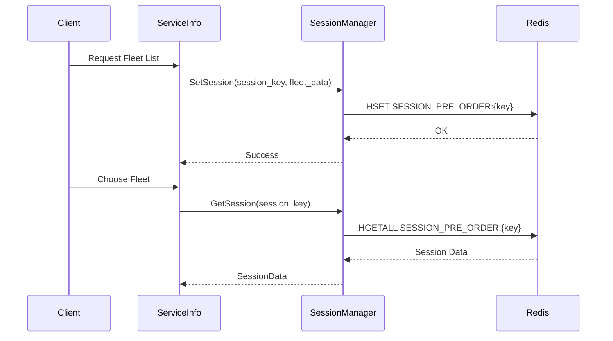
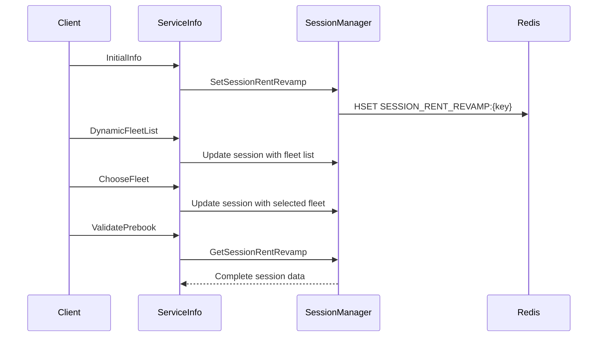

---
tags:
  - mrg
  - service
  - sessionmanager
  - redis
  - session
  - grpc
  - documentation
team: MRG
type: service-documentation
title: Session Manager
status: production
created: '2025-01-05'
updated: '2025-01-05'
repository: git.bluebird.id/mybb-ms/sessionmanager
tech_stack:
  - go
  - grpc
  - redis
grpc_port: 6027
rest_port: 8027
---
# Session Manager

**Team**: MRG (Meta Reservation Gateway)  
**Status**: ✅ Production  
**Repository**: `git.bluebird.id/mybb-ms/sessionmanager`

---

## 📋 Overview

Session Manager adalah service untuk mengelola session data pada flow booking di aplikasi MyBluebird. Service ini menyimpan state sementara selama proses booking berlangsung menggunakan Redis.

### Fungsi Utama
- **Pre-Order Session** - Menyimpan data fleet list request/response
- **EZ Pay Session** - Session untuk flow EZ Pay
- **Cititrans Session** - Session untuk booking shuttle Cititrans
- **Reschedule Session** - Session untuk reschedule booking
- **Rent Revamp Session** - Session untuk flow rental baru (hourly/daily)

---

## 🛠️ Tech Stack

| Component | Technology |
|-----------|------------|
| Language | Go 1.24 |
| Protocol | gRPC + REST (gRPC-Gateway) |
| Database | - |
| Cache | Redis |
| Monitoring | Elastic APM, Prometheus |
| Container | Docker, Kubernetes |

---

## 🔌 Dependencies

### Infrastructure Only

| Component | Purpose |
|-----------|---------|
| **Redis** | Session storage (primary data store) |

### Repository Structure

```go
type Repository struct {
    Redis          repoiface.Redis
    TokenGenerator repoiface.TokenGenerator
}
```

> **Note**: Session Manager adalah service yang sangat lightweight - hanya bergantung pada Redis untuk storage.

---

## 📡 API Contracts

### gRPC Service

**Package**: `sessionmanager`  
**Proto File**: `contract/session-manager.proto`  
**Ports**: gRPC `6027`, REST `8027`

### Methods Overview

| Method | Description | Interceptors |
|--------|-------------|--------------|
| `HealthCheck` | Health check endpoint | - |
| `SetSession` | Set pre-order session | ValidateInput |
| `GetSession` | Get pre-order session | ValidateInput |
| `DeleteSession` | Delete pre-order session | ValidateInput |
| `SetSessionEZPay` | Set EZ Pay session | ValidateInput |
| `GetSessionEZPay` | Get EZ Pay session | ValidateInput |
| `DeleteSessionEZPay` | Delete EZ Pay session | ValidateInput |
| `SetSessionCititrans` | Set Cititrans session | ValidateInput |
| `GetSessionCititrans` | Get Cititrans session | ValidateInput |
| `SetSessionReschedule` | Set reschedule session | ValidateInput |
| `GetSessionReschedule` | Get reschedule session | ValidateInput |
| `SetSessionRentRevamp` | Set rent revamp session | ValidateInput |
| `GetSessionRentRevamp` | Get rent revamp session | ValidateInput |
| `DeleteSessionRentRevamp` | Delete rent revamp session | ValidateInput |

---

## 🗄️ Redis Schema

### Session Contexts (Keys)

| Context | Redis Key Pattern | Purpose |
|---------|-------------------|---------|
| Pre-Order | `SESSION_PRE_ORDER:{session_key}` | Fleet list booking |
| EZ Pay | `SESSION_PRE_ORDER_EZ_PAY:{session_key}` | EZ Pay validation |
| Cititrans | `SESSION_PRE_ORDER_CITITRANS:{session_key}` | Shuttle booking |
| Reschedule | `SESSION_RESCHEDULE:{session_key}` | Order reschedule |
| Rent Revamp | `SESSION_RENT_REVAMP:{session_key}` | Rental booking |

### Session Fields

#### Pre-Order Session
```
FLEET_LIST_REQUEST
FLEET_LIST_RESPONSE
STRIKETHROUGH_PROMO_RESPONSE
```

#### EZ Pay Session
```
ValidateEZPayRequest
ValidateEZPayResponse
BBDVehicleInfoResponse
```

#### Cititrans Session
```
SESSION_DATA
SCHEDULE_LIST_REQUEST
SCHEDULE_LIST_RESPONSE
```

#### Rent Revamp Session
```
DYNAMIC_FLEET_LIST_REQUEST
DYNAMIC_FLEET_LIST_RESPONSE
FLEET_ID
SELECTED_FLEET
UPSELL_FLEET_RESPONSE
RECALCULATE_RENT_PRICE_REQUEST
RECALCULATE_RENT_PRICE_RESPONSE
VALIDATE_PREBOOK_REQUEST
VALIDATE_PREBOOK_RESPONSE
RENT_ORDER_CONFIRMATION_REQUEST
RENT_ORDER_CONFIRMATION_RESPONSE
CONTACT_INFORMATION
PASSENGER_INFORMATION
SELECTED_PICKUP
SELECTED_DROPOFF
```

### TTL Configuration
- Default: `15 minutes` (configurable via `SESSION_TTL`)
- Lock timeout: `3 seconds`

---

## ⚙️ Configuration

### Environment Variables

```env
# Application
APP_NAME=mybb-session-manager
GRPC_PORT=6027
REST_PORT=8027
LOG_LEVEL=info
LOG_DIRECTORY=

# Redis
REDIS_HOST=""
REDIS_PORT=6379
REDIS_DATABASE=5
REDIS_PASSWORD=""
SESSION_TTL=15m

# Elastic APM
ELASTIC_APM_CLOUD_PROVIDER=""
ELASTIC_APM_ENVIRONMENT=staging
ELASTIC_APM_SECRET_TOKEN=""
ELASTIC_APM_SERVER_TIMEOUT="30s"
ELASTIC_APM_SERVER_URL=http://172.26.20.58:8200 
ELASTIC_APM_SERVICE_NAME=mybb-session-manager
```

---

## 📂 Project Structure

```
sessionmanager/
├── main.go                    # Entry point
├── go.mod                     # Dependencies
├── Dockerfile                 # Container build
├── Jenkinsfile                # CI/CD pipeline
│
├── config/                    # Configuration
│   ├── default.go
│   ├── logger/
│   └── repository/
│
├── constants/                 # Constants
│   └── redis.go               # Redis keys & contexts
│
├── contract/                  # API contracts
│   ├── session-manager.proto
│   ├── session-manager.pb.go
│   ├── session-manager_grpc.pb.go
│   ├── session-manager.pb.gw.go
│   └── session-manager.swagger.json
│
├── repository/                # Data access layer
│   ├── base_repository.go
│   ├── repoiface/             # Interfaces
│   ├── repomock/              # Mocks
│   ├── redis/                 # Redis implementation
│   └── tokenGenerator/        # Token generation
│
├── usecase/                   # Business logic
│   ├── base_usecase.go
│   ├── set_session.go
│   ├── get_session.go
│   ├── delete_session.go
│   ├── set_session_ezpzy.go
│   ├── get_session_ezpay.go
│   ├── delete_session_ez_pay.go
│   ├── set_session_cititrans.go
│   ├── get_session_cititrans.go
│   ├── set_session_rent_revamp.go
│   ├── get_session_rent_revamp.go
│   ├── delete_session_rent_revamp.go
│   ├── set_session_reschedule.go
│   ├── get_session_reschedule.go
│   └── health_check.go
│
├── transport/                 # Transport layer
│   ├── base_transport.go
│   └── ... (handlers)
│
├── server/                    # Server setup
│   ├── grpc.go
│   ├── rest.go
│   └── metric.go
│
├── util/                      # Utilities
│   ├── error/
│   ├── interceptor/
│   ├── response.go
│   └── server.go
│
└── k8s/                       # Kubernetes manifests
    ├── deployment.yaml
    ├── service.yaml
    ├── gcp-application.yaml
    └── huawei-application.yaml
```

---

## 🔗 Service Relationships

### Downstream (Services yang memanggil Session Manager)

| Service | Purpose |
|---------|---------|
| **Service Info** | Store/retrieve fleet list session |
| **Booking Service** | Store/retrieve booking session |
| **Order Service** | Store/retrieve order session |

### Client Library
- `git.bluebird.id/mybb-ms/lib/sessionmanagerclient` v0.0.52

---

## 📊 Session Flow Diagrams

### Pre-Order Session Flow


### Rent Revamp Session Flow


---

## 🔗 Related Documentation

- [[README|Service Info]] - Primary consumer of Session Manager
- [[02-Work/Teams/MRG/00-overview/README|MRG Team Overview]]

---

## 🏷️ Tags

#mrg #service #sessionmanager #redis #session #grpc #documentation

---

*Last Updated*: 2025-01-05  
*Generated from*: Repository analysis
