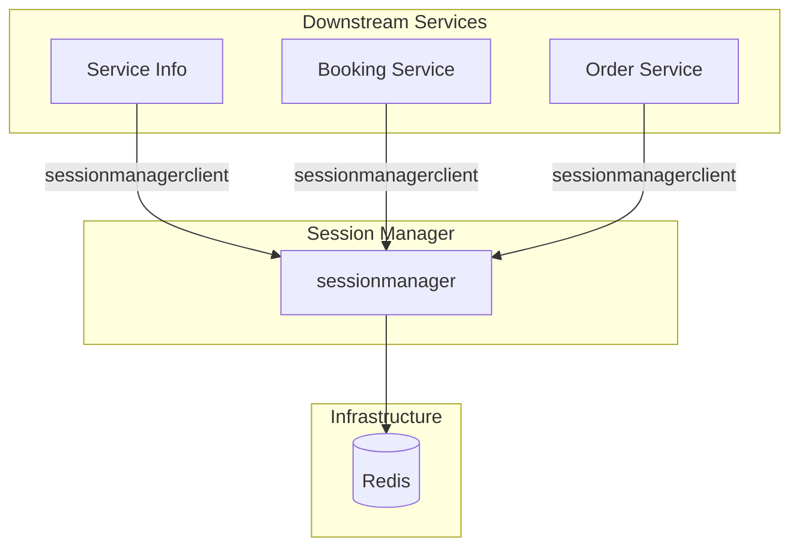

---
tags:
  - dependency
  - sessionmanager
  - architecture
  - mrg
  - redis
type: dependency-map
title: Session Manager - Dependencies
parent: sessionmanager
---
# Session Manager - Dependencies

**Service**: [[README|Session Manager]]  
**Type**: Dependency Map

---

## 🔄 Dependency Diagram



---

## 📊 Dependencies Detail

### Infrastructure Dependencies

| Component | Purpose | Configuration |
|-----------|---------|---------------|
| **Redis** | Session storage | `REDIS_HOST`, `REDIS_PORT`, `REDIS_DATABASE` |

### No External Service Dependencies

Session Manager adalah service yang **sangat lightweight** dan hanya bergantung pada:
1. **Redis** - Untuk menyimpan session data
2. **Token Generator** - Internal utility untuk generate session key

---

## 🔌 Repository Interfaces

```go
type Repository struct {
    Redis          repoiface.Redis
    TokenGenerator repoiface.TokenGenerator
}
```

### Redis Interface

```go
type Redis interface {
    // Session operations
    HSet(ctx context.Context, key string, values ...interface{}) error
    HGetAll(ctx context.Context, key string) (map[string]string, error)
    Del(ctx context.Context, keys ...string) error
    Expire(ctx context.Context, key string, expiration time.Duration) error
    
    // Health check
    Ping(ctx context.Context) error
}
```

### Token Generator Interface

```go
type TokenGenerator interface {
    Generate() string
}
```

---

## 📤 Downstream Services (Clients)

Services yang menggunakan Session Manager:

| Service | Client Library | Version | Purpose |
|---------|----------------|---------|---------|
| Service Info | `sessionmanagerclient` | v0.0.52 | Fleet list session |
| Booking Service | `sessionmanagerclient` | v0.0.52 | Booking flow session |
| Order Service | `sessionmanagerclient` | v0.0.52 | Order session |

### Client Usage Example

```go
import (
    "git.bluebird.id/mybb-ms/lib/sessionmanagerclient"
)

// Initialize client
client := sessionmanagerclient.NewClient(
    sessionmanagerclient.WithHost("sessionmanager-service"),
    sessionmanagerclient.WithPort(6027),
)

// Set session
err := client.SetSession(ctx, &sessionmanager.SessionData{
    SessionKey: "unique-session-key",
    FleetListRequest: request,
    FleetListResponse: response,
})

// Get session
session, err := client.GetSession(ctx, &sessionmanager.GetSessionRequest{
    SessionKey: "unique-session-key",
})
```

---

## ⚙️ Configuration

### Redis Connection

| Env Variable | Default | Description |
|--------------|---------|-------------|
| `REDIS_HOST` | - | Redis host |
| `REDIS_PORT` | 6379 | Redis port |
| `REDIS_DATABASE` | 5 | Redis database number |
| `REDIS_PASSWORD` | - | Redis password |
| `SESSION_TTL` | 15m | Session time-to-live |

---

## 🏷️ Tags

#dependency #sessionmanager #architecture #mrg #redis

---

*Last Updated*: 2025-01-05
