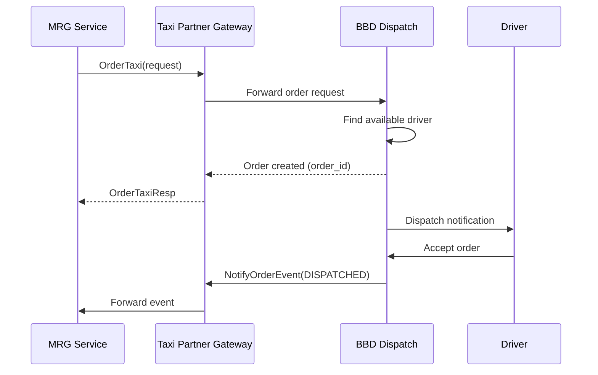
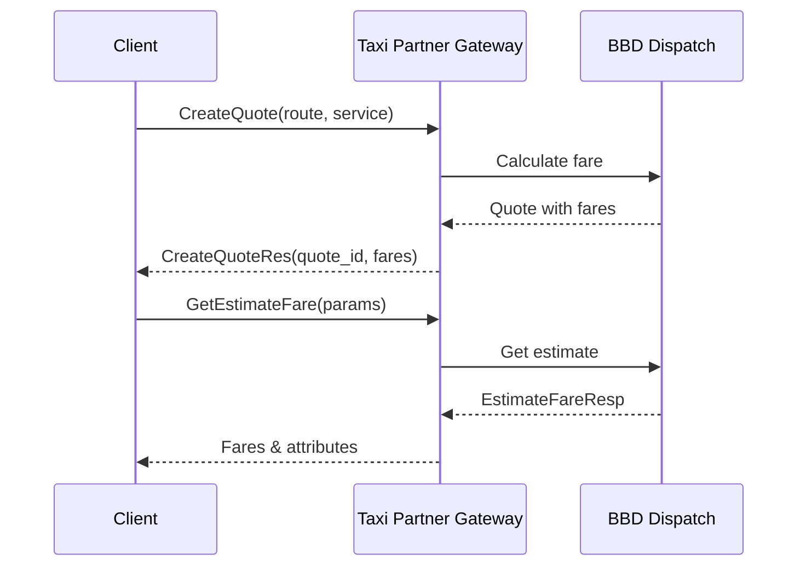

---
tags:
  - mrg
  - service
  - taxipartnergateway
  - bbd
  - dispatch
  - grpc
  - integration
  - documentation
team: MRG
type: service-documentation
title: Taxi Partner Gateway
status: production
created: '2025-01-05'
updated: '2025-01-05'
grpc_port: 6008
rest_port: 8008
repository: git.bluebird.id/mybb-ms/taxipartnergateway
tech_stack:
  - go
  - grpc
  - jwt
  - oauth2
---
# Taxi Partner Gateway

**Team**: MRG (Meta Reservation Gateway)  
**Status**: ✅ Production  
**Repository**: `git.bluebird.id/mybb-ms/taxipartnergateway`

---

## 📋 Overview

Taxi Partner Gateway adalah microservice yang berfungsi sebagai **bridge/gateway** antara sistem MRG (Meta Reservation Gateway) dengan BBD (Bluebird Dispatch). Service ini menghubungkan sistem pemesanan MyBluebird dengan sistem dispatching driver untuk proses order taxi.

### Fungsi Utama

- **Order Management** - Create order, cancel order, retry finding taxi
- **Quote Management** - Create quote, get estimate fare
- **Vehicle Tracking** - Get vacant vehicles, vehicle location, ETA
- **Driver Dispatch** - Order taxi, notify order events
- **Order Modification** - Edit partner fare, location, payment
- **Rating System** - Set order rating, get rating reviews
- **Area Management** - Get operational areas, airport detection

---

## 🛠️ Tech Stack

| Component | Technology |
|-----------|------------|
| Language | Go 1.21 |
| Protocol | gRPC + REST (gRPC-Gateway) |
| External Integration | BBD gRPC (Bluebird Dispatch) |
| Auth | JWT, OAuth2 |
| Monitoring | Elastic APM |
| Container | Docker, Kubernetes |

---

## 🔑 Konsep Utama

### 1. Order Flow (MRG → BBD)

```
MRG Request → Taxi Partner Gateway → BBD Dispatch → Driver Assignment
```

**Typical Order Flow:**
1. `CreateQuote` - Get fare estimation
2. `GetEstimateFare` - Validate pricing
3. `OrderTaxi` - Submit order to BBD
4. `NotifyOrderEvent` - Receive dispatch updates
5. `GetVehicleLocation` - Track driver location

### 2. Service Types

BBD menyediakan berbagai service type:
- **Regular Taxi** - Standard taxi service
- **Executive** - Premium taxi service  
- **Airport Transfer** - Airport pickup/dropoff
- **Rental** - Hourly rental service

### 3. Order States

| Status | Description |
|--------|-------------|
| CREATED | Order created, waiting dispatch |
| DISPATCHED | Driver assigned |
| ARRIVED | Driver arrived at pickup |
| ENGAGED | Trip started |
| COMPLETED | Trip completed |
| CANCELLED | Order cancelled |

### 4. BBD Integration

Service ini berkomunikasi dengan 3 BBD services:
- **BBD Auth** - Authentication & token management
- **BBD gRPC** - Main dispatch operations
- **BBD Area** - Area & location services

---

## 🔌 Dependencies

### External Services (BBD)

| Service | Purpose | Client Library |
|---------|---------|----------------|
| **BBD Auth** | OAuth2 authentication, token refresh | `bbdauthclient` v1.0.1 |
| **BBD gRPC** | Main dispatch operations | `bbdgrpcclient` v1.1.10 |
| **BBD Area** | Area operations, airport detection | `bbdareaclient` v0.0.3 |

### Repository Structure

```go
type Repository struct {
    BBDGrpcClient repoiface.BBDGrpcClient
    BBDAuthClient repoiface.BBDAuthClient
    BBDAreaClient repoiface.BBDAreaClient
}
```

---

## 📡 API Contracts

### gRPC Service

**Package**: `taxipartnergateway`  
**Proto File**: `contract/taxipartnergateway.proto`  
**Ports**: gRPC `6008`, REST `8008`

### Methods Overview

#### Order Operations

| Method | Description |
|--------|-------------|
| `OrderTaxi` | Create new taxi order |
| `OrderTaxiEzpay` | Create order with EzPay (street hailing) |
| `CancelOrder` | Cancel existing order |
| `RetryFindingTaxi` | Retry driver search for order |
| `GetOrderDetail` | Get order details by order ID |
| `GetOrderDetailByPartner` | Get order by partner order ID |

#### Quote & Fare

| Method | Description |
|--------|-------------|
| `CreateQuote` | Create fare quote |
| `GetEstimateFare` | Get fare estimation |
| `EditPartnerFare` | Modify order fare/promo |

#### Vehicle & Location

| Method | Description |
|--------|-------------|
| `GetVacantVehicles` | Get available vehicles in area |
| `GetVehicleLocation` | Get vehicle current location |
| `GetVehicleByVehicleNo` | Get vehicle info by plate number |
| `GetEta` | Get estimated time of arrival |

#### Order Modification

| Method | Description |
|--------|-------------|
| `EditPartnerLocation` | Update order locations |
| `EditPartnerPayment` | Update payment method |

#### Rating & Review

| Method | Description |
|--------|-------------|
| `SetOrderRating` | Submit order rating |
| `GetOrderRatingReviews` | Get rating review options |

#### Area Operations

| Method | Description |
|--------|-------------|
| `GetAreaOperationalAndAirport` | Check area & airport status |
| `GetAreaById` | Get area details by ID |

#### System

| Method | Description |
|--------|-------------|
| `HealthCheck` | Service health check |
| `SetSystemCallbackURL` | Set callback URL for events |
| `NotifyOrderEvent` | Handle order event notifications |
| `GetServices` | Get available service types |

---

## ⚙️ Configuration

### Environment Variables

```env
# Application
APP_NAME=taxi-partner-gateway
GRPC_PORT=6008
REST_PORT=8008
LOG_LEVEL=INFO
LOG_DIRECTORY=

# BBD Connection
BBD_AUTH_HOST=
BBD_AUTH_PORT=
BBD_CLIENT_HOST=
BBD_CLIENT_PORT=
BBD_AREA_HOST=
BBD_AREA_PORT=
BBD_CERT_PATH=./cert/bbd_partner.pem
BBD_GRPC_CLIENT_API_KEY=

# OAuth2 Authentication
CLIENT_ID=
RESPONSE_TYPE=
SCOPE=
USER_ID=
USER_SECRET=
EXPIRED=200000

# ETA Configuration
ETA_RADIUS=5000
ETA_NUM_NEAREST=10
ETA_TIME_UNIT=min
ETA_FORMAT=2

# APM
ELASTIC_APM_SERVER_NAME=
ELASTIC_APM_SERVER_URL=
```

---

## 📂 Project Structure

```
taxipartnergateway/
├── main.go                    # Entry point
├── go.mod                     # Dependencies
├── Dockerfile                 # Container build
├── Jenkinsfile                # CI/CD pipeline
├── README.md                  # Project documentation
│
├── cert/                      # Certificates
│   └── bbd_partner.pem        # BBD TLS certificate
│
├── config/                    # Configuration
│   ├── config_map.go          # Config management
│   ├── logger/                # Logger setup
│   └── repository/            # Repository initialization
│
├── contract/                  # API contracts
│   ├── taxipartnergateway.proto
│   ├── taxipartnergateway.pb.go
│   ├── taxipartnergateway_grpc.pb.go
│   ├── taxipartnergateway.pb.gw.go
│   ├── taxipartnergateway.swagger.json
│   └── taxipartnergateway.yaml
│
├── repository/                # Data access layer
│   ├── base_repository.go
│   ├── repoiface/             # Interfaces
│   │   ├── bbdgrpcclient.go
│   │   ├── bbdauthclient.go
│   │   └── bbdareaclient.go
│   ├── repomock/              # Mocks for testing
│   ├── bbdgrpcclient/         # BBD gRPC client
│   ├── bbdauthclient/         # BBD Auth client
│   └── bbdareaclient/         # BBD Area client
│
├── usecase/                   # Business logic
│   ├── base_usecase.go
│   ├── api_key_manager.go     # JWT/API key management
│   ├── order_taxi.go
│   ├── order_taxi_ezpay.go
│   ├── cancel_order.go
│   ├── retry_finding_taxi.go
│   ├── create_quote.go
│   ├── get_estimate_fare.go
│   ├── get_vacant_vehicles.go
│   ├── get_vehicle_location.go
│   ├── get_eta.go
│   ├── edit_partner_fare.go
│   ├── edit_partner_location.go
│   ├── edit_partner_payment.go
│   ├── get_order_detail.go
│   ├── get_order_detail_by_partner.go
│   ├── set_order_rating.go
│   ├── get_order_rating_reviews.go
│   ├── get_services.go
│   ├── get_area_by_id.go
│   ├── get_area_operational_airport.go
│   ├── notify_order_event.go
│   ├── set_system_callback_url.go
│   └── *_test.go              # Unit tests
│
├── transport/                 # Transport layer
│   ├── base_transport.go
│   └── ... (one file per endpoint)
│
├── server/                    # Server setup
│   ├── grpc.go
│   ├── rest.go
│   └── rest_option.go
│
├── util/                      # Utilities
│   ├── server.go
│   ├── interceptor/
│   └── servopt/
│
├── doc/                       # Sequence diagrams
│   ├── order_taxi_sequence_diagram.plantuml
│   ├── cancel_order_sequence_diagram.plantuml
│   ├── create_quote_sequence_diagram.plantuml
│   ├── get_estimate_fare_sequence_diagram.plantuml
│   ├── get_vacant_vehicles_sequence_diagram.plantuml
│   └── ... (15 diagrams)
│
└── k8s/                       # Kubernetes manifests
    ├── deployment.yaml
    └── service.yaml
```

---

## 🔄 Integration Flows

### Order Taxi Flow



### Quote & Estimation Flow



---

## 📊 Key Data Structures

### Order
```protobuf
message Order {
  int64 order_id = 1;
  int32 status = 2;
  OrderService service = 3;
  repeated OrderCustomer customers = 4;
  Route route = 5;
  repeated OrderPayment payments = 6;
  repeated OrderFare fares = 9;
  OrderVehicle vehicle = 14;
  OrderDriver driver = 15;
  repeated OrderEvent events = 18;
}
```

### OrderTaxiReq
```protobuf
message OrderTaxiReq {
  string request_id = 1;
  OrderService service = 2;
  OrderSchedule schedule = 3;
  repeated OrderCustomer customers = 4;
  Route route = 5;
  repeated OrderPayment payments = 6;
  repeated OrderPromo promos = 7;
  OrderPartner partner = 11;
  string quote_id = 14;
}
```

### Vehicle
```protobuf
message Vehicle {
  string vehicle_type = 1;
  string vehicle_model = 2;
  int32 passenger_seat = 3;
  string vehicle_no = 4;
  Location location = 5;
}
```

---

## 🔐 Authentication

### BBD OAuth2 Flow

1. **Initial Auth**: Use `client_id`, `user_id`, `user_secret` to get access token
2. **Token Refresh**: Auto-refresh before expiration
3. **API Key**: JWT token used for all BBD API calls

```go
// API Key Manager handles token lifecycle
type ApiKeyManager struct {
    clientID     string
    userID       string
    userSecret   string
    token        string
    expiredAt    time.Time
}
```

---

## 🔗 Related Documentation

- [[api-reference|API Reference]]
- [[dependencies|Dependencies]]
- [[02-Work/Teams/MRG/00-overview/README|MRG Team Overview]]
- [[02-Work/Teams/MRG/02-services/reservation-service/README|Reservation Service]] (upstream)

---

## 🏷️ Tags

#mrg #service #taxipartnergateway #bbd #dispatch #grpc #integration #documentation

---

*Last Updated*: 2025-01-05  
*Generated from*: Repository analysis
