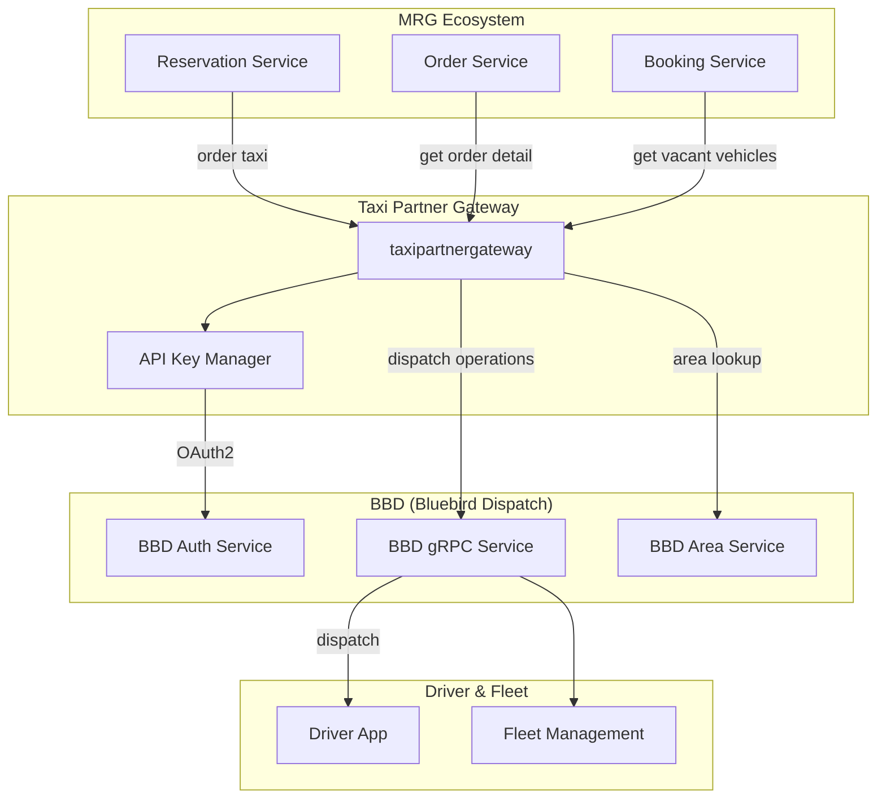
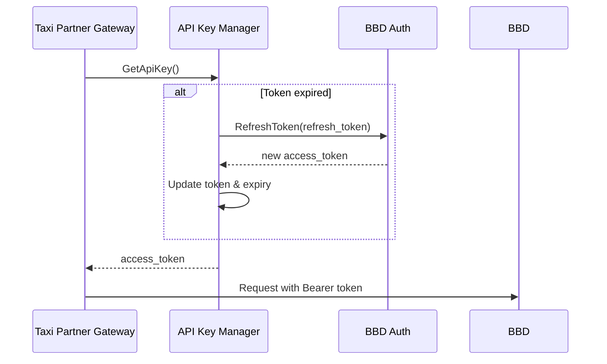

---
tags:
  - dependency
  - taxipartnergateway
  - bbd
  - dispatch
  - architecture
  - mrg
type: dependency-map
title: Taxi Partner Gateway - Dependencies
parent: taxipartnergateway
---
# Taxi Partner Gateway - Dependencies

**Service**: [[README|Taxi Partner Gateway]]  
**Type**: Dependency Map

---

## 🔄 Dependency Diagram



---

## 📊 Dependencies Detail

### External Services (BBD)

| Service | Protocol | Client Library | Version | Purpose |
|---------|----------|----------------|---------|---------|
| **BBD Auth** | gRPC | `bbdauthclient` | v1.0.1 | OAuth2 authentication, token management |
| **BBD gRPC** | gRPC | `bbdgrpcclient` | v1.1.10 | Main dispatch operations |
| **BBD Area** | gRPC | `bbdareaclient` | v0.0.3 | Area operations, airport detection |

### Client Library Details

#### bbdauthclient (v1.0.1)
```go
type BBDAuthClient interface {
    Authenticate(ctx context.Context, req *AuthRequest) (*AuthResponse, error)
    RefreshToken(ctx context.Context, refreshToken string) (*TokenResponse, error)
}
```

#### bbdgrpcclient (v1.1.10)
```go
type BBDGrpcClient interface {
    // Order Operations
    OrderTaxi(ctx context.Context, request *contract.OrderTaxiReq) (*contract.OrderTaxiResp, error)
    OrderEzpay(ctx context.Context, request *contract.OrderEzpayReq) (*contract.OrderEzpayResp, error)
    CancelOrder(ctx context.Context, request *contract.CancelOrderReq) (*contract.CancelOrderResponse, error)
    RetryFindingTaxi(ctx context.Context, request *contract.OrderIDReqID) (*contract.RetryFindingTaxiResponse, error)
    GetOrderDetail(ctx context.Context, request *contract.OrderIDReqID) (*contract.Order, error)
    GetOrderDetailByPartner(ctx context.Context, request *contract.OrderPartner) (*contract.Order, error)
    
    // Quote & Fare
    CreateQuote(ctx context.Context, request *contract.CreateQuoteReq) (*contract.CreateQuoteRes, error)
    GetEstimateFare(ctx context.Context, request *contract.EstimateFareReq) (*contract.EstimateFareResp, error)
    EditPartnerFare(ctx context.Context, request *contract.EditPartnerFareRequest) (*contract.EditPartnerFareResponse, error)
    
    // Vehicle Operations
    GetVacantVehicles(ctx context.Context, request *contract.VacantVehiclesReq) (*contract.VacantVehiclesResp, error)
    GetVehicleLocation(ctx context.Context, request *contract.OrderIDReqID) (*contract.VehicleLocationResp, error)
    GetVehicleByVehicleNo(ctx context.Context, request *contract.GetVehicleByVehicleNoRequest) (*contract.GetVehicleByVehicleNoResponse, error)
    GetEta(ctx context.Context, request *contract.GetEtaReq) (*contract.GetEtaResp, error)
    
    // Location & Payment
    EditPartnerLocation(ctx context.Context, request *contract.EditPartnerLocationRequest) (*emptypb.Empty, error)
    EditPartnerPayment(ctx context.Context, request *contract.EditPartnerPaymentRequest) (*contract.EditPartnerPaymentResponse, error)
    
    // Rating
    SetOrderRating(ctx context.Context, request *contract.SetOrderRatingRequest) (*contract.SetOrderRatingResponse, error)
    GetOrderRatingReviews(ctx context.Context, request *contract.GetOrderRatingReviewsRequest) (*contract.GetOrderRatingReviewsResponse, error)
    
    // Services
    GetServices(ctx context.Context, request *contract.GetServicesReq) (*contract.GetServicesResp, error)
    
    // System
    SetSystemCallbackURL(ctx context.Context, request *contract.SetSystemCallBackUrlRequest) (*emptypb.Empty, error)
    NotifyOrderEvent(ctx context.Context, request *contract.NotifyEvent) (*emptypb.Empty, error)
    
    // API Key
    SetApiKey(newApiKey string)
}
```

#### bbdareaclient (v0.0.3)
```go
type BBDAreaClient interface {
    GetAreaOperationalAndAirport(ctx context.Context, req *AreaRequest) (*AreaResponse, error)
    GetAreaById(ctx context.Context, req *GetAreaByIdRequest) (*Area, error)
}
```

---

## 🔌 Repository Structure

```go
type Repository struct {
    BBDGrpcClient repoiface.BBDGrpcClient
    BBDAuthClient repoiface.BBDAuthClient
    BBDAreaClient repoiface.BBDAreaClient
}
```

---

## 📤 Upstream Services (Clients)

Services yang memanggil Taxi Partner Gateway:

| Service | Purpose | Methods Used |
|---------|---------|--------------|
| **Reservation Service** | Create/manage reservations | `OrderTaxi`, `GetEstimateFare`, `GetServices` |
| **Booking Service** | Booking flow | `CreateQuote`, `GetVacantVehicles`, `GetEta` |
| **Order Service** | Order management | `GetOrderDetail`, `CancelOrder`, `EditPartnerLocation` |
| **Service Info** | Service availability | `GetServices`, `GetAreaOperationalAndAirport` |

---

## ⚙️ Configuration

### BBD Connection

| Setting | Env Variable | Description |
|---------|--------------|-------------|
| BBD Auth Host | `BBD_AUTH_HOST` | BBD Auth service host |
| BBD Auth Port | `BBD_AUTH_PORT` | BBD Auth service port |
| BBD Client Host | `BBD_CLIENT_HOST` | BBD gRPC service host |
| BBD Client Port | `BBD_CLIENT_PORT` | BBD gRPC service port |
| BBD Area Host | `BBD_AREA_HOST` | BBD Area service host |
| BBD Area Port | `BBD_AREA_PORT` | BBD Area service port |
| BBD Cert Path | `BBD_CERT_PATH` | TLS certificate path |
| BBD API Key | `BBD_GRPC_CLIENT_API_KEY` | API key for authentication |

### OAuth2 Configuration

| Setting | Env Variable | Description |
|---------|--------------|-------------|
| Client ID | `CLIENT_ID` | OAuth2 client identifier |
| User ID | `USER_ID` | Service account user ID |
| User Secret | `USER_SECRET` | Service account secret |
| Scope | `SCOPE` | OAuth2 scope |
| Response Type | `RESPONSE_TYPE` | OAuth2 response type |
| Token Expiry | `EXPIRED` | Token expiration in seconds |

### ETA Configuration

| Setting | Env Variable | Default | Description |
|---------|--------------|---------|-------------|
| Radius | `ETA_RADIUS` | 5000 | Search radius in meters |
| Num Nearest | `ETA_NUM_NEAREST` | 10 | Max vehicles for ETA |
| Time Unit | `ETA_TIME_UNIT` | "min" | Time unit (min/sec) |
| Format | `ETA_FORMAT` | 2 | Response format |

---

## 🔐 Authentication Flow

### API Key Manager

Taxi Partner Gateway mengelola JWT token untuk autentikasi ke BBD:

```go
type ApiKeyManager struct {
    authClient   BBDAuthClient
    clientID     string
    userID       string
    userSecret   string
    scope        string
    token        string
    refreshToken string
    expiredAt    time.Time
}

// Auto-refresh before expiration
func (m *ApiKeyManager) GetApiKey() (string, error) {
    if time.Now().After(m.expiredAt) {
        return m.refreshApiKey()
    }
    return m.token, nil
}
```

### Token Lifecycle



---

## 📦 External Libraries

### Core Dependencies

| Library | Version | Purpose |
|---------|---------|---------|
| `grpc` | v1.66.0 | gRPC framework |
| `grpc-gateway` | v2.16.0 | REST gateway |
| `golang-jwt` | v3.2.2 | JWT handling |
| `google-uuid` | v1.6.0 | UUID generation |

### Bluebird Internal

| Library | Version | Purpose |
|---------|---------|---------|
| `aphrodite` | v1.7.36 | Common framework |

### Monitoring

| Library | Version | Purpose |
|---------|---------|---------|
| `elastic-apm` | v2.6.2 | APM monitoring |

---

## 🔒 Security

### TLS Certificate

BBD connection menggunakan TLS dengan certificate:
```
./cert/bbd_partner.pem
```

### Token Security

- Access token di-refresh otomatis sebelum expired
- Sensitive credentials disimpan sebagai environment variables
- Token tidak di-log atau di-expose

---

## 🏷️ Tags

#dependency #taxipartnergateway #bbd #dispatch #architecture #mrg

---

*Last Updated*: 2025-01-05
