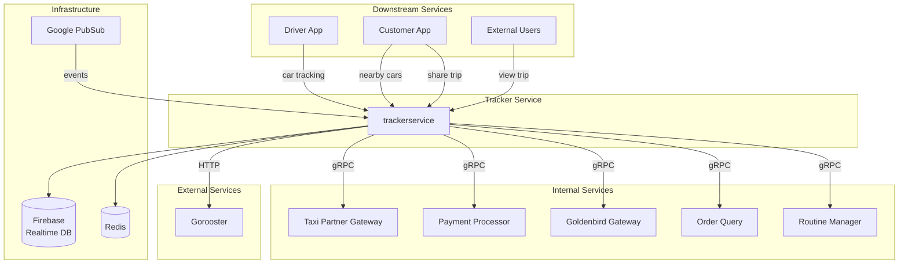

---
tags:
  - dependency
  - trackerservice
  - architecture
  - mrg
type: dependency-map
title: Tracker Service - Dependencies
parent: trackerservice
---
# Tracker Service - Dependencies

**Service**: [[README|Tracker Service]]  
**Type**: Dependency Map

---

## 🔄 Dependency Diagram



---

## 📊 Dependencies Detail

### Internal Service Dependencies

| Service | Protocol | Client Library | Version | Purpose |
|---------|----------|----------------|---------|---------|
| **Taxi Partner Gateway** | gRPC | `taxipartnergatewayclient` | v1.0.10 | Partner car availability, driver location |
| **Payment Processor** | gRPC | `paymentprocessorclient` | v1.1.15 | Payment status, e-wallet balance check |
| **Goldenbird Gateway** | gRPC | `gbgatewayclient` | v0.0.13 | Fleet management, car availability |
| **Order Query** | gRPC | `orderqueryclient` | v0.0.13 | Order details, trip information |
| **Routine Manager** | gRPC | `routinemanagerclient` | v0.0.2 | Schedule periodic tasks |

### External Service Dependencies

| Service | Protocol | Client Library | Version | Purpose |
|---------|----------|----------------|---------|---------|
| **Gorooster** | HTTP | `gorooster-client` | v1.1.4 | Event routing, webhook forwarding |

**Gorooster Endpoints**:
- `POST /forward` - Forward car tracking updates
- `POST /webhook` - Register webhook callbacks
- `GET /health` - Health check

### Infrastructure Dependencies

| Component | Purpose | Configuration |
|-----------|---------|---------------|
| **Firebase Realtime DB** | Real-time location storage & sync | `FIREBASE_URL`, `FIREBASE_AUTH_FILE` |
| **Redis** | Location cache, nearby cars cache, session storage | `REDIS_HOST`, `REDIS_PORT`, `REDIS_DB` |
| **Google PubSub** | Order state changes event stream | `PUBSUB_PROJECT_ID`, `PUBSUB_CREDENTIAL` |

---

## 🔌 Repository Interfaces

```go
type Repository struct {
    Redis            repoiface.RedisRepository
    Firebase         repoiface.Firebase
    Partner          repoiface.RepoPartnerGateway
    Gorooster        repoiface.Gorooster
    PaymentProcessor repoiface.PaymentProcessor
    GbGateway        repoiface.GbGateway
    OrderQuery       repoiface.OrderQuery
    RoutineManager   repoiface.RoutineManagerIface
}
```

### Redis Interface
```go
type RedisRepository interface {
    // Car location caching
    SetCarLocation(ctx context.Context, orderID int64, location *Location, ttl time.Duration) error
    GetCarLocation(ctx context.Context, orderID int64) (*Location, error)
    
    // Nearby cars caching
    SetNearbyCars(ctx context.Context, location *Location, serviceType int64, cars []*Car, ttl time.Duration) error
    GetNearbyCars(ctx context.Context, location *Location, serviceType int64) ([]*Car, error)
    
    // Share trip session
    SetShareSession(ctx context.Context, token string, session *ShareSession, ttl time.Duration) error
    GetShareSession(ctx context.Context, token string) (*ShareSession, error)
    DeleteShareSession(ctx context.Context, token string) error
    
    // Order state caching
    SetOrderState(ctx context.Context, orderID int64, state *OrderState, ttl time.Duration) error
    GetOrderState(ctx context.Context, orderID int64) (*OrderState, error)
    
    // Hash operations for car location
    HSet(ctx context.Context, key string, field string, value interface{}) error
    HGet(ctx context.Context, key string, field string) (string, error)
    HDel(ctx context.Context, key string, fields ...string) error
}
```

### Firebase Interface
```go
type Firebase interface {
    // Real-time location operations
    SetCarLocation(ctx context.Context, orderID int64, location *Location) error
    GetCarLocation(ctx context.Context, orderID int64) (*Location, error)
    
    // Tracking status
    SetTrackingActive(ctx context.Context, orderID int64, active bool) error
    GetTrackingActive(ctx context.Context, orderID int64) (bool, error)
    
    // Trip data
    SetTripData(ctx context.Context, orderID int64, data map[string]interface{}) error
    GetTripData(ctx context.Context, orderID int64) (map[string]interface{}, error)
    
    // Listener
    ListenToLocation(ctx context.Context, orderID int64, callback func(*Location)) error
    
    // Cleanup
    DeleteTrackingData(ctx context.Context, orderID int64) error
}
```

### Taxi Partner Gateway Interface
```go
type RepoPartnerGateway interface {
    // Get available partner cars
    GetAvailableCars(ctx context.Context, req *GetAvailableCarsRequest) ([]*Car, error)
    
    // Get specific driver location
    GetDriverLocation(ctx context.Context, driverID string) (*Location, error)
    
    // Check driver availability
    IsDriverAvailable(ctx context.Context, driverID string) (bool, error)
}
```

### Goldenbird Gateway Interface
```go
type GbGateway interface {
    // Get available GB cars
    GetAvailableCars(ctx context.Context, req *GetAvailableCarsRequest) ([]*Car, error)
    
    // Get fleet status
    GetFleetStatus(ctx context.Context, serviceType int64) (*FleetStatus, error)
    
    // Update car status
    UpdateCarStatus(ctx context.Context, carNumber string, status string) error
}
```

### Payment Processor Interface
```go
type PaymentProcessor interface {
    // Get payment status for trip
    GetPaymentStatus(ctx context.Context, orderID int64) (*PaymentStatus, error)
    
    // Check e-wallet balance
    CheckBalance(ctx context.Context, userID string) (*Balance, error)
    
    // Process payment
    ProcessPayment(ctx context.Context, req *PaymentRequest) (*PaymentResult, error)
}
```

### Order Query Interface
```go
type OrderQuery interface {
    // Get order details
    GetOrderDetails(ctx context.Context, orderID int64) (*OrderDetails, error)
    
    // Get trip information
    GetTripInfo(ctx context.Context, tripID string) (*TripInfo, error)
    
    // Check order status
    GetOrderStatus(ctx context.Context, orderID int64) (string, error)
}
```

### Gorooster Interface
```go
type Gorooster interface {
    // Forward car tracking event
    ForwardCarTracking(ctx context.Context, data *CarTrackingEvent) error
    
    // Register webhook
    RegisterWebhook(ctx context.Context, event string, url string) error
    
    // Health check
    HealthCheck(ctx context.Context) error
}
```

### Routine Manager Interface
```go
type RoutineManagerIface interface {
    // Schedule periodic task
    ScheduleTask(ctx context.Context, task *Task) error
    
    // Cancel scheduled task
    CancelTask(ctx context.Context, taskID string) error
    
    // Get task status
    GetTaskStatus(ctx context.Context, taskID string) (*TaskStatus, error)
}
```

---

## 📤 Downstream Services (Clients)

Applications yang memanggil Tracker Service:

| Client | Purpose | Common Methods |
|--------|---------|----------------|
| **Driver App** | Update location during trip | CarTracking |
| **Customer App** | View nearby cars, track driver | GetNearbyCars, Subscribe to Firebase |
| **External Users** | View shared trip (public) | Access share URL |
| **Admin Dashboard** | Monitor fleet tracking | HealthCheck, Query metrics |

---

## ⚙️ Configuration

### Service Connections

| Service | Host Env | Port Env | Additional Config |
|---------|----------|----------|-------------------|
| Taxi Partner Gateway | `TAXI_PARTNER_URL` | `TAXI_PARTNER_PORT` | - |
| Payment Processor | `PAYMENT_PROCESSOR_HOST` | `PAYMENT_PROCESSOR_PORT` | - |
| Goldenbird Gateway | `GB_GATEWAY_HOST` | `GB_GATEWAY_PORT` | - |
| Order Query | `ORDER_QUERY_HOST` | `ORDER_QUERY_PORT` | - |
| Order Query Legacy | `ORDER_QUERY_LEGACY_HOST` | `ORDER_QUERY_LEGACY_PORT` | `ORDER_QUERY_LEGACY_TOKEN` |
| Routine Manager | `ROUTINEMANAGER_HOST` | `ROUTINEMANAGER_PORT` | - |
| Gorooster | `GOROOSTER_URL` | - | `GOROOSTER_API_KEY`, `GOROOSTER_CLIENT_NAME` |

### Infrastructure

#### Firebase Configuration
```env
# Firebase Realtime Database
FIREBASE_URL=https://mybluebird-production.firebaseio.com/
FIREBASE_AUTH=xxx
FIREBASE_AUTH_FILE=cert/firebase.json

# Firebase Admin SDK
FIREBASE_DB_URL=mybluebird-production.firebaseapp.com
FIREBASE_CREDENTIAL_FILE=cert/firebase-credentials.json
```

**Firebase Database Structure**:
```
/car_tracking/
    /{order_id}/
        car_number: string
        driver_id: string
        latitude: float
        longitude: float
        timestamp: int
        accuracy: float
        tracking_active: bool
        started_at: int
        final_location: {
            latitude: float
            longitude: float
            timestamp: int
        }
```

**Firebase Security Rules**:
```json
{
  "rules": {
    "car_tracking": {
      "$order_id": {
        ".read": true,
        ".write": "auth != null"
      }
    }
  }
}
```

#### Redis Configuration
```env
REDIS_HOST=172.26.11.40
REDIS_PORT=6379
REDIS_PASSWORD=
REDIS_DB=0
```

**Redis Key Patterns**:
```
# Car location (Hash)
car_location:{order_id}
    - CAR_LOCATION_RESPONSE: location JSON
    - CAR_LOCATION_IS_SHARE: bool
    - tracking_active: bool

# Nearby cars (String)
nearby_cars:{lat}_{lng}_{service_type}
    - Value: Array of Car JSON
    - TTL: 30 seconds

# Share trip session (String)
share_trip:{token}
    - Value: ShareSession JSON
    - TTL: Until trip ends

# Share trip data (String)
share_trip_data:{token}
    - Value: Parsed order data JSON
    - TTL: Until trip ends

# Order state (Hash)
order_change:{order_id}
    - ORDER_CHANGE_RESPONSE: state JSON
    - TTL: 24 hours

# Trip summary (String)
trip_summary:{order_id}
    - Value: Trip summary JSON
    - TTL: 24 hours
```

#### Google PubSub Configuration
```env
PUBSUB_CREDENTIAL=cert/pubsub-credentials.json
PUBSUB_PROJECT_ID=mybluebird
```

**PubSub Topics & Subscriptions**:
```yaml
Topics:
  - order.state.changes
  - car.tracking.updates
  
Subscriptions:
  - name: tracker-service-order-changes
    topic: order.state.changes
    ack_deadline: 60s
    message_retention: 7d
    
  - name: tracker-service-car-tracking
    topic: car.tracking.updates
    ack_deadline: 30s
    message_retention: 1d
```

### Car Tracking Settings

```env
# Tracking duration & frequency
CAR_LOCATION_DURATION=24h
CAR_LOCATION_FREQUENCY=20s

# Gorooster forwarding
CAR_TRACKING_URL=http://gorooster-forwarder:8022/trackerservice/car-tracking
```

**Tracking Parameters**:
- **Update Frequency**: Every 20 seconds (driver app sends location)
- **Tracking Duration**: 24 hours maximum per trip
- **Significant Change**: >10 meters before updating Firebase
- **Location Accuracy**: Target ±10 meters

### Nearby Cars Settings

```env
NEARBY_CAR_RADIUS_GB=200.0
NEARBY_CAR_LIMIT_GB=10
ODD_EVENT_TYPE=ALL
```

**Search Parameters**:
- **Radius**: 200 meters (configurable)
- **Limit**: 10 cars maximum
- **Cache TTL**: 30 seconds
- **Service Types**: 1=Regular, 2=Premium, 3=Executive

### Share Trip Settings

```env
ODRD_SHARE_TRIP_HOST=https://odrd.mybluebird.id
SHARE_TRIP_HOST=https://share.mybluebird.id
```

**Share Trip Configuration**:
- **Token**: UUID v4 format
- **URL Format**: `https://share.mybluebird.id/trip/{token}`
- **Session TTL**: Until trip ends (max 24h)
- **Public Access**: No authentication required
- **Background Parsing**: 1-minute job frequency

### Feature Flags

```env
FULL_MICROSERVICE=true
```

---

## 🔗 Dependency Version Matrix

### Go Modules (go.mod)

| Module | Version | Purpose |
|--------|---------|---------|
| `firebase.google.com/go/v4` | v4.11.0 | Firebase Admin SDK |
| `cloud.google.com/go/pubsub` | v1.42.0 | Google PubSub client |
| `git.bluebird.id/mybb-ms/aphrodite` | v1.7.38 | Common utilities |
| `git.bluebird.id/mybb-ms/commonmessaging` | v0.1.15 | PubSub messaging helpers |
| `git.bluebird.id/mybb-ms/lib/taxipartnergatewayclient` | v1.0.10 | Taxi Partner client |
| `git.bluebird.id/mybb-ms/lib/paymentprocessorclient` | v1.1.15 | Payment Processor client |
| `git.bluebird.id/mybb-ms/lib/gbgatewayclient` | v0.0.13 | GB Gateway client |
| `git.bluebird.id/mybb-ms/lib/orderqueryclient` | v0.0.13 | Order Query client |
| `git.bluebird.id/mybb-ms/lib/routinemanagerclient` | v0.0.2 | Routine Manager client |
| `git.bluebird.id/mybb-ms/lib/gorooster-client` | v1.1.4 | Gorooster client |
| `github.com/go-redis/redis/v8` | v8.11.5 | Redis client |
| `github.com/google/uuid` | v1.6.0 | UUID generation |
| `google.golang.org/grpc` | v1.66.0 | gRPC framework |
| `go.elastic.co/apm/v2` | v2.6.2 | APM monitoring |

---

## 🎯 Dependency Call Patterns

### CarTracking Call Pattern
```
Driver App
    ↓
TrackerService
    ├─→ Firebase (write location) [timeout: 5s]
    ├─→ Redis (cache location) [timeout: 2s]
    └─→ Gorooster (forward event) [async, fire-and-forget]
```

### GetNearbyCars Call Pattern
```
Customer App
    ↓
TrackerService
    ├─→ Redis (cache check) [timeout: 1s]
    ├─→ GbGateway (get GB cars) [parallel, timeout: 5s]
    └─→ TaxiPartner (get partner cars) [parallel, timeout: 5s]
    ↓
Merge & Sort
    ↓
    └─→ Redis (cache results) [timeout: 2s]
```

### ShareTrip Call Pattern
```
Customer App
    ↓
TrackerService
    ├─→ Redis (store session) [timeout: 2s]
    └─→ Task Manager (queue job) [async]
    ↓
Task Manager (background)
    ├─→ OrderQuery (get details) [timeout: 10s]
    └─→ Redis (cache parsed data) [timeout: 2s]
```

### OrderChanges Call Pattern
```
PubSub Event
    ↓
TrackerService
    ├─→ Firebase (update status) [timeout: 5s]
    ├─→ Redis (cache state) [timeout: 2s]
    └─→ PaymentProcessor (get payment status) [timeout: 5s, if trip ended]
```

---

## 🚨 Failure Modes & Fallbacks

| Dependency | Failure Impact | Fallback Strategy |
|------------|----------------|-------------------|
| **Firebase** | Cannot sync real-time | Return error, retry with exponential backoff |
| **Redis** | No cache | Direct DB/service calls, slower response |
| **Taxi Partner** | No partner cars | Continue with GB cars only |
| **Goldenbird Gateway** | No GB cars | Continue with partner cars only |
| **Payment Processor** | Cannot get status | Store partial trip summary, retry later |
| **Order Query** | Cannot get details | Return basic info from Redis cache |
| **Gorooster** | Forward failed | Log error, don't block main flow |
| **PubSub** | Events lost | Retry mechanism with dead letter queue |

---

## 📈 Monitoring & Health Checks

### Health Check Dependencies
```go
func (s *Service) HealthCheck() error {
    checks := []struct{
        name string
        check func() error
    }{
        {"redis", s.repo.Redis.Ping()},
        {"firebase", s.repo.Firebase.Ping()},
        {"taxi_partner", s.repo.Partner.Health()},
        {"gb_gateway", s.repo.GbGateway.Health()},
        {"payment_processor", s.repo.PaymentProcessor.Health()},
        {"gorooster", s.repo.Gorooster.HealthCheck()},
    }
    
    for _, c := range checks {
        if err := c.check(); err != nil {
            return fmt.Errorf("%s unhealthy: %w", c.name, err)
        }
    }
    
    return nil
}
```

### Metrics to Monitor
- Firebase write latency & error rate
- Redis cache hit rate
- Car tracking update frequency
- Nearby cars query latency
- Share trip generation rate
- PubSub message lag
- Task manager job queue depth
- Background worker processing time

---

## 🏷️ Tags

#dependency #trackerservice #architecture #mrg

---

*Last Updated*: 2025-01-26
