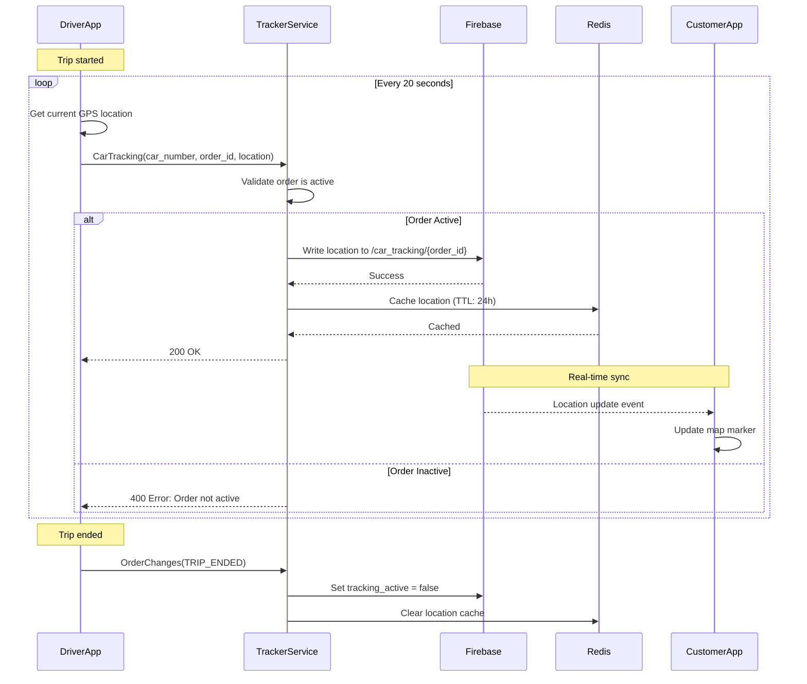
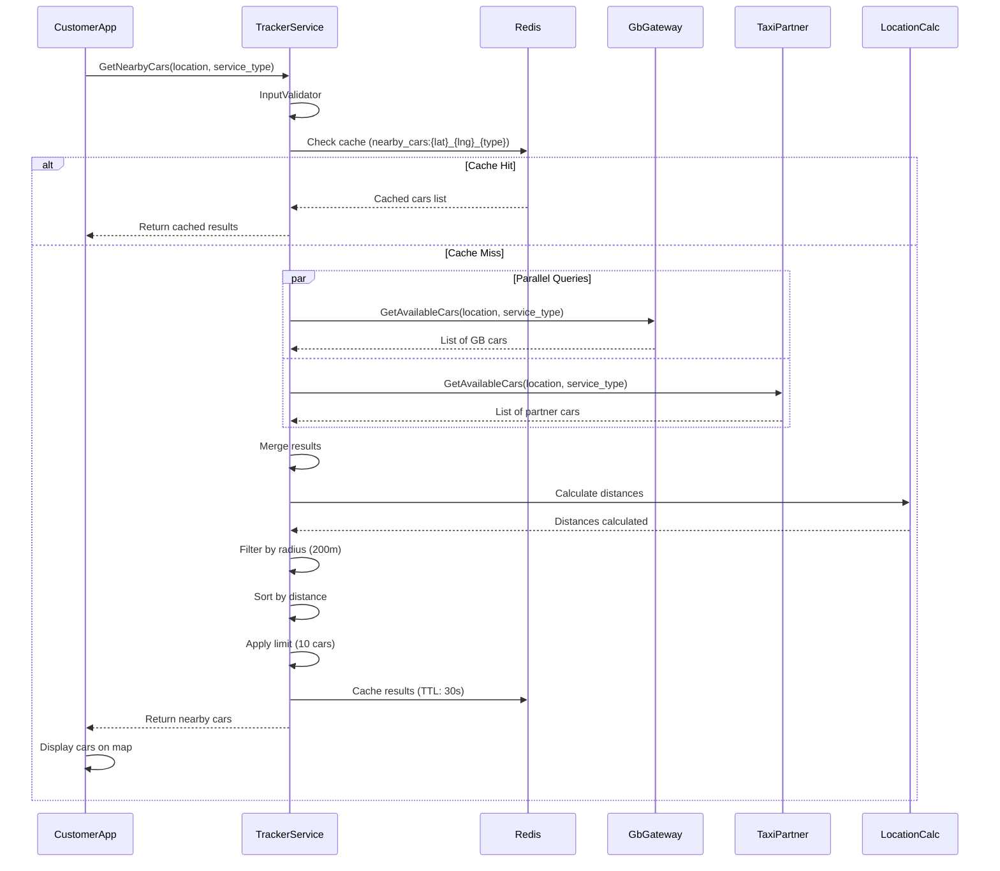
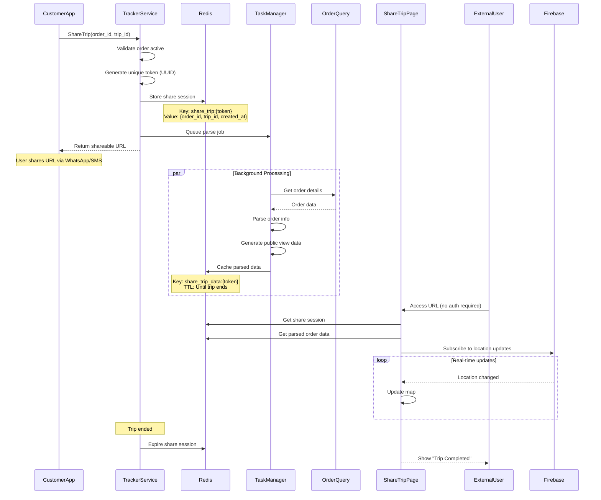
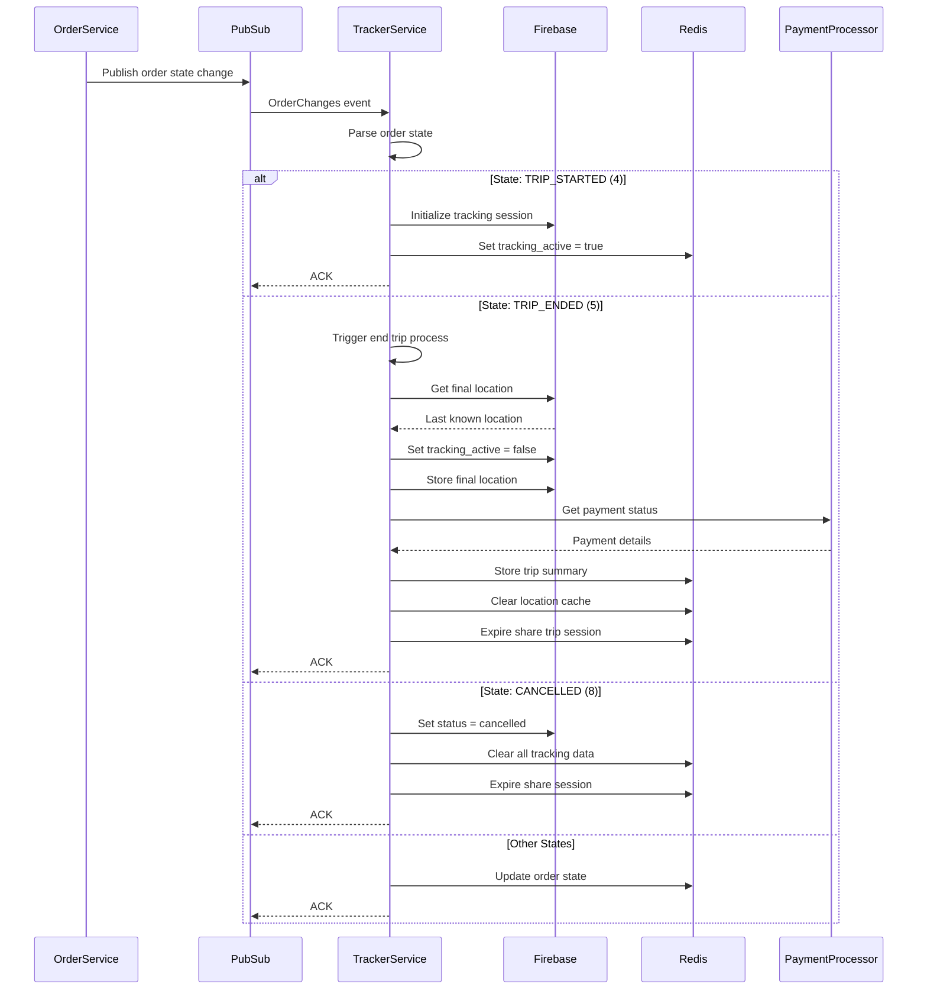
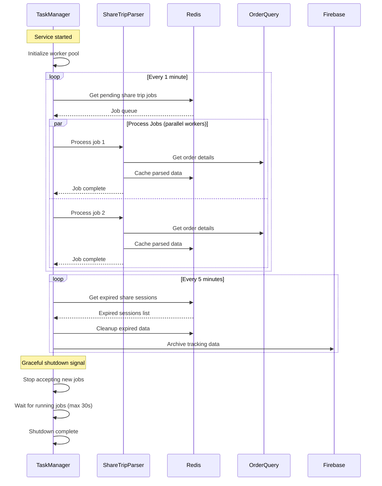

---
tags:
  - trackerservice
  - workflow
  - architecture
  - mrg
type: workflow-documentation
title: Tracker Service - Workflows
parent: trackerservice
---
# Tracker Service - Workflows

**Service**: [[README|Tracker Service]]  
**Type**: Workflow Documentation

---

## 🔄 Workflow Overview

TrackerService mendukung berbagai workflows untuk real-time location tracking dan trip monitoring dalam MyBB ecosystem. Setiap workflow dirancang untuk provide accurate, real-time location data dengan minimal latency.

---

## 1️⃣ Real-Time Car Tracking Workflow

**Scenario**: Driver dalam perjalanan, location di-update setiap 20 detik

### Sequence Diagram



### Key Steps

1. **GPS Location Acquisition**
   - Driver app gets location from device GPS
   - Frequency: Every 20 seconds (configurable via `CAR_LOCATION_FREQUENCY`)
   - Include: latitude, longitude, timestamp, accuracy

2. **Location Update Request**
   ```go
   request := &CarLocationRequest{
       CarNumber: "B1234XYZ",
       OrderID: 12345,
       UserID: driverID,
       MetaData: metadata,
   }
   ```

3. **Order Validation**
   - Check order exists and is active
   - Verify driver is assigned to this order
   - Validate trip has started

4. **Firebase Write**
   ```
   Path: /car_tracking/{order_id}
   Data: {
     car_number: string,
     latitude: float,
     longitude: float,
     timestamp: int,
     driver_id: string,
     accuracy: float
   }
   ```

5. **Redis Caching**
   - Key: `car_location:{order_id}`
   - Hash fields:
     - `CAR_LOCATION_RESPONSE`: Current location
     - `CAR_LOCATION_IS_SHARE`: Share trip status
   - TTL: 24 hours

6. **Real-Time Sync to Customer**
   - Customer app subscribes to Firebase path
   - Receives instant updates when location changes
   - Updates map marker in real-time

7. **Location Change Detection**
   - Only write to Firebase if significant change (>10 meters)
   - Reduce unnecessary writes
   - Battery optimization

---

## 2️⃣ Nearby Cars Discovery Workflow

**Scenario**: User membuka app, perlu lihat available cars di sekitar

### Sequence Diagram



### Key Steps

1. **User Location**
   - Get user's current GPS location
   - Request: latitude, longitude, service_type_id

2. **Cache Check**
   ```
   Key: nearby_cars:{lat_rounded}:{lng_rounded}:{service_type}
   Precision: 4 decimal places (±11m accuracy)
   TTL: 30 seconds
   ```

3. **Parallel Data Fetching**
   
   **From Goldenbird Gateway**:
   ```go
   gbCars := gbGateway.GetAvailableCars(ctx, &GetAvailableCarsRequest{
       Location: location,
       ServiceType: serviceType,
       Radius: config.NearbyCarsRadiusGB, // 200m
   })
   ```
   
   **From Taxi Partner Gateway**:
   ```go
   partnerCars := taxiPartner.GetAvailableCars(ctx, &GetAvailableCarsRequest{
       Location: location,
       ServiceType: serviceType,
       Status: "available",
   })
   ```

4. **Merge & Deduplicate**
   - Combine results from both sources
   - Remove duplicates by car_number
   - Tag with `taxi_category` (goldenbird/partner)

5. **Distance Calculation**
   ```go
   func calculateDistance(lat1, lng1, lat2, lng2 float64) float64 {
       // Haversine formula
       R := 6371.0 // Earth radius in km
       dLat := toRadians(lat2 - lat1)
       dLng := toRadians(lng2 - lng1)
       
       a := math.Sin(dLat/2) * math.Sin(dLat/2) +
            math.Cos(toRadians(lat1)) * math.Cos(toRadians(lat2)) *
            math.Sin(dLng/2) * math.Sin(dLng/2)
       
       c := 2 * math.Atan2(math.Sqrt(a), math.Sqrt(1-a))
       return R * c * 1000 // Convert to meters
   }
   ```

6. **Filtering & Sorting**
   ```go
   // Filter by radius
   filteredCars := filterByRadius(mergedCars, userLocation, 200.0)
   
   // Sort by distance (nearest first)
   sort.Slice(filteredCars, func(i, j int) bool {
       return filteredCars[i].Distance < filteredCars[j].Distance
   })
   
   // Apply limit
   if len(filteredCars) > 10 {
       filteredCars = filteredCars[:10]
   }
   ```

7. **Cache Result**
   - Store in Redis for 30 seconds
   - Next request within 30s returns cached data
   - Reduce load on GB Gateway & Taxi Partner

8. **Response to Client**
   ```json
   {
     "cars": [
       {
         "taxi_category": "goldenbird",
         "number": "B1234XYZ",
         "location": {"latitude": -6.2089, "longitude": 106.8457}
       }
     ]
   }
   ```

---

## 3️⃣ Share Trip Workflow

**Scenario**: User ingin share trip status ke family/friends

### Sequence Diagram



### Key Steps

1. **Share Request**
   ```go
   request := &ShareTripRequest{
       OrderID: "ORDER123",
       TripID: "TRIP456",
   }
   ```

2. **Token Generation**
   ```go
   token := uuid.New().String()
   // Example: "550e8400-e29b-41d4-a716-446655440000"
   ```

3. **Session Storage**
   ```
   Key: share_trip:{token}
   Value: {
     "order_id": "ORDER123",
     "trip_id": "TRIP456",
     "created_at": 1706246400,
     "expires_at": 1706332800
   }
   TTL: Until trip ends (max 24h)
   ```

4. **URL Generation**
   ```
   Format: https://share.mybluebird.id/trip/{token}
   Example: https://share.mybluebird.id/trip/550e8400-e29b-41d4-a716-446655440000
   ```

5. **Background Parsing Job**
   - Queued via Task Manager
   - Priority: Low (non-blocking)
   - Timeout: 30 seconds

6. **Order Details Fetching**
   ```go
   orderDetails := orderQuery.GetOrderDetails(ctx, orderID)
   
   parsedData := ShareTripData{
       DriverName: orderDetails.DriverName,
       DriverPhoto: orderDetails.DriverPhoto,
       CarNumber: orderDetails.CarNumber,
       CarType: orderDetails.CarType,
       PickupAddress: orderDetails.PickupAddress,
       DropoffAddress: orderDetails.DropoffAddress,
       EstimatedArrival: orderDetails.ETA,
       TripStatus: "in_progress",
   }
   ```

7. **Public View Cache**
   ```
   Key: share_trip_data:{token}
   Value: Parsed order data (JSON)
   TTL: Until trip ends
   ```

8. **External User Access**
   - No authentication required
   - Access via unique token
   - Real-time location updates via Firebase listener

9. **Public View Features**
   - Driver info (name, photo, car details)
   - Real-time location on map
   - Trip route visualization
   - ETA updates
   - Pickup & dropoff markers

10. **Session Expiration**
    - Auto-expire when trip ends
    - Manual expire after 24 hours
    - Token becomes invalid after expiration

---

## 4️⃣ Order State Changes Workflow

**Scenario**: Order state berubah, tracking perlu di-update

### Sequence Diagram



### Key Steps

1. **PubSub Event Reception**
   ```go
   message := &OrderChangesReq{
       OrderState: 5,
       TripEnded: true,
       OrderID: 12345,
       UserID: "CUST123",
       PaymentMethod: "epay",
       FinalEpay: "150000",
   }
   ```

2. **State Parsing**
   ```go
   switch message.OrderState {
   case ORDER_CREATED:
       // Initialize order tracking
   case DRIVER_ASSIGNED:
       // Start monitoring driver availability
   case TRIP_STARTED:
       // Begin real-time tracking
   case TRIP_ENDED:
       // End trip process
   case CANCELLED:
       // Cleanup tracking data
   }
   ```

3. **Trip Started Handler**
   ```go
   func handleTripStarted(orderID int64) {
       // Initialize Firebase tracking path
       firebase.Set(ctx, fmt.Sprintf("/car_tracking/%d", orderID), map[string]interface{}{
           "tracking_active": true,
           "started_at": time.Now().Unix(),
       })
       
       // Set Redis flag
       redis.HSet(ctx, fmt.Sprintf("car_location:%d", orderID), 
           "tracking_active", true)
   }
   ```

4. **Trip Ended Handler**
   ```go
   func handleTripEnded(orderID int64) error {
       // Get final location from Firebase
       finalLocation := firebase.Get(ctx, fmt.Sprintf("/car_tracking/%d", orderID))
       
       // Stop tracking
       firebase.Set(ctx, fmt.Sprintf("/car_tracking/%d/tracking_active", orderID), false)
       firebase.Set(ctx, fmt.Sprintf("/car_tracking/%d/final_location", orderID), finalLocation)
       
       // Get payment status
       paymentStatus := paymentProcessor.GetStatus(ctx, orderID)
       
       // Store trip summary
       tripSummary := TripSummary{
           OrderID: orderID,
           FinalLocation: finalLocation,
           EndTime: time.Now(),
           PaymentStatus: paymentStatus,
       }
       redis.Set(ctx, fmt.Sprintf("trip_summary:%d", orderID), tripSummary, 24*time.Hour)
       
       // Clear real-time tracking cache
       redis.Del(ctx, fmt.Sprintf("car_location:%d", orderID))
       
       // Expire share trip session
       shareToken := getShareToken(orderID)
       if shareToken != "" {
           redis.Expire(ctx, fmt.Sprintf("share_trip:%s", shareToken), 5*time.Minute)
       }
       
       return nil
   }
   ```

5. **Cancelled Handler**
   ```go
   func handleCancelled(orderID int64) {
       // Update Firebase status
       firebase.Set(ctx, fmt.Sprintf("/car_tracking/%d/status", orderID), "cancelled")
       
       // Clear all tracking data
       redis.Del(ctx, 
           fmt.Sprintf("car_location:%d", orderID),
           fmt.Sprintf("order_change:%d", orderID))
       
       // Expire share session immediately
       shareToken := getShareToken(orderID)
       if shareToken != "" {
           redis.Del(ctx, fmt.Sprintf("share_trip:%s", shareToken))
       }
   }
   ```

6. **Payment Status Sync**
   - Query Payment Processor untuk final payment status
   - Update trip summary dengan payment details
   - Handle insufficient balance scenarios

7. **Cleanup Process**
   - Remove real-time tracking data from Redis
   - Keep trip summary for 24 hours (analytics)
   - Archive to cold storage if needed

---

## 5️⃣ Background Task Manager Workflow

**Scenario**: Background jobs untuk parsing, cleanup, monitoring

### Sequence Diagram



### Key Components

1. **Share Trip Parser Worker**
   ```go
   type ShareTripParserWorker struct {
       redis       RedisRepository
       orderQuery  OrderQuery
       workerCount int
   }
   
   func (w *ShareTripParserWorker) Start(ctx context.Context) {
       for i := 0; i < w.workerCount; i++ {
           go w.worker(ctx, i)
       }
   }
   
   func (w *ShareTripParserWorker) worker(ctx context.Context, id int) {
       ticker := time.NewTicker(1 * time.Minute)
       defer ticker.Stop()
       
       for {
           select {
           case <-ticker.C:
               w.processJobs(ctx)
           case <-ctx.Done():
               return
           }
       }
   }
   ```

2. **Job Processing**
   ```go
   func (w *ShareTripParserWorker) processJobs(ctx context.Context) {
       jobs := w.redis.GetPendingJobs(ctx, "share_trip_parse")
       
       for _, job := range jobs {
           // Parse order details
           orderDetails := w.orderQuery.GetOrderDetails(ctx, job.OrderID)
           
           // Transform to public view data
           publicData := transformToPublicData(orderDetails)
           
           // Cache parsed data
           w.redis.Set(ctx, 
               fmt.Sprintf("share_trip_data:%s", job.Token),
               publicData,
               24*time.Hour)
           
           // Mark job complete
           w.redis.RemoveJob(ctx, "share_trip_parse", job.ID)
       }
   }
   ```

3. **Cleanup Task**
   ```go
   func (tm *TaskManager) cleanupExpiredSessions(ctx context.Context) {
       // Get expired share sessions
       expiredSessions := tm.redis.GetExpiredSessions(ctx, "share_trip")
       
       for _, session := range expiredSessions {
           // Remove session data
           tm.redis.Del(ctx, fmt.Sprintf("share_trip:%s", session.Token))
           
           // Remove parsed data
           tm.redis.Del(ctx, fmt.Sprintf("share_trip_data:%s", session.Token))
           
           // Archive to Firebase (optional)
           tm.firebase.Archive(ctx, session)
       }
   }
   ```

4. **Graceful Shutdown**
   ```go
   func (tm *TaskManager) ShutDown(ctx context.Context) error {
       // Stop accepting new jobs
       tm.stopAcceptingJobs()
       
       // Wait for running jobs with timeout
       shutdownCtx, cancel := context.WithTimeout(ctx, 30*time.Second)
       defer cancel()
       
       done := make(chan struct{})
       go func() {
           tm.waitForJobs()
           close(done)
       }()
       
       select {
       case <-done:
           return nil
       case <-shutdownCtx.Done():
           return errors.New("shutdown timeout")
       }
   }
   ```

---

## 📊 Workflow Comparison Matrix

| Workflow | Trigger | Frequency | External Calls | Caching |
|----------|---------|-----------|----------------|---------|
| **Car Tracking** | Driver app | Every 20s | Firebase, Redis | ✅ 24h |
| **Nearby Cars** | User action | On demand | GbGateway, TaxiPartner | ✅ 30s |
| **Share Trip** | User action | Once | OrderQuery, Redis | ✅ Until end |
| **Order Changes** | PubSub event | Real-time | PaymentProcessor | ✅ 24h |
| **Task Manager** | Background | Every 1-5min | OrderQuery, Firebase | ❌ |

---

## 🔒 Performance Optimizations

### Caching Strategy
| Data Type | TTL | Key Pattern |
|-----------|-----|-------------|
| Car Location | 24 hours | `car_location:{order_id}` |
| Nearby Cars | 30 seconds | `nearby_cars:{lat}_{lng}_{type}` |
| Share Session | Until trip ends | `share_trip:{token}` |
| Trip Summary | 24 hours | `trip_summary:{order_id}` |

### Firebase Optimization
- Write only on significant location changes (>10m)
- Use delta updates instead of full writes
- Index optimization for query performance
- Batch writes when possible

### Background Processing
- Worker pool untuk parallel job processing
- Job queue dengan priority levels
- Graceful shutdown dengan timeout protection

---

## 🏷️ Tags

#trackerservice #workflow #architecture #mrg

---

*Last Updated*: 2025-01-26
