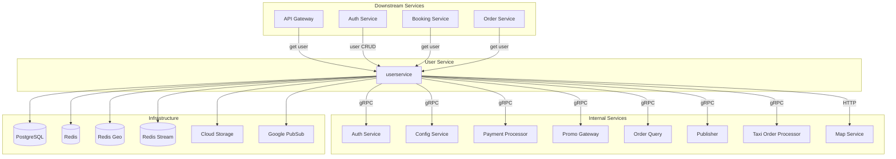

---
tags:
  - dependency
  - userservice
  - architecture
  - mrg
type: dependency-map
title: User Service - Dependencies
parent: userservice
---
# User Service - Dependencies

**Service**: [[README|User Service]]  
**Type**: Dependency Map

---

## 🔄 Dependency Diagram



---

## 📊 Dependencies Detail

### Internal Service Dependencies

| Service | Protocol | Client Library | Version | Purpose |
|---------|----------|----------------|---------|---------|
| **Auth Service** | gRPC | `authclient` | v0.0.6 | Token validation, auth support |
| **Config Service** | gRPC | `configseviceclient` | v0.0.9 | Feature flags, whitelist config |
| **Payment Processor** | gRPC | `paymentprocessorclient` | v1.1.34 | Payment method validation, balance |
| **Promo Gateway** | gRPC | `promogatewayclient` | v1.1.20 | Referral system, vouchers |
| **Order Query** | gRPC | `orderqueryclient` | v1.0.4 | Order history for favorite trip |
| **Publisher** | gRPC | - | - | Event publishing |
| **Taxi Order Processor** | gRPC | `topclient` | v0.0.18 | Outlet info, booth info |
| **Map Service** | HTTP | - | - | Location services |

### Infrastructure Dependencies

| Component | Purpose | Configuration |
|-----------|---------|---------------|
| **PostgreSQL** | Main data storage (users, addresses, payments) | `DB_HOST`, `DB_PORT`, `DB_NAME` |
| **PostgreSQL Read** | Read replica | `DB_HOST_READ` |
| **Redis** | Session cache, rate limiting | `REDIS_URL` |
| **Redis Geo** | Geospatial data storage | `REDIS_GEO_URL` |
| **Redis Stream** | Event streaming | `REDIS_STREAM_URL` |
| **Redis Replica** | Read replica | `REDIS_REPLICA_URL` |
| **Google Cloud Storage** | Profile image storage | `GOOGLE_APPLICATION_CREDENTIALS` |
| **Google PubSub** | Event messaging | `PROJECT_ID`, `PUBSUB_EMULATOR_HOST` |

---

## 🔌 Repository Interfaces

```go
type Repository struct {
    Db                 Db
    Redis              repoiface.RedisRepository
    RedisStream        repoiface.RedisRepository
    RedisGeo           repoiface.RedisGeoRepository
    Storage            repoiface.StorageRepository
    Location           repoiface.LocationRepository
    PaymentProcessor   repoiface.PaymentProcessor
    PromoGateway       repoiface.PromoGateway
    ConfigService      repoiface.ConfigService
    OrderQuery         repoiface.OrderQuery
    AuthService        repoiface.AuthService
    Publisher          repoiface.Publisher
    TaxiOrderProcessor repoiface.TaxiOrderProcessor
    MapService         repoiface.MapService
}
```

### Database Interface
```go
type Db struct {
    Transaction            repoiface.DbTransaction
    User                   repoiface.UserRepository
    UserAdditionalInfo     repoiface.UserAdditionalInfoRepository
    UserVerification       repoiface.UserVerificationRepository
    UserResendOtpCount     repoiface.UserResendOtpCountRepository
    Device                 repoiface.DeviceRepository
    LoginSoftBanned        repoiface.LoginSoftBannedRepository
    FavoriteAddress        repoiface.FavoriteAddressRepository
    NavigationUserState    repoiface.NavigationUserStateRepository
    PaymentMethodUserRepo  repoiface.PaymentMethodUserRepository
    PaymentMethodTypeRepo  repoiface.PaymentMethodTypeRepository
    HomeServicesRepo       repoiface.HomeServicesRepository
    UserLocationRepository repoiface.UserLocationRepository
    FavoriteTrip           repoiface.FavoriteTripRepository
    Country                repoiface.CountryRepository
    UserNotification       repoiface.UserNotificationRepository
}
```

### Redis Interface
```go
type RedisRepository interface {
    Get(ctx context.Context, key string) (string, error)
    Set(ctx context.Context, key string, value interface{}, expiration time.Duration) error
    Del(ctx context.Context, keys ...string) error
    Exists(ctx context.Context, keys ...string) (int64, error)
    // ... more methods
}
```

### Redis Geo Interface
```go
type RedisGeoRepository interface {
    GeoAdd(ctx context.Context, key string, geoLocation ...*redis.GeoLocation) (int64, error)
    GeoRadius(ctx context.Context, key string, longitude, latitude float64, query *redis.GeoRadiusQuery) ([]redis.GeoLocation, error)
    // ... more methods
}
```

### Storage Interface
```go
type StorageRepository interface {
    Upload(ctx context.Context, bucketName, objectName string, file []byte) (string, error)
    Delete(ctx context.Context, bucketName, objectName string) error
    GetSignedURL(ctx context.Context, bucketName, objectName string) (string, error)
}
```

### Auth Service Interface
```go
type AuthService interface {
    ValidateToken(ctx context.Context, token string) (*AuthResponse, error)
    RefreshToken(ctx context.Context, accessToken, refreshToken string) (*TokenResponse, error)
}
```

### Config Service Interface
```go
type ConfigService interface {
    GetWhitelist(ctx context.Context, feature string) (*WhitelistData, error)
    CheckEnabledFeature(ctx context.Context, req *CheckFeatureRequest) (bool, error)
}
```

### Payment Processor Interface
```go
type PaymentProcessor interface {
    GetPaymentMethods(ctx context.Context, userID string) ([]PaymentMethod, error)
    GetBalance(ctx context.Context, userID, paymentType string) (*Balance, error)
    ValidatePayment(ctx context.Context, req *ValidateRequest) (*ValidateResponse, error)
}
```

### Promo Gateway Interface
```go
type PromoGateway interface {
    GetReferralList(ctx context.Context, userID string) (*ReferralListResponse, error)
    GetReferralExplanation(ctx context.Context, usecase string) (*ExplanationResponse, error)
}
```

### Order Query Interface
```go
type OrderQuery interface {
    GetOrderDetail(ctx context.Context, orderID string) (*OrderDetail, error)
    GetOrderHistory(ctx context.Context, userID string, limit int) ([]Order, error)
}
```

---

## 📤 Downstream Services (Clients)

Services yang memanggil User Service:

| Service | Purpose |
|---------|---------|
| **Auth Service** | User CRUD, authentication, password validation |
| **API Gateway** | Get user profile, validate user existence |
| **Booking Service** | Get user data untuk booking |
| **Order Service** | Get user data untuk order |
| **Payment Service** | Get user payment methods |
| **Notification Service** | Get user notification preferences |

---

## ⚙️ Configuration

### Service Connections

| Service | Host Env | Port Env |
|---------|----------|----------|
| Auth Service | `AUTH_SERVICE_HOST` | `AUTH_SERVICE_PORT` |
| Config Service | `CONFIG_SERVICE_HOST` | `CONFIG_SERVICE_PORT` |
| Payment Processor | `PAYMENT_PROCESSOR_HOST` | `PAYMENT_PROCESSOR_PORT` |
| Promo Gateway | `PROMO_GATEWAY_HOST` | `PROMO_GATEWAY_PORT` |
| Order Query | `ORDER_QUERY_HOST` | `ORDER_QUERY_PORT` |
| Publisher | `PUBLISHER_HOST` | `PUBLISHER_PORT` |
| Taxi Order Processor | `TAXI_ORDER_PROCESSOR_HOST` | `TAXI_ORDER_PROCESSOR_PORT` |
| Map Service | `MAP_SERVICE_HOST` | `MAP_SERVICE_TIMEOUT` |

### Database Configuration

| Setting | Env Variable |
|---------|--------------|
| Host (Write) | `DB_HOST` |
| Host (Read) | `DB_HOST_READ` |
| Username | `DB_USERNAME` |
| Password | `DB_PASSWORD` |
| Port | `DB_PORT` |
| Database Name | `DB_NAME` |
| SSL Mode | `DB_SSL_MODE` |

### Redis Configuration

| Setting | Env Variable |
|---------|--------------|
| Redis URL | `REDIS_URL` |
| Redis Geo URL | `REDIS_GEO_URL` |
| Redis Stream URL | `REDIS_STREAM_URL` |
| Redis Replica URL | `REDIS_REPLICA_URL` |

### Cloud Configuration

| Setting | Env Variable |
|---------|--------------|
| Project ID | `PROJECT_ID` |
| PubSub Emulator | `PUBSUB_EMULATOR_HOST` |
| Credentials | `GOOGLE_APPLICATION_CREDENTIALS` |

---

## 📦 External Libraries

### Core Dependencies

| Library | Version | Purpose |
|---------|---------|---------|
| `grpc` | v1.75.1 | gRPC framework |
| `grpc-gateway` | v2.27.3 | REST gateway |
| `gorm` | v1.25.1 | ORM |
| `go-redis` | v8.11.5 | Redis client |
| `pubsub` | v1.50.1 | Google PubSub |
| `cloud-storage` | v1.56.0 | GCS client |

### Bluebird Internal

| Library | Version | Purpose |
|---------|---------|---------|
| `aphrodite` | v1.9.43 | Common framework |
| `commonmessaging` | v0.1.18 | PubSub messaging |
| `qb-postgresql` | v1.6.1 | PostgreSQL utilities |

### Monitoring & Security

| Library | Version | Purpose |
|---------|---------|---------|
| `elastic-apm` | v2.6.2 | APM monitoring |
| `prometheus` | v1.21.0 | Metrics |
| `phonenumbers` | v1.1.7 | Phone validation |
| `crypto` | v0.42.0 | Password hashing |

---

## 🏷️ Tags

#dependency #userservice #architecture #mrg

---

*Last Updated*: 2025-01-05
