# UPG — Helicopter View

> **Purpose**: Single-page pandangan 30.000 kaki atas seluruh service landscape UPG (Unified Payment Gateway).
> **Data source**: Bluelink `services/payment/**` (meta-spec per 2026-06-29).
> **Total service UPG**: **22 services** | Semua terdokumentasi di Bluelink.
> **Sister doc**: [[../../MRG/01-architecture/MRG-Helicopter-View|MRG Helicopter View]]

---

## Domain Map

| Domain | Tanggung Jawab | Primary Service |
|--------|---------------|-----------------|
| **Gateway & Orchestration** | Entry point + orkestrasi payment lifecycle | mrg-gateway, meta-payment-gateway (MPG v2) |
| **Internal Gateway** | Aggregator query/ops + webhook hub | web-gateway, webhook-fwd |
| **Routing & Identity** | BIN routing, merchant auth, card access control | routing-service, auth-service, access-control |
| **Core / Data** | Single source of truth transaksi + data-access layer | transaction, bbecv-adapter, bbecv-adapter-query |
| **Background Jobs** | Retry transaksi gagal, BIN sync, laporan | upg-scheduler |
| **Payment Providers — Card** | Kartu kredit/debit | card-payment, nicepay-service |
| **Payment Providers — E-Wallet** | Dompet digital | gopay-service, dana-service, ovo-service, shopeepay-service, linkaja-service |
| **ECV & Voucher** | Electronic Cash Voucher korporat + trip voucher | ecv, ecvpay, trip-voucher |
| **HO Integration** | Posting ke SAP / Head Office | intermediate-ho |

---

## Arsitektur Diagram — Full Landscape

```mermaid
flowchart TB
    %% ─── CONSUMER LAYER ───
    subgraph Consumers["📲 Consumer / Caller"]
        MRG["MRG Backend\n(paymentprocessor / upgforwarder)"]
        BBWALLET["BBWallet App\n(MyBB e-wallet)"]
        OPS["Internal Ops / Scheduler Tools"]
    end

    %% ─── GATEWAY LAYER ───
    subgraph GatewayLayer["🌐 Gateway & Orchestration"]
        MRGGW["mrg-gateway\ngRPC/REST :9102 · P1\nPayment Orchestrator · 54 RPC\nCross-Charge · GB Flows"]
        MPG["meta-payment-gateway (MPG v2)\nREST :3009 · P1\n⚠️ Monolith · 8 provider inline\nBBWallet backend"]
        WEBGW["web-gateway\ngRPC/REST :9301 · P1\nStateless Aggregator (query+pushHO)"]
        WHFWD["webhook-fwd\ngRPC :9301 / REST :9501 · P1\nCallback Hub · Midtrans/NicePay"]
    end

    %% ─── ROUTING & IDENTITY ───
    subgraph RoutingIdentity["🧭 Routing & Identity"]
        ROUTING["routing-service\ngRPC :9111 · P1\nBIN Routing · Preauth Eligibility"]
        AUTH["auth-service\ngRPC :9107/9108 · P1\nMerchant Auth · sign_key"]
        ACCESS["access-control\ngRPC+REST · P1\nCard BIN Block · Whitelist"]
    end

    %% ─── CORE / DATA ───
    subgraph CoreData["🗃️ Core / Data"]
        TRX["transaction\ngRPC :9103 · P1\n🔵 SSOT Transaksi · 58 RPC\nRide/Rent/QRIS/Cross-Payment"]
        BBECV["bbecv-adapter\ngRPC :9110 · P1\nData-Access Layer (DB bbecv) · 77 RPC"]
        BBECVQ["bbecv-adapter-query\ngRPC :9114 · P1\nRead/Query companion"]
        SCHED["upg-scheduler\ngRPC/REST :8080 · P1\nRetry Cron · BIN Renew · Report"]
    end

    %% ─── PROVIDERS: CARD ───
    subgraph CardProviders["💳 Card Providers"]
        CARD["card-payment\ngRPC :8077 · P1\nMidtrans CC · Auth/Capture/Void/Refund"]
        NICEPAY["nicepay-service\nP1\nNicePay · Payment Link"]
    end

    %% ─── PROVIDERS: E-WALLET ───
    subgraph WalletProviders["👛 E-Wallet Providers"]
        GOPAY["gopay-service\ngRPC :9104 · P1"]
        DANA["dana-service\ngRPC :9113 · P1"]
        OVO["ovo-service\ngRPC :9120 · P1"]
        SHOPEE["shopeepay-service\nP1"]
        LINKAJA["linkaja-service\ngRPC :9113 · P1 · TCash"]
    end

    %% ─── ECV & VOUCHER ───
    subgraph EcvVoucher["🎟️ ECV & Voucher"]
        ECV["ecv\ngRPC :9101 · P1\nReserve/Complete/Cancel · Budget Voucher"]
        ECVPAY["ecvpay\nP1\nECV Pay"]
        TRIPV["trip-voucher\ngRPC :8080 · P1"]
    end

    %% ─── HO INTEGRATION ───
    subgraph HoLayer["🏢 HO Integration"]
        IHO["intermediate-ho\ngRPC :9105 · P1\nEvent-Driven · Idempotent\nPush ke SAP"]
    end

    %% ─── INFRASTRUCTURE ───
    subgraph Infra["🗄️ Infrastructure"]
        PG[(PostgreSQL\nDB: bbecv · ecvbilling · MPG\n⚠️ Multi-DB fragmented)]
        REDIS[(Redis)]
        PUBSUB[GCP PubSub\nEvent Backbone]
        FLIPT[Flipt\nFeature Flag]
        APM[Elastic APM]
    end

    %% ─── EXTERNAL ───
    subgraph External["🌍 External Systems"]
        MIDTRANS[Midtrans\nCC + GoPay]
        DANA_EXT[DANA]
        OVO_EXT[OVO Snap]
        SHOPEE_EXT[ShopeePay]
        LINKAJA_EXT[LinkAja / TCash]
        NICEPAY_EXT[NicePay]
        EXTRA[Paypro · iSaku]
        SAP[SAP\nERP / HO Finance]
        BBD[BBD\nPayment Dashboard]
        CORPSOL[Corporate Customer\nCorpSol / Voucher]
    end

    %% ── Consumer → Gateway ──
    MRG --> MRGGW
    BBWALLET --> MPG
    OPS --> WEBGW & SCHED

    %% ── mrg-gateway orchestration ──
    MRGGW --> ROUTING & AUTH
    MRGGW --> CARD & GOPAY & DANA & OVO & SHOPEE & LINKAJA
    MRGGW --> ECV & TRIPV
    MRGGW --> TRX & BBECV & BBECVQ
    MRGGW --> IHO
    MRGGW -.->|recharge booking| MPG

    %% ── routing / access ──
    ROUTING --> BBECV & MIDTRANS
    ROUTING --> FLIPT
    ACCESS --> BBECV & TRX
    CARD --> AUTH & ROUTING & ACCESS

    %% ── providers → external ──
    CARD --> MIDTRANS
    NICEPAY --> NICEPAY_EXT
    GOPAY --> MIDTRANS
    DANA --> DANA_EXT
    OVO --> OVO_EXT
    SHOPEE --> SHOPEE_EXT
    LINKAJA --> LINKAJA_EXT
    MPG --> MIDTRANS & DANA_EXT & OVO_EXT & SHOPEE_EXT & LINKAJA_EXT & EXTRA

    %% ── transaction / data ──
    TRX --> CARD & GOPAY & DANA & OVO & SHOPEE & LINKAJA
    BBECV --> PG
    TRX --> PG & REDIS

    %% ── ECV ──
    ECV --> BBECV & CORPSOL
    ECVPAY --> BBECV
    TRIPV --> BBECV

    %% ── HO / SAP ──
    IHO --> SAP
    IHO --> CARD & GOPAY & DANA & OVO & SHOPEE & LINKAJA & ECV
    MPG --> SAP

    %% ── webhook ──
    MIDTRANS -.->|callback| WHFWD
    NICEPAY_EXT -.->|callback| WHFWD
    WHFWD --> MRGGW & BBD
    WHFWD --> BBECV & TRX

    %% ── scheduler retry ──
    SCHED --> IHO & CARD & GOPAY & DANA & OVO & SHOPEE & LINKAJA & ECV & ECVPAY
    SCHED -.-> MPG

    %% ── event backbone ──
    MRGGW & TRX & BBECV & IHO & ECV & WHFWD & MPG --> PUBSUB

    %% ── web-gateway aggregation ──
    WEBGW --> TRX & IHO & CARD & BBECVQ
    WEBGW -.->|legacy HO| MRG
```

---

## Service Registry — Status & Tier

| Service | Domain | Port (gRPC/REST) | Tier | Stack | Status |
|---|---|---|---|---|---|
| **mrg-gateway** | Gateway / Orchestrator | 9102 (cmux) | **P1** | Go, bluebird-chassis, gRPC+REST, Redis, PubSub | ✅ Prod |
| **meta-payment-gateway** (MPG v2) | Gateway (BBWallet) | 3009 REST | **P1** ⚠️ | Go, go-kit, REST, PG, Redis, PubSub | ✅ Prod (monolith) |
| **web-gateway** | Internal Aggregator | 9301 (cmux) | P1 | Go, go-kit, gRPC+REST, stateless | ✅ Prod |
| **webhook-fwd** | Callback Hub | 9301 / 9501 | P1 | Go, go-kit, gRPC+REST, PubSub | ✅ Prod |
| **routing-service** | Card BIN Routing | 9111 | P1 | Go, go-kit, gRPC, PG, Redis, Flipt, CB | ✅ Prod |
| **auth-service** | Merchant Auth | 9107 / 9108 | P1 | Go, go-kit, gRPC, PG, Redis | ✅ Prod |
| **access-control** | Card Access Control | env | P1 | Go, gRPC+REST, PG (R/W split), Redis, Flipt | ✅ Prod |
| **transaction** | Core Trx (SSOT) | 9103 | **P1** | Go, go-kit, gRPC, PG, Redis, PubSub, CB | ✅ Prod |
| **bbecv-adapter** | Data-Access Layer | 9110 | **P1** | Go, go-kit, gRPC, PG (bbecv), Redis, PubSub, CB | ✅ Prod |
| **bbecv-adapter-query** | Read Query | 9114 | P1 | Go, gRPC | ✅ Prod |
| **upg-scheduler** | Retry Cron | 8080 (cmux) | P1 | Go, robfig/cron, gRPC+REST, PG, PubSub | ✅ Prod |
| **card-payment** | CC Provider | 8077 | P1 | Go, gRPC, Midtrans | ✅ Prod |
| **nicepay-service** | NicePay / Payment Link | — | P1 | Go, gRPC | ✅ Prod |
| **gopay-service** | GoPay Wallet | 9104 | P1 | Go, gRPC, Midtrans | ✅ Prod |
| **dana-service** | DANA Wallet | 9113 | P1 | Go, gRPC | ✅ Prod |
| **ovo-service** | OVO Wallet | 9120 | P1 | Go, gRPC, OVO Snap | ✅ Prod |
| **shopeepay-service** | ShopeePay Wallet | — | P1 | Go, gRPC | ✅ Prod |
| **linkaja-service** | LinkAja / TCash Wallet | 9113 | P1 | Go, gRPC, HTTP+SOAP | ✅ Prod |
| **ecv** | ECV Voucher | 9101 | P1 | Go, go-kit, gRPC, PG, Redis, PubSub | ✅ Prod |
| **ecvpay** | ECV Pay | — | P1 | Go, gRPC | ✅ Prod |
| **trip-voucher** | Trip Voucher | 8080 | P1 | Go, gRPC | ✅ Prod |
| **intermediate-ho** | HO / SAP Orchestrator | 9105 | **P1** | Go, go-kit, gRPC, PG, PubSub, CB | ✅ Prod |

> Catatan port: beberapa provider memakai port yang sama dari sisi config mrg-gateway (9113 untuk DANA/LinkAja/ShopeePay) — kemungkinan alias/port-forward berbeda per environment; perlu konfirmasi ke tim UPG sebelum dipublikasikan ke VP.

---

## Architectural Patterns

| Pattern | Digunakan Oleh |
|---|---|
| **API Gateway / Orchestrator** | mrg-gateway (orkestrasi lifecycle payment) |
| **Strategy Pattern (cross-payment)** | mrg-gateway — `DirectPayable` / `Authorizable` / `PaymentProvider` interface |
| **Provider-per-Service** | card-payment, gopay, dana, ovo, shopeepay, linkaja (1 provider = 1 service) |
| **Data-Access Layer terpusat** | bbecv-adapter (satu-satunya pintu ke DB `bbecv`) |
| **CQRS (partial)** | bbecv-adapter (write) + bbecv-adapter-query (read) |
| **Event-driven (GCP PubSub)** | HO push, async trx update, refund, QRIS — backbone utama |
| **Idempotent Upsert** | intermediate-ho (key: transaction_id+status+type) — anti double-push SAP |
| **Distributed Lock (Redis)** | mrg-gateway cross-charge (DB 7) — anti double-charge |
| **Circuit Breaker (gobreaker)** | routing, transaction, intermediate-ho, web-gateway, webhook-fwd, bbecv-adapter |
| **Cron Retry Safety-Net** | upg-scheduler (retry semua provider + HO) |
| **Feature Flag (Flipt)** | routing-service (preauth debit), access-control, mrg-gateway (policy GB) |
| **Multi-Cloud Deploy** | Semua service (GCP `upg-*-1602` + Huawei CCE) via ArgoCD |
| **Webhook Aggregator** | webhook-fwd (Midtrans + NicePay → fan-out ke MRG/merchant/BBD) |

---

## Risk & Tech-Debt Summary

| Risk | Service | Issue | Catatan |
|---|---|---|---|
| 🔴 **Dual Gateway** | mrg-gateway vs meta-payment-gateway | Dua entry point payment paralel; MPG v2 monolith dengan 8 provider inline vs arsitektur microservices baru | Duplikasi logic; migrasi monolith→microservices belum tuntas |
| 🔴 **Data Ownership Fragmented** | transaction · bbecv-adapter (DB bbecv) · MPG (DB sendiri) | 3 tempat penyimpanan transaksi berbeda | Sulit jadikan SSOT tunggal; rekonsiliasi kompleks |
| 🟠 **Business Logic di Gateway** | mrg-gateway | Gateway sekaligus orchestrator (54 RPC) — bukan routing-only | Selaras dengan [[tech-debt]] UPG #1 |
| 🟠 **PostgreSQL SPOF** | semua service | Banyak service share DB (bbecv, ecvbilling) | Perlu cek HA/Patroni status |
| 🟡 **Provider Port Ambiguity** | dana/linkaja/shopeepay | Port 9113 tampak di-share di config | Perlu konfirmasi tim UPG |
| 🟢 **Retry Safety-Net** | upg-scheduler | Sudah ada cron retry per provider | ✅ Mitigated |
| 🟢 **Resilience** | mayoritas service | Circuit breaker + idempotency + distributed lock | ✅ Pattern matang |

---

## Quick Reference — Feature Placement

| Kebutuhan Baru | Masuk ke Service |
|---|---|
| Payment provider e-wallet baru | service provider baru (pola `{provider}-service`) + daftar di mrg-gateway + routing-service |
| Payment method kartu baru / acquiring | `routing-service` (cc_route) + `card-payment` |
| Blokir / whitelist kartu (BIN) | `access-control` |
| Merchant baru / kredensial | `auth-service` |
| Penyimpanan / query transaksi | `transaction` (SSOT) — bukan langsung ke DB |
| Akses data legacy `bbecv` | `bbecv-adapter` (jangan akses DB langsung) |
| Voucher korporat (ECV) | `ecv` / `ecvpay` |
| Trip voucher | `trip-voucher` |
| Posting ke SAP / HO | `intermediate-ho` (via PubSub event) |
| Retry transaksi gagal | `upg-scheduler` (tambah cron job) |
| Callback dari payment provider | `webhook-fwd` |
| Query/report untuk ops internal | `web-gateway` |
| Orkestrasi flow payment baru (reserve/complete/charge) | `mrg-gateway` |

---

## Related Documents

- [[../../MRG/01-architecture/MRG-Helicopter-View|MRG Helicopter View]] — sister landscape (MyBB)
- [[../tech-debt|UPG Tech Debt]]
- [[../tasks/TASK-risk-assessment-system-wide|System-Wide Risk Assessment]]
- Bluelink: `services/payment/**` — meta-spec per service

---

_Generated: 2026-06-30 | Source: Bluelink `services/payment/**` (per 2026-06-29)_
