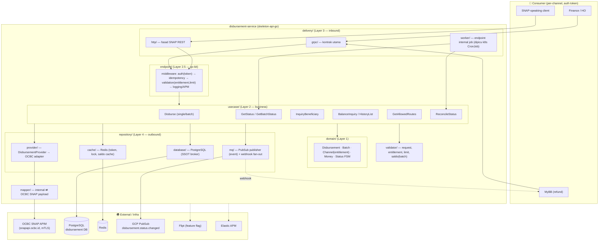
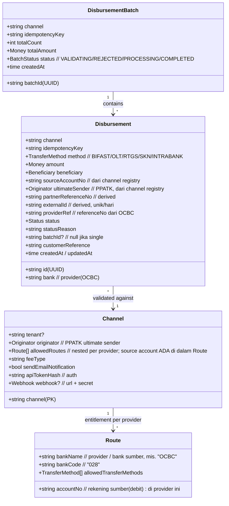
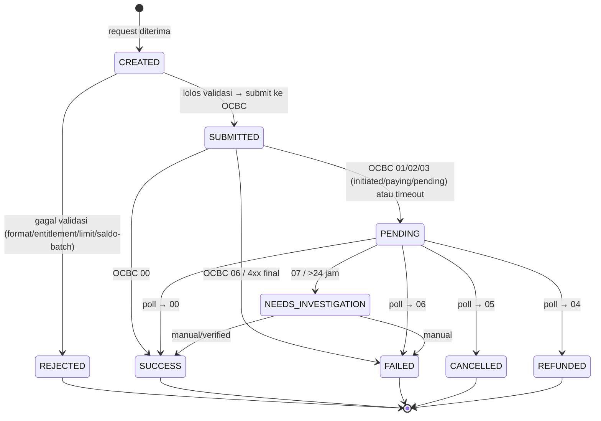
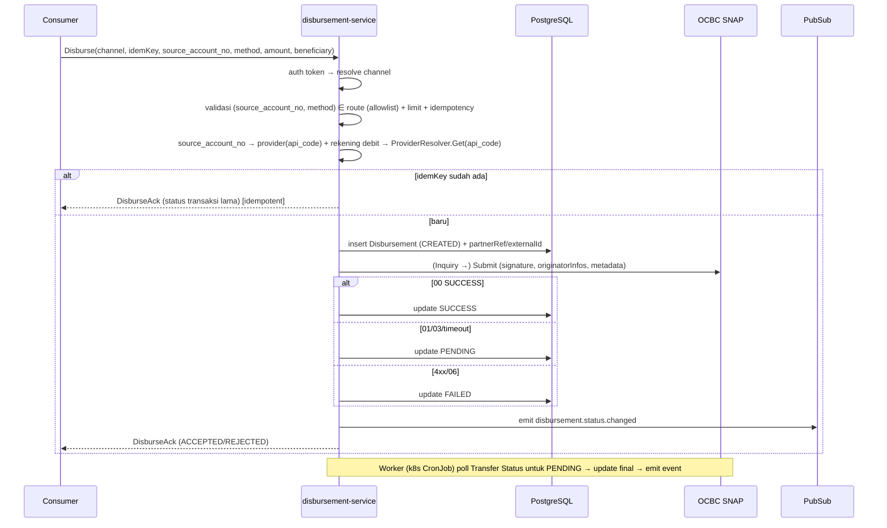
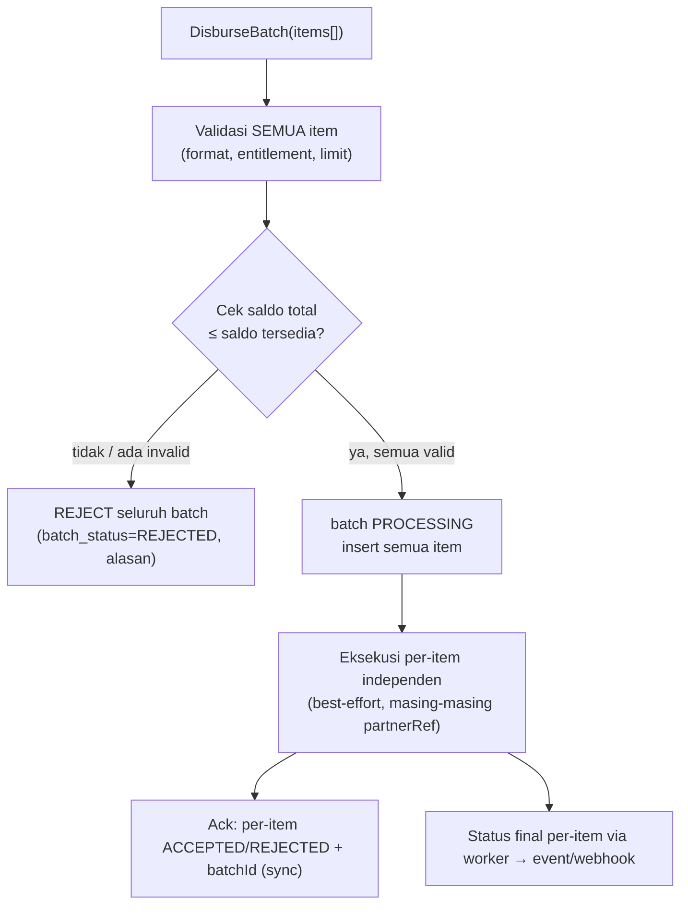
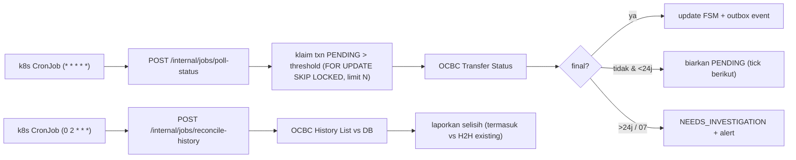

# Disbursement Gateway (UPG) — Design

> **Framework standar (enera)**: **`eneraplus`** — code generator Go Bluebird (repo `git.bluebird.id/eneraplus/eneraplus`, lib `aphrodite`). Service di-scaffold via `eneraplus init-service` (lihat skill `enera`). Layout ter-generate mencakup `usecase/`, `repository/<name>/`, `config/default.go`; konsep layer selaras skeleton-api-go (Clean Architecture + go-kit) di bawah.
> ⚠️ **Reconcile**: pemetaan layer di §2 bersifat konseptual — **samakan dengan output nyata `eneraplus init-service`** (mis. penamaan folder & ada/tidaknya layer `endpoint/`,`delivery/` terpisah) saat implementasi.
> **Basis keputusan**: [[disbursement-gateway-requirements|Requirements]] · **Basis data OCBC**: [[ocbc-snap-disbursement-data-model|Data Model]].
> **Terkonfirmasi OCBC (2026-07-08)**: **single-only + polling-only** (CONF-1 tak ada batch endpoint · CONF-2 tak ada callback). Broker tanggung batch & poller penuh. **CONF-3**: ketersediaan channel digerbang whitelist per-channel (bank+transferMethod) → fase 1 whitelist BIFAST+Intrabank; OLT/RTGS/SKN saat metadata (DATA-1) turun.
> **Boundary**: dokumen desain (arsitektur, kontrak, skema, state machine). Bukan implementasi (→ `/sa:implement`).

---

## 1. Ringkasan Desain

`disbursement-service` = **broker disbursement** (Opsi B: broker-shaped, OCBC-only, provider-agnostic). Consumer internal (Finance dst) memanggil via **gRPC** (utama) / **fasad SNAP REST**; broker menerjemahkan ke **OCBC SNAP**, mengelola idempotency/state/batch/entitlement, menyimpan record di **store sendiri**, dan **emit event** (tanpa posting SAP/HO).

**Prinsip desain kunci:**
1. **Provider-agnostic** — kontrak consumer tak membocorkan istilah OCBC; `DisbursementProvider` interface, OCBC = 1 implementasi.
2. **Store sendiri + event** (#1) — SSOT operasional di DB broker; unified view via event projection (fase lanjut).
3. **Idempotent per-channel** (#3) — `unique(channel, idempotency_key)`, retensi ikut record.
4. **Batch = validate-all-then-execute** (#2) — termasuk cek saldo total; eksekusi best-effort per-item.
5. **Entitlement per-channel** (B6) — client pilih `bank`+`transferMethod`, divalidasi allowlist.

---

## 2. Component Architecture (target layout eneraplus; konsep layer skeleton-api-go)



**Peran per layer (skeleton-api-go):**

| Layer | Isi disbursement-service |
|---|---|
| `domain/` | `Disbursement`, `DisbursementBatch`, `Channel` (entitlement+config), `Money`, enum `TransferMethod`/`Status`, FSM |
| `usecase/` | `disburse.go`, `disburse_batch.go`, `get_status.go`, `inquiry_beneficiary.go`, `balance_inquiry.go`, `history_list.go`, `get_allowed_routes.go`, `reconcile_status.go` |
| `endpoint/` | go-kit endpoints + middleware chain (auth token → idempotency → validation → logging/APM) |
| `delivery/grpc` | Kontrak gRPC utama (proto) |
| `delivery/http` | Fasad SNAP REST (mirror operasi) |
| `delivery/worker` | **Endpoint internal** (ClusterIP, internal-only) untuk poll-status + reconcile-history, **dipicu k8s CronJob** (bukan in-process cron). Klaim baris PENDING via `FOR UPDATE SKIP LOCKED` |
| `repository/database` | PostgreSQL — SSOT broker |
| `repository/cache` | Redis — token OCBC, distributed lock (anti double-submit), cache saldo |
| `repository/provider` | `DisbursementProvider` interface + `ocbc/` adapter (auth, signature, per-channel endpoint) |
| `repository/mq` | PubSub publisher + webhook dispatcher |
| `mapper/` | Kontrak internal ⇄ payload OCBC SNAP (per channel) |
| `validator/` | Validasi request, entitlement, limit teknis, saldo (batch) |
| `pkg/` | `signature/` (RSA+HMAC OCBC), `apm`, `circuitbreaker`, `retry`, `logger`, `featureflag`, `errors`, `httpclient`, `tls` (mTLS OCBC) |

---

## 3. Domain Model



---

## 4. Data Model (PostgreSQL — DB `disbursement`)

> Skema konseptual (kolom kunci). Detail tipe/index final di `/sa:implement` + `migrations/`.

**`channel_registry`** — entitlement + config per channel (kunci semua resolusi)
| Kolom | Ket |
|---|---|
| `channel` (PK) | identitas consumer |
| `tenant` | opsional, grouping |
| `originator_customer_no/name/bank_code` | PPATK ultimate sender (OQ-4) |
| `fee_type`, `send_email_notification` | default OCBC |
| `api_token_hash` | auth per channel (B5) |
| `webhook_url`, `webhook_secret` | notif webhook (nullable) |

> **Entitlement dinormalisasi ke 4 tabel** (bukan jsonb) — `channel_registry` = tabel client (`channel` = `id_client`). **`provider` (integrasi/bank) DIPISAH dari `source_account` (rekening)**:

**`provider`** — integrasi/bank sumber (1 baris per bank/integrasi, BUKAN per rekening)
| Kolom | Ket |
|---|---|
| `id` (PK, BIGSERIAL) | |
| `api_code` (UNIQUE) | kunci resolver → adapter + key kredensial di vault |
| `bank_name`, `bank_code` | "OCBC", "028" |
| `enabled` | default TRUE |

**`source_account`** — rekening sumber dana (N per provider; 1 bank bisa banyak rekening)
| Kolom | Ket |
|---|---|
| `id` (PK) | |
| `provider_id` | FK → `provider(id)` |
| `account_no` | rekening debit |
| `label` | mis. "Finance Ops" (opsional) |
| `enabled` | default TRUE · UNIQUE(`provider_id`,`account_no`) |

**`transfer_method`** — master rail
| Kolom | Ket |
|---|---|
| `id` (PK), `name` (UNIQUE) | INTRABANK/BIFAST/OLT/RTGS/SKN (samakan enum kode) |
| `enabled` | default TRUE |

**`route`** — entitlement (relation): client × **rekening** × method
| Kolom | Ket |
|---|---|
| `id` (PK) | |
| `id_client` | FK → `channel_registry(channel)` |
| `source_account_id` | FK → `source_account(id)` |
| `id_transfer` | FK → `transfer_method(id)` |
| `enabled` | default TRUE; route dibuat **eksplisit (opt-in)** oleh admin via `AddRoute` — bukan auto-allow-all. Nonaktif = FALSE (`DisableRoute`) |
| | UNIQUE(`id_client`,`source_account_id`,`id_transfer`) |

`GetAllowedRoutes` = `SELECT ... FROM route JOIN source_account JOIN provider JOIN transfer_method WHERE id_client=? AND *.enabled` → group **per rekening** jadi nested `Route[]`. Kredensial provider **tetap di vault** (key by `api_code`), bukan DB.

**`disbursements`** — record transaksi (SSOT operasional)
| Kolom | Ket |
|---|---|
| `id` (PK, UUID) | txn id internal |
| `channel`, `batch_id` (nullable) | asal |
| `idempotency_key` | + **UNIQUE(`channel`,`idempotency_key`)** (#3) |
| `bank`, `transfer_method` | pilihan client (tervalidasi entitlement) |
| `amount_value`, `currency` | IDR |
| `beneficiary_account_no/name/bank_code` | penerima (name dari inquiry) |
| `source_account_no` | dari registry |
| `partner_reference_no` (UNIQUE), `external_id` | derived OCBC |
| `provider_ref` | `referenceNo` OCBC |
| `status`, `status_reason` | FSM |
| `purpose`, `customer_reference`, `remark` | meta |
| `raw_request`, `raw_response` (jsonb) | audit/PPATK |
| `created_at`, `updated_at` | |

**`disbursement_batches`** — header batch
| Kolom | Ket |
|---|---|
| `batch_id` (PK), `channel` | |
| `idempotency_key` | UNIQUE(`channel`,`idempotency_key`) |
| `total_count`, `total_amount` | |
| `status` | VALIDATING/REJECTED/PROCESSING/COMPLETED |
| `rejected_reason` (nullable) | bila gagal gate validasi |

**`bank_metadata`** — lookup statis (DATA-1, untuk OLT/RTGS/SKN)
| `bank_code` (PK), `city_code`, `address`, `network_clearing_id`, `branch_name`, `bene_category_default`

**`outbox`** — event outbox (reliable publish ke PubSub)
| `id`, `aggregate_id`, `event_type`, `payload` (jsonb), `published_at` (nullable)

> **Provider token** OCBC (accessToken + expiresAt) disimpan di **Redis** (TTL 900s) + fallback tabel `provider_tokens` bila perlu persist.

---

## 5. State Machine (lifecycle transaksi)



Mapping kode OCBC → status kanonik ada di [[ocbc-snap-disbursement-data-model#6. Status & Response Code (kanonik)|data model §6]]. **Retry hanya dari PENDING** (poll Transfer Status), tidak dari FAILED/REJECTED.

---

## 6. API Contract (gRPC utama)

> Proto sketch (bukan final). Fasad SNAP REST me-mirror operasi ini dengan payload gaya SNAP.

```protobuf
service DisbursementService {
  // Entitlement — client tahu bank+metode yang boleh (B6)
  rpc GetAllowedRoutes(GetAllowedRoutesReq) returns (AllowedRoutesResp);
  // AllowedRoutesResp { repeated Route routes }
  // Route { bank_name, bank_code, account_no, label, repeated TransferMethod allowed_transfer_methods }
  //   nested per REKENING sumber (source_account) — client pilih account_no + method

  // Cek nama beneficiary sebelum transfer
  rpc InquiryBeneficiary(InquiryRequest) returns (InquiryResponse);

  // Single disbursement
  rpc Disburse(DisburseRequest) returns (DisburseAck);      // status=ACCEPTED|REJECTED

  // Batch (fase 1) — validate-all-then-execute (#2)
  rpc DisburseBatch(DisburseBatchRequest) returns (DisburseBatchAck); // per-item ack + batchId

  // Status
  rpc GetStatus(GetStatusRequest) returns (DisbursementStatus);
  rpc GetBatchStatus(GetBatchStatusRequest) returns (BatchStatus);

  // Query pass-through (consumer-facing per PRD)
  rpc BalanceInquiry(BalanceRequest) returns (BalanceResponse);
  rpc HistoryList(HistoryRequest) returns (HistoryResponse);
}

message DisburseRequest {
  string channel = 1;              // + auth token (metadata) — B5
  string idempotency_key = 2;      // #3
  string source_account_no = 3;    // rekening sumber (debit) — divalidasi entitlement B6; bank di-derive
  string transfer_method = 4;      // validasi entitlement — B6
  Money  amount = 5;
  Beneficiary beneficiary = 6;     // TUJUAN: account_no + bank_code
  string purpose = 7;
  string customer_reference = 8;
  // provider(api_code)+bank di-derive dari source_account; originator(PPATK), signature, partnerRef, externalId → di-resolve broker
}

message DisburseAck {
  string txn_id = 1;
  Status status = 2;             // ACCEPTED (pending final) | REJECTED
  string reason = 3;            // bila REJECTED
}

message DisburseBatchAck {
  string batch_id = 1;
  BatchStatus batch_status = 2;  // REJECTED (gate gagal) | PROCESSING
  repeated ItemAck items = 3;    // per-item ACCEPTED/REJECTED + reason
}
```

**Catatan kontrak:**
- Consumer **tidak** mengirim `partnerReferenceNo`, `externalId`, `signature`, `sourceAccount`, `originatorInfos`, metadata bank — semua **di-resolve broker** (lihat [[ocbc-snap-disbursement-data-model#4. Unified Internal Contract Fields (INTI)|data model §4]]).
- `channel` via auth (token per channel, B5); dipakai untuk resolve registry + entitlement + audit.
- Status final **tidak** di response `Disburse` (async) → via **event/polling/webhook** (OQ-2).

### 6.1 Admin API (internal-only) — registrasi & entitlement

> **Keputusan (2026-07-09):** operasi admin = **RPC internal di service ini** (Fork-1 opsi A), ClusterIP internal-only (jaringan Bluebird), **terpisah** dari kontrak consumer. Menutup gap flow #1–#3 (daftar client, registrasi rekening, kelola route, penerbitan token). Fase-1 boleh **seed manual DB** dulu sambil API admin dibangun.

```protobuf
service DisbursementAdmin {
  // Client / channel onboarding
  rpc RegisterClient(RegisterClientReq) returns (RegisterClientResp);   // buat channel + originator PPATK
  rpc IssueToken(IssueTokenReq) returns (IssueTokenResp);               // generate token → plaintext SEKALI
  rpc RotateToken(RotateTokenReq) returns (IssueTokenResp);             // token baru, invalidate lama

  // Provider & rekening sumber
  rpc RegisterProvider(RegisterProviderReq) returns (ProviderResp);     // integrasi/bank (api_code, bank)
  rpc RegisterSourceAccount(RegisterSourceAccountReq) returns (SourceAccountResp); // rekening (provider, account_no, label)

  // Entitlement (route)
  rpc AddRoute(AddRouteReq) returns (RouteResp);                        // client × source_account × method (opt-in)
  rpc DisableRoute(DisableRouteReq) returns (RouteResp);                // enabled=false ("pengurangan")

  // Master rail (opsional/jarang)
  rpc AddTransferMethod(AddTransferMethodReq) returns (TransferMethodResp);
}
```

**Prinsip Admin API:**
- **Internal-only** (ClusterIP + jaringan Bluebird), tidak di-expose gateway publik — sama seperti endpoint poller (§8.3).
- **Penerbitan token** (Fork-2 opsi A): `IssueToken`/`RegisterClient` → service **generate token acak opaque** (32-byte, base62) → simpan **`api_token_hash` = SHA-256(token)** (token high-entropy, bukan password) → kembalikan **plaintext SEKALI** di response (tak bisa dilihat lagi). `RotateToken` = generate baru + invalidate lama.
- **Entitlement opt-in** (grey zone #3): `AddRoute` eksplisit per (client, source_account, method); tak ada auto-allow-all. `DisableRoute` = soft-disable (audit-friendly).
- Semua operasi admin **ter-audit** (siapa, kapan, apa).

---

## 7. Provider Abstraction (Opsi B)

```go
// repository/provider/provider.go
type DisbursementProvider interface {
    InquiryBeneficiary(ctx, InquiryInput) (InquiryResult, error)
    Submit(ctx, SubmitInput) (SubmitResult, error)      // → providerRef + status awal
    GetStatus(ctx, StatusInput) (StatusResult, error)
    BalanceInquiry(ctx, BalanceInput) (BalanceResult, error)
    HistoryList(ctx, HistoryInput) (HistoryResult, error)
}

// Provider resolver — kunci multi-provider "tambah implementor → langsung jalan".
// Usecase resolve adapter dari `bank` yang dipilih client (route). Tambah bank =
// implement interface + daftar 1 baris; kontrak & usecase TAK berubah.
type ProviderResolver interface {
    Get(bank string) (DisbursementProvider, error) // "OCBC" → ocbcAdapter, "BCA" → bcaAdapter
}
```

- **OCBC adapter** (`repository/provider/ocbc/`) implement interface: kelola token B2B (Redis, auto-refresh <900s), Transaction Signature (HMAC_SHA512) via `pkg/signature`, mTLS (`pkg/tls`), pemetaan `transfer_method` → endpoint OCBC (BIFAST/OLT/RTGS/SKN/Intrabank), chaining Inquiry `referenceNo` → Submit, isi `originatorInfos` + metadata bank dari lookup.
- **Multi-provider (mis. tambah BCA)**: (1) tulis adapter baru implement `DisbursementProvider`, (2) daftar di `ProviderResolver` (`"BCA"→bcaAdapter`), (3) tambah route di `channel_registry.allowed_routes` (bank + rekening + rail). **Nol** perubahan proto/usecase. Rekening sumber ikut per-route, jadi tiap provider punya sumber dana & rail sendiri.
- **Fase 1**: hanya OCBC adapter yang diimplement (Opsi B); resolver & seam sudah disiapkan agar provider ke-2 plug-in tanpa refactor.

---

## 8. Key Flows

### 8.1 Single Disburse (worst-case: polling)


> **Alur 2-langkah opsional (konfirmasi nama):** consumer boleh panggil `InquiryBeneficiary(source_account_no, method, beneficiary)` **dulu** → dapat `beneficiaryAccountName` → tampilkan/konfirmasi ke user → baru `Disburse`. Broker juga tetap chaining Inquiry→Submit internal saat Disburse (untuk `referenceNo`).

### 8.2 Batch (#2 — validate-all-then-execute)


### 8.3 Status Poller & Reconciler (k8s CronJob → endpoint internal)

**Mekanisme (keputusan 2026-07-08):** cron **= k8s CronJob** (bukan in-process). CronJob memanggil **endpoint internal** service (ClusterIP, internal-only, aman via jaringan Bluebird — tanpa auth tambahan). Dua CronJob:
- **poll-status** — `schedule: "* * * * *"` (per menit), `concurrencyPolicy: Forbid`, `startingDeadlineSeconds` diset → `POST /internal/jobs/poll-status`.
- **reconcile-history** — `schedule: "0 2 * * *"` (harian) → `POST /internal/jobs/reconcile-history`.

**Anti double-poll (WAJIB, alasan correctness bukan security):** endpoint klaim baris PENDING dengan **`SELECT ... FOR UPDATE SKIP LOCKED`** (batch `limit`) → dua run/replica tak mem-poll transaksi sama → tak ada double update/emit. `concurrencyPolicy: Forbid` hanya cegah tumpuk antar-trigger, tidak menggantikan lock ini.



### 8.4 Notifikasi (OQ-2)
- **Event**: publish ke `disbursement.status.changed` dengan atribut `channel` → **subscription per-consumer + filter `channel`** (isolasi).
- **Polling**: `GetStatus`/`GetBatchStatus`.
- **Webhook** (opsional): dispatcher baca `channel_registry.webhook_url`, sign pakai `webhook_secret`, retry + DLQ.

### 8.5 Registrasi & Onboarding (Admin API, internal-only)

Urutan onboarding lengkap dari nol sampai client bisa transaksi. Semua via **DisbursementAdmin** (§6.1); fase-1 boleh seed manual DB.

```mermaid
sequenceDiagram
    participant Adm as Admin (internal)
    participant S as DisbursementAdmin (RPC internal)
    participant DB as PostgreSQL

    Note over Adm,DB: 1) Setup provider & rekening (sekali per bank/rekening)
    Adm->>S: RegisterProvider(api_code="OCBC", bank_name, bank_code)
    S->>DB: INSERT provider → provider_id
    Adm->>S: RegisterSourceAccount(provider_id, account_no, label)
    S->>DB: INSERT source_account → source_account_id
    Adm->>S: AddTransferMethod(name="BIFAST"/…)  %% biasanya seed sekali
    S->>DB: INSERT transfer_method

    Note over Adm,DB: 2) Onboard client + token
    Adm->>S: RegisterClient(channel, originator PPATK, tenant?)
    S->>DB: INSERT channel_registry
    Adm->>S: IssueToken(channel)
    S->>S: generate token acak → api_token_hash = SHA-256(token)
    S->>DB: simpan hash
    S-->>Adm: token PLAINTEXT (sekali; simpan aman)

    Note over Adm,DB: 3) Beri entitlement (opt-in eksplisit)
    Adm->>S: AddRoute(channel, source_account_id, transfer_method_id)
    S->>DB: INSERT route (enabled=true)
    Note over Adm,DB: ("pengurangan" = DisableRoute → enabled=false)
```

Setelah ini, client bisa `GetAllowedRoutes` (lihat route yang di-assign) → `Disburse` (§8.1).

---

## 9. Cross-Cutting

| Aspek | Desain |
|---|---|
| **Auth (B5)** | Token/API key per channel di metadata gRPC / header REST → middleware cocokkan `api_token_hash`; set `channel` context. **Penerbitan (§6.1):** admin `IssueToken` → token acak opaque (32-byte base62) → simpan `api_token_hash = SHA-256(token)` → plaintext dikembalikan **sekali**; `RotateToken` = baru + invalidate lama. Token high-entropy → SHA-256 cukup (bukan password). |
| **Idempotency (#3)** | Middleware: `UNIQUE(channel, idempotency_key)`; hit ke-2 kembalikan hasil pertama. Batch: key level-batch + per-item. Retensi ikut record. |
| **Anti double-submit** | Redis distributed lock per `partner_reference_no` saat submit (pola `mrg-gateway`). |
| **Entitlement (B6)** | `route` = **allowlist eksplisit (opt-in)** — admin assign `source_account` + method per client saat registrasi (tak ada auto-default/allow-all). `GetAllowedRoutes` kembalikan allowlist; validator tolak (`source_account`,`method`) di luar route. `enabled` = nonaktif sementara. |
| **Balance (B3)** | Single: tanpa pre-check. **Batch: cek total vs saldo** di gate (caveat: race dgn H2H → eksekusi tetap best-effort). |
| **Signature/mTLS** | `pkg/signature` (SHA256withRSA token, HMAC_SHA512 transaction) + `pkg/tls` mTLS ke `snapapi.ocbc.id`. Secret di vault/env. |
| **Resilience** | Circuit breaker (`pkg/circuitbreaker`) ke OCBC; retry hanya PENDING; poller (k8s CronJob → endpoint, `FOR UPDATE SKIP LOCKED`) sebagai safety-net. |
| **HO/SAP (B2)** | **Tidak** posting. Hanya emit event; posting = subscriber terpisah bila perlu. |
| **Guard / Velocity (OQ-5)** | ❌ **Tidak ada guard broker-side** (2026-07-09) — tak ada hard cap/rate-limit (OQ-5 drop), **tak ada `max_amount` per route**, **tak ada whitelist bank tujuan**. Alasan: (1) token sudah divalidasi **owner di sisi client** (approval hulu, MoM ITRFD-621); (2) transaksi bisa **sangat besar** → cap broker-side justru blok txn legit. Rem = owner-approve token + limit teknis OCBC + saldo + **monitoring/alert**. |
| **Feature flag** | Flipt — rollout per channel / per transfer_method. |
| **Observability** | Elastic APM tracing; metrik per channel/method (volume, success rate, latency, saldo); alert saldo rendah & pending menumpuk. |

---

## 10. Penempatan di Landscape UPG

Domain baru **"Disbursement"** di [[../../UPG-Helicopter-View|helicopter view]]. Berdiri sendiri (store + event sendiri), **tidak** menyentuh `transaction`/`bbecv-adapter` (#1). Konsumsi infra bersama: PostgreSQL (DB terpisah `disbursement`), Redis, GCP PubSub, Flipt, APM, ArgoCD (GCP `upg-*` + Huawei CCE). Penjadwalan poller/reconciler pakai **k8s CronJob** (bukan in-process `upg-scheduler`): CronJob memicu endpoint internal service per jadwal (§8.3). Alasan: schedule dikelola ops via manifest (tanpa redeploy app), terpisah dari scale deployment; service aman karena internal-only di jaringan Bluebird.

---

## 11. Open Items / Pending (tidak blok mulai implementasi BIFAST/Intrabank)

| Item | Dampak desain |
|---|---|
| **CONF-1** batch endpoint OCBC? | ✅ **TIDAK ada** (2026-07-08) → broker loop per-item (desain saat ini terkunci). |
| **CONF-2** callback OCBC? | ✅ **Polling-only** (2026-07-08) → worker poll (desain saat ini terkunci); tak ada consumer callback OCBC. |
| **CONF-3 / DATA-1** attachment metadata | ✅ **(2026-07-08)** Ketersediaan method digerbang whitelist per-channel → **whitelist BIFAST + Intrabank dulu**; OLT/RTGS/SKN di-whitelist saat metadata (`bank_metadata`) turun. Bukan blocker go-live. |
| **DATA-2/3** category codes & trxPurpose default | Isi default di mapper/registry saat disepakati product. |

---

## 12. Next Steps

1. Review & sign-off desain → tulis **RFC-UPG-00X** (pola [[../../rfcs/RFC-UPG-001-ho-report-queue-service|RFC-UPG-001]]).
2. `/sa:implement` bertahap: **(a)** skeleton + registry + auth + idempotency, **(b)** OCBC adapter BIFAST/Intrabank + state machine, **(c)** batch, **(d)** worker poller + event/webhook, **(e)** OLT/RTGS/SKN setelah DATA-1.
3. Paralel: Fase 0 procurement OCBC (kredensial, RSA key, mTLS cert, attachment metadata DATA-1 untuk enable OLT/RTGS/SKN). CONF-1/2/3 sudah terjawab (2026-07-08).

---
_Design — mengikuti framework standar `skeleton-api-go`. Diturunkan dari requirements + data model, 2026-07-03._
