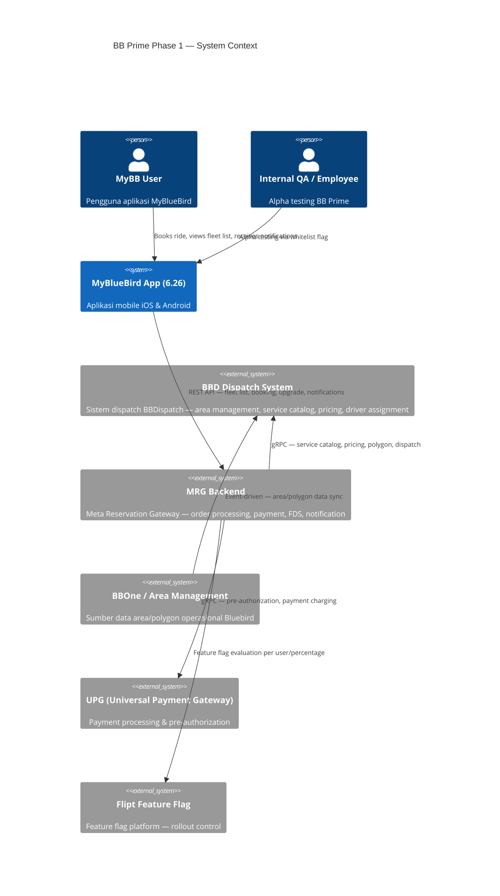
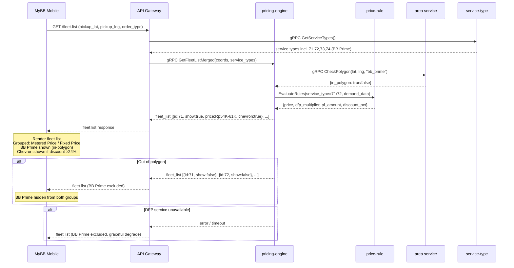
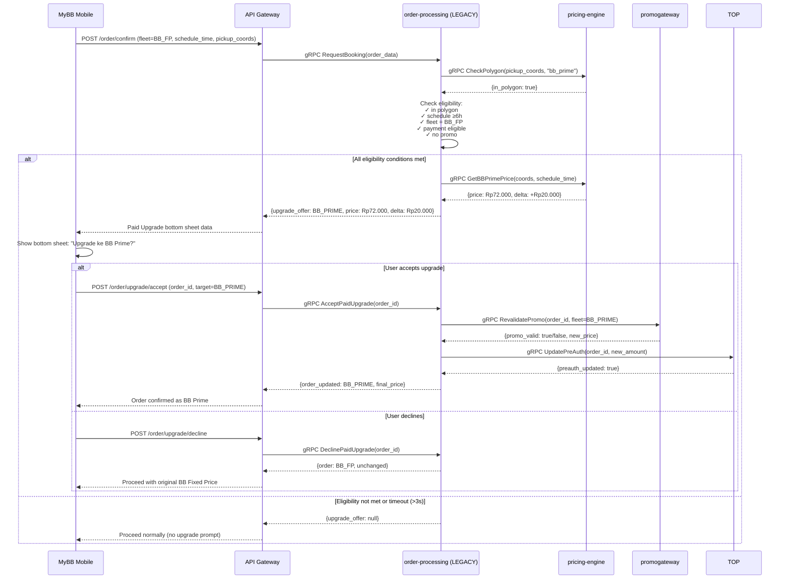
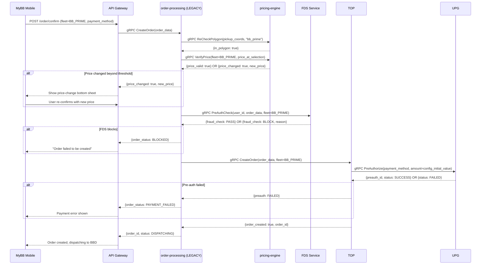
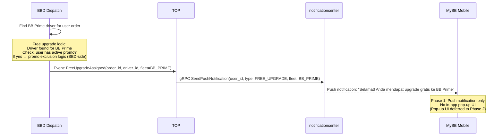

# Integration Document — BB Prime Phase 1 (MyBB 6.26)

---

## Metadata

| Field | Value |
|---|---|
| **Integration Name** | BB Prime Phase 1 — Fleet Display, DFP, Paid Upgrade, FDS Pre-Auth, Free Upgrade |
| **Feature Release** | MyBB 6.26 |
| **PRD Reference** | [BB Prime (incl. Upsell & Free Upgrade Mechanism) v1.0](https://bluebirdgroup.clickup.com/9018711461/docs/8crx7d5-332898/8crx7d5-179418) |
| **Tanggal Dokumen** | 2026-04-23 |
| **Versi Dokumen** | 1.0 |
| **Status** | Draft |
| **Team** | Customer Retail |
| **PM** | Aby Dharmala |
| **APM** | Nurul Aisha Fitriyah, Fionna Benita |
| **TL BE** | Alfian Maulana Malik |
| **TL Mobile** | Angga Fachri Hamdani |
| **Author / Generated by** | bb-architect (Claude Code) |

---

## 1. Overview

BB Prime adalah premium service tier baru di aplikasi MyBlueBird (MyBB). Phase 1 (MyBB 6.26) memperkenalkan BB Prime sebagai opsi fleet baru menggunakan fleet logic yang sudah ada di sisi mobile (tanpa backend fleet list overhaul). Integrasi ini mencakup enam alur utama:

1. **Fleet List Display** — show/hide BB Prime berbasis polygon dari area management
2. **DFP Pricing + Chevron** — model pricing independen BB Prime dengan indikator diskon ≥24%
3. **Fleet List Grouping** — restrukturisasi tampilan mobile dari product-type ke price-type (mobile-only)
4. **Paid Upgrade** — ekstensi flow Paid Upgrade existing ke BB Prime untuk scheduled order ≥6 jam
5. **Order Validation + FDS Pre-Auth** — pipeline validasi order + fraud check + UPG pre-authorization
6. **Free Upgrade Push Notification** — notifikasi upgrade gratis setelah driver BB Prime ditemukan

Phase 2 (MyBB 6.27) akan memigrasi fleet logic ke backend (dynamic fleet list) dan menambah greyed-out states, multi-select fleet, dan sistem upsell banner baru. Phase 1 dan Phase 2 adalah dua release terpisah.

---

## 2. Scope

### 2.1 In Scope (Phase 1 — MyBB 6.26)

| # | Scope Item |
|---|---|
| S-01 | Registrasi BB Prime service types di BBDispatch/service-type (71=Prime Argo, 72=Prime FP, 73=Test Prime Argo, 74=Test Prime FP) |
| S-02 | Polygon check berbasis area service — BE returns show/hide flag ke mobile |
| S-03 | BB Prime DFP pricing model independen (meter & fixed price) di pricing-engine |
| S-04 | BB Prime Platform Fee (PF) kategorisasi terpisah dari standard BB |
| S-05 | Chevron discount indicator (≥24%) dari pricing-engine ke mobile |
| S-06 | Fleet list price-type grouping — mobile-side only (Metered Price / Fixed Price) |
| S-07 | "New" label BB Prime fleet card — show/hide configured by BE |
| S-08 | Paid Upgrade flow extension: BB Fixed Price → BB Prime (scheduled, ≥6 jam) via mybb-order-processing-go |
| S-09 | Promo revalidation saat Paid Upgrade via promogateway |
| S-10 | Order validation pipeline + polygon re-check saat konfirmasi order BB Prime |
| S-11 | UPG pre-authorization untuk BB Prime (initial value configurable via config) |
| S-12 | FDS fraud pre-check untuk BB Prime orders |
| S-13 | Free Upgrade push notification via notificationcenter (setelah driver ditemukan) |
| S-14 | Feature flag rollout via Flipt (Alpha → Beta → GA) |
| S-15 | Polygon cache mobile: sync tiap app launch, TTL max 24 jam (config via configservice) |

### 2.2 Out of Scope (Phase 1 — Deferred ke Phase 2/6.27)

| # | Item | Target |
|---|---|---|
| OS-01 | Dynamic fleet list — migrasi fleet logic ke backend | Phase 2 (6.27) |
| OS-02 | Greyed-out states untuk BB Prime out-of-polygon | Phase 2 (6.27) |
| OS-03 | Multi-select fleet (BB, BB Prime, SB — immediate order) | Phase 2 (6.27) |
| OS-04 | Sistem upsell banner baru (menggantikan Paid Upgrade) | Phase 2 (6.27) |
| OS-05 | Payment-first validation architecture | Phase 2 (6.27) |
| OS-06 | Intelligent sorting (last-used first, ineligible to bottom — backend-driven) | Phase 2 (6.27) |
| OS-07 | Free Upgrade in-app pop-up UI | Phase 2 (6.27) |
| OS-08 | Extended polygon untuk scheduled order (berbeda dari immediate) | Phase 2 (6.27) |
| OS-09 | Multi-select untuk delivery order | Out of scope both phases |
| OS-10 | Integrasi payment method baru | Out of scope both phases |

---

## 3. Use Cases

| UC-ID | Aktor                                    | Deskripsi                                                           | Flow             |
| ----- | ---------------------------------------- | ------------------------------------------------------------------- | ---------------- |
| UC-01 | MyBB User (dalam polygon)                | Melihat BB Prime di fleet list immediate order                      | FLOW-01, FLOW-02 |
| UC-02 | MyBB User (luar polygon)                 | BB Prime tidak muncul di fleet list                                 | FLOW-01          |
| UC-03 | MyBB User                                | Melihat fleet list terkelompok Metered/Fixed Price                  | FLOW-03          |
| UC-04 | MyBB User (scheduled ≥6h, dalam polygon) | Menerima tawaran Paid Upgrade ke BB Prime                           | FLOW-04          |
| UC-05 | MyBB User                                | Menerima/menolak Paid Upgrade BB Prime                              | FLOW-04          |
| UC-06 | MyBB User                                | Konfirmasi order BB Prime dengan validasi + FDS + pre-auth          | FLOW-05          |
| UC-07 | MyBB User                                | Menerima push notification free upgrade ke BB Prime                 | FLOW-06          |
| UC-08 | MyBB User                                | Melihat chevron indikator saat BB Prime diskon ≥24%                 | FLOW-02          |
| UC-09 | Internal QA / Employees                  | Akses BB Prime via feature flag Alpha (whitelist)                   | Feature Flag     |
| UC-10 | System                                   | Polygon BB Prime di-sync dari BBOne ke pricing-engine via area-sync | Background Sync  |

---

## 4. Integration Diagram

### 4.1 C4 Context Diagram



### 4.2 C4 Container Diagram

```mermaid
C4Container
    title BB Prime Phase 1 — Container View

    Person(user, "MyBB User")

    Container(mobile, "MyBB Mobile App", "iOS / Android", "Fleet list UI, polygon cache, price-type grouping (mobile-side)")
    Container(apigw, "mybb-api-gateway-go", "Go / Beego", "REST :3000, gRPC :3443 — entry point semua request mobile")

    Container(servicetype, "BBDispatch/service-type", "Go gRPC", "Service catalog — BB Prime types 71/72/73/74")
    Container(pricingengine, "BBDispatch/pricing-engine", "Go gRPC", "DFP meter+fixed, PF kategorisasi, polygon check, chevron flag")
    Container(pricerule, "price-engine/price-rule", "Go", "JSON DSL Rule Engine — Availability, Pricing, Validation, Upsell rules")
    Container(areaservice, "BBDispatch/area", "Go gRPC", "Geolocation & area management — polygon storage")
    Container(areasync, "BBDispatch/area-sync", "Go gRPC", "Sync geographic data dari BBOne ke area service")

    Container(orderproc, "mybb-order-processing-go", "Go [⚠️ LEGACY]", "Order flow, Paid Upgrade flow, eligibility check")
    Container(top, "TOP (Taxi Order Processor)", "Go gRPC", "Order lifecycle state machine, pre-auth, payment lifecycle")
    Container(fds, "FDS Service", "Go gRPC", "Fraud Detection System — pre-auth check")
    Container(promo, "promogateway", "Go gRPC", "Promo, loyalty, referral, subscription gateway")
    Container(notif, "notificationcenter", "Go", "Push notification — free upgrade alert")
    Container(configsvc, "configservice", "Go gRPC", "Remote config — feature flags, polygon cache TTL, payment eligibility")
    Container(flipt, "Flipt", "Go", "Feature flag platform — bb_prime_fase1_alpha/beta/ga")

    ContainerDb(upg, "UPG", "External", "Universal Payment Gateway — pre-authorization")
    ContainerDb(bbone, "BBOne / Area Mgmt", "External", "Source of truth polygon/area data")

    Rel(user, mobile, "Opens app, views fleet list, confirms order")
    Rel(mobile, apigw, "REST — fleet list, booking, upgrade")
    Rel(apigw, servicetype, "gRPC — service catalog query")
    Rel(apigw, pricingengine, "gRPC — DFP pricing + polygon check + chevron")
    Rel(pricingengine, pricerule, "Internal — rule evaluation")
    Rel(pricingengine, areaservice, "gRPC — polygon coordinates lookup")
    Rel(bbone, areasync, "Event — area/polygon update")
    Rel(areasync, areaservice, "gRPC — sync area data")
    Rel(apigw, orderproc, "gRPC — booking, Paid Upgrade")
    Rel(orderproc, top, "gRPC — order lifecycle, pre-auth")
    Rel(top, upg, "gRPC — pre-authorization")
    Rel(orderproc, fds, "gRPC — fraud pre-check")
    Rel(orderproc, promo, "gRPC — promo revalidation")
    Rel(top, notif, "Event — free upgrade trigger")
    Rel(mobile, configsvc, "gRPC — polygon cache config, feature flag")
    Rel(mobile, flipt, "Feature flag evaluation")
```



### 4.3 Sequence Diagrams

#### FLOW-01 & FLOW-02: Fleet List Display + DFP + Chevron



#### FLOW-04: Paid Upgrade — BB Fixed Price → BB Prime



#### FLOW-05: Order Validation + FDS Pre-Auth



#### FLOW-06: Free Upgrade Push Notification



---

## 5. Data Exchange & Field Mapping

### 5.1 Data Flow Summary

| Flow | Producer | Consumer | Protocol | Trigger | Direction |
|---|---|---|---|---|---|
| FLOW-01/02 | pricing-engine | mobile (via API GW) | gRPC → REST | Fleet list request | Bidirectional |
| FLOW-03 | mobile | mobile | Internal render | Fleet list loaded | Unidirectional |
| FLOW-04 | order-processing | mobile (via API GW) | gRPC → REST | Scheduled order confirm | Bidirectional |
| FLOW-04 (promo) | promogateway | order-processing | gRPC | Upgrade accepted | Bidirectional |
| FLOW-05 (FDS) | FDS | order-processing | gRPC | Order confirm | Bidirectional |
| FLOW-05 (pre-auth) | UPG | TOP | gRPC | Order creation | Bidirectional |
| FLOW-06 | BBD Dispatch → TOP | notificationcenter → mobile | Event → Push | Driver assigned | Unidirectional |
| Polygon sync | BBOne | area-sync → area service → pricing-engine | Event-driven | Area data update | Unidirectional |

### 5.2 Detail per Flow

---

#### FLOW-01/02 — Fleet List + DFP + Chevron

**Spesifikasi Request**

| Field | Tipe | Wajib | Keterangan |
|---|---|---|---|
| `pickup_lat` | float64 | Ya | Koordinat latitude pickup |
| `pickup_lng` | float64 | Ya | Koordinat longitude pickup |
| `order_type` | enum | Ya | `IMMEDIATE` / `SCHEDULED` |
| `schedule_time` | timestamp | Kondisional | Wajib jika `SCHEDULED` |
| `dropoff_lat` | float64 | Tidak | Opsional untuk estimasi harga |
| `dropoff_lng` | float64 | Tidak | Opsional untuk estimasi harga |

**Spesifikasi Response — Fleet Item BB Prime**

| Field | Tipe | Keterangan |
|---|---|---|
| `service_type_id` | int | 71=Prime Argo, 72=Prime FP, 73=Test Argo, 74=Test FP |
| `name` | string | "Bluebird Prime" / "Bluebird Prime Fixed Price" |
| `show` | bool | `true` = in-polygon, `false` = out-of-polygon (hidden) |
| `price_type` | enum | `METERED` / `FIXED` |
| `price_min` | int64 | Estimasi harga minimum (Metered) |
| `price_max` | int64 | Estimasi harga maksimum (Metered) |
| `price_fixed` | int64 | Harga fixed (Fixed Price) |
| `price_label` | string | "Estimation" / "Fixed price" |
| `chevron_show` | bool | `true` jika discount ≥24% |
| `chevron_direction` | enum | `UP` / `DOWN` |
| `discount_pct` | float | Persentase diskon DFP |
| `platform_fee` | int64 | Platform fee BB Prime (kategorisasi terpisah dari standard BB) |
| `new_label_show` | bool | Tampilkan label "New" (dikontrol BE) |
| `eta_min` | int | ETA minimum dalam menit |
| `eta_max` | int | ETA maksimum dalam menit |
| `seat_count` | int | Jumlah kursi tersedia |

**Status & Error Mapping**

| Kondisi | `show` | `chevron_show` | Action |
|---|---|---|---|
| In-polygon, DFP normal | `true` | sesuai threshold | Tampil normal |
| Out-of-polygon | `false` | `false` | Hidden dari fleet list |
| DFP price = 0 atau negatif | `false` | `false` | Hidden, log error |
| DFP service unavailable | `false` | `false` | Graceful degradation |
| Discount ≥24% | `true` | `true` | Chevron down ditampilkan |
| Discount <24% | `true` | `false` | Harga tanpa chevron |

---

#### FLOW-04 — Paid Upgrade: BB Fixed Price → BB Prime

**Eligibility Check Fields**

| Kondisi | Source | Nilai |
|---|---|---|
| `in_bb_prime_polygon` | pricing-engine polygon check | `true` |
| `schedule_lead_time_hours` | order data | `≥ 6` jam |
| `base_fleet` | order data | `BB_FIXED_PRICE` |
| `payment_method` | order data | Eligible untuk BB Prime / GB Now |
| `has_promo` | order data | `false` |
| `app_version` | mobile header | `≥ 6.26` → upsell ke BB Prime; `≤ 6.25` → upsell ke GB Now |

**Paid Upgrade Bottom Sheet Payload**

| Field | Tipe | Keterangan |
|---|---|---|
| `upgrade_offer` | string | `"BB_PRIME"` |
| `base_fleet_name` | string | "Bluebird Fixed Price" |
| `upgrade_fleet_name` | string | "Bluebird Prime" |
| `base_price` | int64 | Harga original (IDR) |
| `upgrade_price` | int64 | Harga BB Prime DFP (IDR) |
| `price_delta` | int64 | Selisih harga (upgrade_price - base_price) |
| `promo_warning` | bool | `true` jika promo akan diinvalidasi saat upgrade |
| `promo_removed_price` | int64 | Harga tanpa promo jika promo diinvalidasi |

**Promo Revalidation (via promogateway)**

| Kondisi | Hasil |
|---|---|
| Promo valid untuk BB Prime | Promo tetap diterapkan |
| Promo tidak valid untuk BB Prime | Promo dihapus; price delta ditampilkan ke user |
| promogateway timeout | Lanjut dengan harga tanpa promo; log timeout |

---

#### FLOW-05 — Order Validation + FDS + Pre-Auth

**FDS Pre-Auth Request**

| Field | Tipe | Keterangan |
|---|---|---|
| `user_id` | string | ID pengguna |
| `order_id` | string | ID order yang akan dibuat |
| `fleet_type` | string | `"BB_PRIME"` |
| `payment_method` | string | Metode pembayaran |
| `amount` | int64 | Estimasi total fare |
| `pickup_lat` | float64 | Koordinat pickup |
| `pickup_lng` | float64 | Koordinat pickup |

**UPG Pre-Authorization**

| Field | Tipe | Keterangan |
|---|---|---|
| `payment_method_id` | string | ID payment method user |
| `initial_amount` | int64 | **Configurable** — nilai TBA, dikonfigurasi via config |
| `order_id` | string | ID order |
| `fleet_type` | string | `"BB_PRIME"` |

> **Catatan**: Initial pre-auth amount untuk BB Prime belum dikonfigurasi (TBA). Nilai ini akan di-setup by config — tidak hardcoded. Refer ke configservice untuk nilai aktual saat go-live.

**Order Validation Status Mapping**

| Kondisi | Status | Pesan ke User |
|---|---|---|
| Semua validasi pass | `ORDER_CREATED` | Order confirmed, dispatching |
| Polygon re-check gagal | `VALIDATION_FAILED` | BB Prime hidden; kembali ke fleet selection |
| Harga berubah > threshold | `PRICE_CHANGED` | Show price-change bottom sheet |
| FDS block | `FRAUD_BLOCKED` | "Order failed to be created" |
| Pre-auth gagal | `PAYMENT_FAILED` | Payment error screen |

---

#### FLOW-06 — Free Upgrade Push Notification

**Notification Payload**

| Field | Tipe | Keterangan |
|---|---|---|
| `user_id` | string | ID penerima notifikasi |
| `order_id` | string | ID order yang di-upgrade |
| `notification_type` | string | `"FREE_UPGRADE"` |
| `from_fleet` | string | Fleet asal (contoh: "Bluebird") |
| `to_fleet` | string | `"Bluebird Prime"` |
| `title` | string | Judul push notification |
| `body` | string | Body push notification |

> **Concern**: Jika user memiliki promo aktif saat free upgrade terjadi, promo dapat diinvalidasi. Logic penanganan ini harus diimplementasikan di **BBD dispatch side** sebelum Phase 1 go-live.

---

#### Polygon Data Sync (Background — BBOne → pricing-engine)

```
BBOne (Area Management)
    │  Event: AreaUpdated / PolygonChanged
    ▼
BBDispatch/area-sync (Go gRPC)
    │  gRPC: SyncAreaData(area_id, polygon_coords, service_type="bb_prime")
    ▼
BBDispatch/area (Go gRPC)
    │  Store polygon data
    ▼
BBDispatch/pricing-engine
    │  Read polygon on every CheckPolygon() call
    ▼
Mobile Cache (via configservice)
    TTL: max 24 jam | Sync: setiap app launch
```

---

## 6. System Constraints & Expectations

### Performance

| Constraint | Target | Measurement |
|---|---|---|
| DFP response time | P95 ≤ 2 detik | BE DFP API response time |
| Fleet list load time | P95 ≤ current baseline + 200ms | Dari fleet list request ke full render |
| Polygon check (mobile-side) | ≤ 100ms | Device-side, Samsung A-series (mid-range Android) |
| Polygon cache TTL | Max 24 jam | Mobile cache age tracking |

### Reliability

| Constraint | Behavior |
|---|---|
| DFP service down | BB Prime hidden; fleet list tetap berfungsi tanpa BB Prime |
| Polygon check gagal | BB Prime hidden; log error; fleet list tidak crash |
| FDS timeout | Order dilanjutkan; di-log untuk manual review post-ride |
| Paid Upgrade fetch timeout (>3s) | Prompt tidak ditampilkan; user lanjut dengan base fleet |
| Pre-auth failure | Order diblokir; error message ditampilkan ke user |
| Stale polygon cache | Background sync saat app launch; user bisa refresh manual |

### Legacy Service Constraint

> **mybb-order-processing-go** berstatus **⚠️ Production Legacy**. Ekstensi Paid Upgrade untuk BB Prime (FLOW-04) akan menyentuh kode legacy ini. TL BE harus memastikan:
> - Regression testing komprehensif untuk existing Paid Upgrade flow (GB Now)
> - Tidak ada perubahan arsitektur pada Phase 1 — hanya extension/konfigurasi
> - Koordinasi dengan tim jika ada rencana migrasi ke non-legacy service di Phase 2

---

## 7. Operability & Error Handling

### 7.1 Error Codes

| Error Code | Service | Deskripsi | User-Facing Action |
|---|---|---|---|
| `BB_PRIME_OUT_OF_POLYGON` | pricing-engine | Pickup di luar polygon BB Prime | BB Prime hidden dari fleet list |
| `BB_PRIME_DFP_UNAVAILABLE` | pricing-engine | DFP service tidak tersedia | BB Prime hidden; log error |
| `BB_PRIME_DFP_INVALID_PRICE` | pricing-engine | Harga DFP ≤ 0 | BB Prime hidden; log error |
| `BB_PRIME_PRICE_CHANGED` | order-processing | Harga berubah sejak selection | Price-change bottom sheet |
| `BB_PRIME_UPGRADE_INELIGIBLE` | order-processing | Kondisi Paid Upgrade tidak terpenuhi | Tidak tampilkan prompt |
| `BB_PRIME_UPGRADE_TIMEOUT` | order-processing | Fetch Paid Upgrade >3 detik | Skip prompt; lanjut base fleet |
| `BB_PRIME_FDS_BLOCKED` | FDS | Order di-flag fraud | "Order failed to be created" |
| `BB_PRIME_PREAUTH_FAILED` | TOP/UPG | Pre-authorization gagal | Payment error screen |
| `BB_PRIME_PROMO_REVALIDATION_FAIL` | promogateway | Revalidasi promo gagal | Lanjut tanpa promo; tampilkan delta |

### 7.2 Retry & Circuit Breaker Policy

| Service | Retry | Timeout | Circuit Breaker |
|---|---|---|---|
| pricing-engine (DFP) | 1x retry, 500ms backoff | 2 detik | Fallback: hide BB Prime |
| FDS | Tidak di-retry | 3 detik | Order proceed; log untuk review |
| promogateway | 1x retry | 2 detik | Fallback: remove promo |
| UPG (pre-auth) | Tidak di-retry | 5 detik | Block order, error ke user |
| notificationcenter | 2x retry, 1s backoff | 3 detik | Silent fail; log |

### 7.3 Feature Flag — Rollback Plan

| Flag | Scope | Rollback Behavior |
|---|---|---|
| `bb_prime_fase1_alpha` | Whitelist user ID | Disable → BB Prime hidden untuk semua user |
| `bb_prime_fase1_beta` | Percentage rollout | Reduce percentage ke 0% atau disable |
| `bb_prime_fase1_ga` | 100% rollout | Kill switch — BB Prime hidden; fleet list revert ke pre-6.26 |
| `bb_prime_paid_upgrade` | Sub-flag Paid Upgrade | Disable Paid Upgrade saja tanpa rollback BB Prime fleet |

> Rollback tidak memerlukan data migration. Order history BB Prime tetap di sistem; fleet hanya disembunyikan dari list.

### 7.4 Alerting & Monitoring

| Metrik | Alert Threshold | Owner |
|---|---|---|
| DFP P95 latency | >2 detik | ENG (TL BE) |
| Fleet list load P95 | >baseline +200ms | ENG (TL BE + TL Mobile) |
| BB Prime order error rate | Meningkat >baseline | ENG |
| App crash rate (fleet selection screen) | Menurun | ENG (TL Mobile) |
| FDS block rate BB Prime | Spike anomali | ENG + FDS team |
| BB Prime adoption rate | <1% setelah 1 minggu Beta | PM (Aby Dharmala) |

### 7.5 Analytics Events Tracking

| Event Name | Trigger | Properties Kunci |
|---|---|---|
| `ride_confirmation_landing` | Fleet list rendered | `bb_prime_visible`, `location_in_polygon`, `grouping_type` |
| `bb_prime_displayed` | BB Prime card rendered | `dfp_price`, `discount_pct`, `chevron_shown` |
| `bb_prime_hidden_out_of_polygon` | BB Prime excluded | `pickup_lat`, `pickup_lng` |
| `fleet_selected` | User tap fleet | `fleet_type`, `is_bb_prime`, `price_group`, `position_in_group` |
| `paid_upgrade_shown` | Upgrade prompt shown | `base_fleet`, `bb_prime_price`, `price_delta`, `schedule_lead_time_h` |
| `paid_upgrade_accepted` | User accepts upgrade | `promo_revalidated`, `promo_removed` |
| `paid_upgrade_declined` | User declines | `decline_method` |
| `bb_prime_order_confirmed` | User confirms BB Prime order | `order_type`, `dfp_price`, `upgraded_via_paid_upgrade` |
| `bb_prime_fds_triggered` | FDS flags order | `fds_reason`, `action_taken` |
| `bb_prime_order_completed` | Ride selesai | `final_fare`, `ride_duration_min` |

---

## 8. Appendix

### 8.1 Glossary

| Istilah | Definisi |
|---|---|
| **BB Prime** | Premium service tier baru Bluebird di MyBlueBird — menggunakan kendaraan premium dengan DFP pricing independen |
| **DFP** | Dynamic Fare Pricing — model harga dinamis berbasis demand |
| **PF** | Platform Fee — biaya platform yang dikategorisasi per service type |
| **Polygon** | Area geografis yang mendefinisikan zona ketersediaan BB Prime — data dari BBOne via area-sync |
| **Chevron** | Indikator visual harga naik/turun — ditampilkan jika diskon ≥24% |
| **Paid Upgrade** | Flow upsell existing — menawarkan upgrade fleet ke tier lebih tinggi untuk scheduled order |
| **Free Upgrade** | Upgrade gratis ke BB Prime yang dipicu oleh BBD dispatch setelah driver ditemukan |
| **MRG** | Meta Reservation Gateway — cluster backend services MyBlueBird |
| **TOP** | Taxi Order Processor — service utama lifecycle order taxi |
| **FDS** | Fraud Detection System — pre-auth fraud check pada order |
| **UPG** | Universal Payment Gateway — payment processing dan pre-authorization |
| **area-sync** | Service yang mensinkronisasi data area/polygon dari BBOne ke platform Bluebird |
| **Flipt** | Feature flag platform open-source yang digunakan Bluebird untuk rollout bertahap |

### 8.2 Service Registry

| Service | Repo | Protocol | Port |
|---|---|---|---|
| mybb-api-gateway-go | `git.bluebird.id/mybb-ms/mybb-api-gateway-go` | REST / gRPC | 3000 / 3443 |
| mybb-order-processing-go | `git.bluebird.id/mybb-legacy/mybb-app/src/mybb-order-processing-go` | gRPC | — |
| BBDispatch/service-type | BBDispatch internal | gRPC | — |
| BBDispatch/pricing-engine | BBDispatch internal | gRPC | — |
| BBDispatch/area | BBDispatch internal | gRPC / REST | — |
| BBDispatch/area-sync | BBDispatch internal | gRPC | — |
| price-engine/price-rule | price-engine internal | Internal | — |
| TOP (mybb-taxi-order-processor) | `git.bluebird.id/mybb-ms/top` | gRPC | — |
| FDS | `git.bluebird.id/mybb-ms/fds` | gRPC | — |
| promogateway | `git.bluebird.id/mybb-ms/promogateway` | gRPC / REST | — |
| notificationcenter | `git.bluebird.id/mybb-ms/notificationcenter` | gRPC | — |
| configservice | `git.bluebird.id/mybb-ms/configservice` | gRPC / REST | 6003 / 8003 |

### 8.3 Related Documents

| Dokumen | Link |
|---|---|
| PRD BB Prime Phase 1 | [ClickUp Doc](https://bluebirdgroup.clickup.com/9018711461/docs/8crx7d5-332898/8crx7d5-179418) |
| PRD Price Engine / DFP | [ClickUp Doc](https://bluebirdgroup.clickup.com/docs/9018711461/d/h/8crx7d5-369018/186f8cdf92ca6df) |
| Figma Design — Ride Immediate/Advance | [Figma Branch](https://www.figma.com/design/JQvevvf2ADqUTkMS2vXu5Q/branch/wRZSay4KJvBTDJWp7v0ydI) |

---

## 9. Referensi & Dasar Pembuatan

### 9.1 Requestor / Penginisiasi

| Field | Value |
|---|---|
| **Requestor** | Lukmanul Hakim (lukmanul.hakim@bluebirdgroup.com) |
| **Divisi** | Engineering — MyBlueBird Platform |

### 9.2 Dasar Permintaan

| # | Tipe | Referensi | Keterangan |
|---|---|---|---|
| 1 | PRD | [BB Prime (incl. Upsell & Free Upgrade) v1.0](https://bluebirdgroup.clickup.com/9018711461/docs/8crx7d5-332898/8crx7d5-179418) | PRD utama fitur BB Prime Phase 1 — April 2026 |
| 2 | Knowledge Base | Bluelink MCP — `BBDispatch/service-type`, `BBDispatch/pricing-engine`, `BBDispatch/area`, `BBDispatch/area-sync` | Current condition BBDispatch services |
| 3 | Knowledge Base | Bluelink MCP — `services/MRG/*` (order-processing, TOP, FDS, promogateway, notificationcenter, configservice, API gateway) | Current condition MRG backend services |
| 4 | Knowledge Base | Bluelink MCP — `price-engine/price-rule`, `flipt/flipt-feature-flag` | Price Rule Engine & Feature Flag platform |

### 9.3 Versi & Tanggal

| Field | Value |
|---|---|
| **Tanggal Pembuatan** | 2026-04-23 |
| **Versi Dokumen** | 1.0 |
| **Author** | bb-architect (Claude Code) — generated from PRD + Bluelink assessment |
| **Next Review** | Sebelum Alpha (setelah polygon BB Prime didefinisikan oleh STO & pre-auth amount dikonfigurasi) |

---

> **Open Items sebelum dokumen ini final:**
> - [ ] **OQ-01**: Polygon BB Prime (immediate + scheduled) dikonfirmasi dari STO / Area Management → update FLOW-01 polygon spec
> - [ ] **Pre-auth amount**: Nilai initial BB Prime pre-auth dikonfigurasi via configservice → update FLOW-05 UPG section
> - [ ] **Paid Upgrade threshold**: Konfirmasi final ≥6 jam dari PM (Aby Dharmala) → tercantum di FLOW-04
> - [ ] **Free Upgrade promo conflict**: Logic di BBD dispatch dikonfirmasi dan diimplementasikan sebelum Phase 1 go-live
