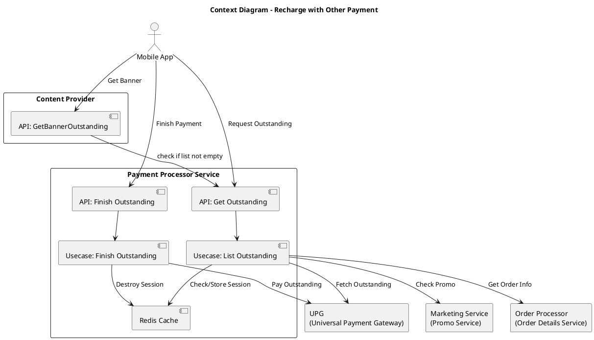
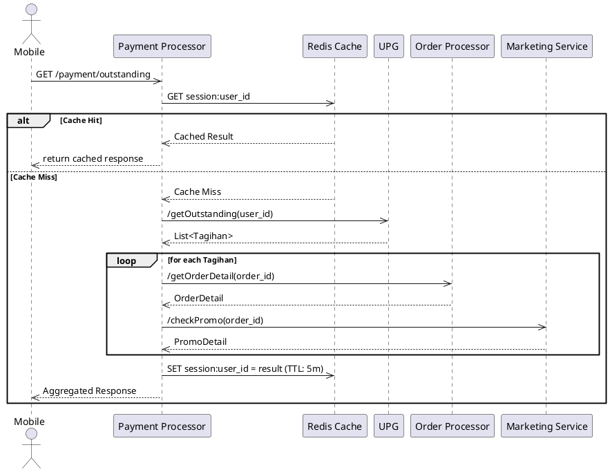
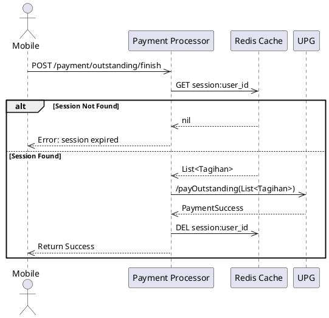
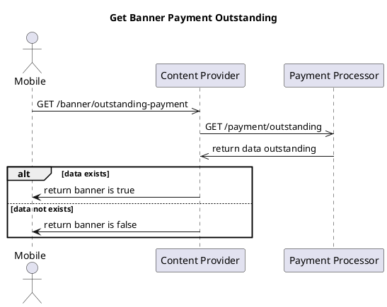

# Recharge with Other Payment - Integration Guide

> **Feature**: Payment Outstanding / Recharge with Other Payment
> **Services**: MRG (Meta Reservation Gateway) × UPG (Universal Payment Gateway)
> **Status**: Implementation Guide
> **Date**: 2025-01-03

## Overview

Fitur **Recharge with Other Payment** memungkinkan user untuk melakukan pembayaran tagihan outstanding (order yang belum dibayar) menggunakan metode pembayaran lain selain yang digunakan saat pemesanan awal.

### Key Capabilities
- Mengambil daftar tagihan outstanding dari UPG
- Melengkapi informasi order dari Order Processor
- Mengecek promo yang tersedia melalui Marketing Service
- Melakukan pembayaran dengan payment method yang berbeda
- Caching untuk optimasi performa

---

## Architecture Context

### Service Components

| Service | Role | Responsibilities |
|---------|------|------------------|
| **Mobile App** | Client | Trigger request untuk payment outstanding |
| **Content Provider** | Banner Manager | Menampilkan banner jika ada outstanding payment |
| **Payment Processor** | Orchestrator | Mengatur flow payment outstanding |
| **UPG** | Payment Gateway | Menyimpan dan memproses tagihan outstanding |
| **Order Processor** | Order Data | Menyediakan detail order per tagihan |
| **Marketing Service** | Promo Engine | Mengecek ketersediaan promo per order |
| **Redis Cache** | Cache Layer | Temporary storage untuk session management |

### Context Diagram



---

## Use Cases

### 1. Get Payment Outstanding

**Tujuan**: Mengambil daftar tagihan outstanding user

**Flow**:
1. Mobile app request ke Payment Processor
2. Payment Processor cek Redis cache
3. Jika cache hit → return cached result
4. Jika cache miss:
   - Fetch outstanding list dari UPG
   - Loop untuk setiap tagihan:
     - Get order detail dari Order Processor
     - Check promo dari Marketing Service
   - Aggregate data dan simpan ke Redis (TTL: 5 menit)
5. Return response ke mobile app

**Caching Strategy**:
- Key: `session:user_id`
- TTL: 5 minutes
- Tujuan: Mengurangi load ke downstream services

**Response Example**:
```json
{
  "outstanding_payments": [
    {
      "order_id": "ORD-001",
      "amount": 50000,
      "service_type": "ride",
      "status": "pending",
      "created_at": "2025-01-03T10:00:00Z",
      "promo": {
        "available": true,
        "discount": 5000,
        "code": "NEWUSER"
      }
    }
  ],
  "total_amount": 50000,
  "total_discount": 5000,
  "final_amount": 45000
}
```

---

### 2. Finish Outstanding Payment

**Tujuan**: Melakukan pembayaran untuk tagihan outstanding

**Flow**:
1. Mobile app POST request dengan payment method baru
2. Payment Processor ambil session dari Redis
3. Jika session expired → return error
4. Jika session valid:
   - Kirim payment request ke UPG
   - Hapus session dari Redis
5. Return success response

**Error Handling**:
- Session expired: HTTP 400 dengan message "Session expired, please refresh"
- Payment failed: HTTP 500 dengan detail error dari UPG
- Invalid payload: HTTP 400 dengan validation error

**Request Example**:
```json
{
  "user_id": "USER-123",
  "payment_method": "gopay",
  "order_ids": ["ORD-001", "ORD-002"]
}
```

---

### 3. Get Banner Payment Outstanding

**Tujuan**: Menampilkan banner di app jika user memiliki outstanding payment

**Flow**:
1. Content Provider request banner info
2. Content Provider call Payment Processor API
3. Jika ada outstanding payment → return banner = true
4. Jika tidak ada → return banner = false

**Response Example**:
```json
{
  "show_banner": true,
  "message": "You have pending payments",
  "action_url": "/payment/outstanding"
}
```

---

## Sequence Diagrams

### Get Payment Outstanding Flow



---

### Finish Outstanding Payment Flow



---

### Get Banner Payment Outstanding Flow



---

## Data Flow Summary

| Source | Target | Data | Purpose |
|--------|--------|------|---------|
| Mobile | Payment Processor | API Request | Trigger payment flow |
| Payment Processor | Redis | Cache check/update | Performance optimization |
| Payment Processor | UPG | Tagihan list | Get outstanding bills |
| Payment Processor | Order Processor | Order detail per tagihan | Complete order information |
| Payment Processor | Marketing Service | Promo check per order | Apply available discounts |
| Payment Processor | Redis | Session store/delete | Session management |
| Payment Processor | Mobile | Aggregated response | Complete payment info |

---

## Technical Implementation

### API Endpoints

#### 1. Get Outstanding Payment
```
GET /api/v1/payment/outstanding
Headers:
  Authorization: Bearer {token}
  X-User-ID: {user_id}

Response: 200 OK
{
  "outstanding_payments": [...],
  "total_amount": 50000,
  "cached": true
}
```

#### 2. Finish Outstanding Payment
```
POST /api/v1/payment/outstanding/finish
Headers:
  Authorization: Bearer {token}
  Content-Type: application/json

Body:
{
  "user_id": "USER-123",
  "payment_method": "gopay",
  "order_ids": ["ORD-001"]
}

Response: 200 OK
{
  "status": "success",
  "transaction_id": "TXN-789",
  "paid_orders": ["ORD-001"]
}
```

#### 3. Get Banner Status
```
GET /api/v1/banner/outstanding-payment
Headers:
  Authorization: Bearer {token}

Response: 200 OK
{
  "show_banner": true,
  "count": 2
}
```

---

### Redis Configuration

**Key Pattern**: `payment:outstanding:session:{user_id}`

**Data Structure**:
```json
{
  "user_id": "USER-123",
  "outstanding_payments": [...],
  "fetched_at": "2025-01-03T10:00:00Z",
