---
tags:
  - rabbitmq
  - messaging
  - infrastructure
  - benchmark
  - mermaid
  - hwc
  - performance-testing
type: technical-reference
status: active
created: '2026-01-30'
related:
  - rabbitmq-queue-types-comparison
last_updated: '2026-02-02'
---
# RabbitMQ Benchmark: Classic vs Quorum Queue Comparison

**Created:** 2026-01-30  
**Author:** Architecture Team  
**Purpose:** Dokumentasi detail mekanisme benchmark Classic vs Quorum Queue  
**Source:** `D:\code\go\Arsitech\rabit-mq-banchmark\docs\comparison.md`

---

## Table of Contents

1. [Test Architecture Overview](#1-test-architecture-overview)
2. [Environment Setup Flow](#2-environment-setup-flow)
3. [Benchmark Execution Flow](#3-benchmark-execution-flow)
4. [Message Flow Comparison](#4-message-flow-comparison)
5. [Raft Consensus Mechanism](#5-raft-consensus-mechanism)
6. [Metrics Collection](#6-metrics-collection)
7. [Test Scenarios](#7-test-scenarios)
8. [Results Analysis](#8-results-analysis)
9. [Limitations](#9-limitations)

---

## 1. Test Architecture Overview

### Infrastructure Diagram


### Component Roles


---

## 2. Environment Setup Flow

### Cluster Formation Sequence


### Setup State Machine


---

## 3. Benchmark Execution Flow

### Main Benchmark Process

```mermaid
flowchart TD
    A([🚀 Start Benchmark]) --> B[Initialize Variables<br/>TIMESTAMP, RESULTS_DIR]
    B --> C[Create Results Directory]
    
    C --> D{{"🔄 For Each Test Scenario<br/>T01, T02, T07, T08, L04, L05"}}
    
    D --> E[Build PerfTest Command]
    E --> F[Run Docker Container]
    
    subgraph PerfTestExec["⚡ PerfTest Execution"]
        F --> G[Connect to RabbitMQ]
        G --> H{Queue Type?}
        
        H -->|Classic| I[Create Classic Queue<br/>Single Node]
        H -->|Quorum| J[Create Quorum Queue<br/>Raft Consensus]
        
        I --> K[Start Publisher Thread]
        J --> K
        
        K --> L[Start Consumer Thread]
        L --> M[Run for Duration<br/>30 seconds]
        M --> N[Calculate Statistics]
    end
    
    N --> O[Save Results to File]
    O --> P{More Tests?}
    
    P -->|Yes| D
    P -->|No| Q[Generate Summary]
    Q --> R([✅ End])
    
    style A fill:#22c55e,color:#000
    style R fill:#22c55e,color:#000
    style PerfTestExec fill:#1e3a5f
```



### Test Execution Sequence


---

## 4. Message Flow Comparison

### Classic Queue Flow (Single Node - No Replication)

> ⚠️ **Note:** Classic Mirrored Queues sudah **deprecated di RabbitMQ 3.9** dan **removed di RabbitMQ 4.0**. Classic Queue sekarang adalah **single-node only**, tidak ada replication.

```mermaid
flowchart LR
    subgraph ClassicFlow["📦 Classic Queue - Single Node"]
        P["📤 Publisher"]
        Q[("📬 Queue\nrabbitmq1")]
        C["📥 Consumer"]
        D[("💾 Disk")]
        
        P -->|"1. Publish"| Q
        Q -->|"2. Persist"| D
        Q -->|"3. Confirm"| P
        Q -->|"4. Deliver"| C
        C -->|"5. ACK"| Q
    end
    
    style Q fill:#22c55e,color:#000
    style D fill:#64748b,color:#fff
```



**Classic Queue Characteristics:**
- Message disimpan di **single node** saja
- **Tidak ada replication** ke node lain
- Jika node crash = **data hilang** (kecuali persistent + durable)
- Confirm dikirim setelah write ke memory/disk (fast)

### Quorum Queue Flow (Raft Consensus - Replicated)

```mermaid
flowchart LR
    subgraph QuorumFlow["🔒 Quorum Queue - Replicated"]
        P2["📤 Publisher"]
        L[("📬 Leader\nrabbitmq1")]
        F1[("📋 Follower\nrabbitmq2")]
        F2[("📋 Follower\nrabbitmq3")]
        C2["📥 Consumer"]
        
        P2 -->|"1. Publish"| L
        L -->|"2. Replicate"| F1
        L -->|"2. Replicate"| F2
        F1 -->|"3. ACK"| L
        F2 -->|"3. ACK"| L
        L -->|"4. Confirm\n(after majority)"| P2
        L -->|"5. Deliver"| C2
    end
    
    style L fill:#f59e0b,color:#000
    style F1 fill:#f59e0b,color:#000
    style F2 fill:#f59e0b,color:#000
```



**Quorum Queue Characteristics:**
- Message di-replicate ke **semua nodes** (Raft consensus)
- Confirm dikirim setelah **majority ACK** (2 dari 3 nodes)
- Jika 1 node crash = **data aman**, auto failover
- Lebih lambat karena perlu consensus

### Comparison Matrix

```mermaid
flowchart LR
    subgraph Classic["🟢 Classic Queue"]
        C1["Single Node Storage"]
        C2["Async Replication"]
        C3["Fast Confirm"]
        C4["Risk: Data Loss"]
    end
    
    subgraph Quorum["🟠 Quorum Queue"]
        Q1["Multi-Node Storage"]
        Q2["Sync Replication"]
        Q3["Majority Confirm"]
        Q4["Safe: No Data Loss"]
    end
    
    C1 -.->|"vs"| Q1
    C2 -.->|"vs"| Q2
    C3 -.->|"vs"| Q3
    C4 -.->|"vs"| Q4
    
    style Classic fill:#22c55e20
    style Quorum fill:#f59e0b20
```



---

## 5. Raft Consensus Mechanism

### Raft Replication Sequence

```mermaid
sequenceDiagram
    autonumber
    participant P as 📤 Publisher
    participant L as 🟠 Leader (R1)
    participant F1 as 🟠 Follower (R2)
    participant F2 as 🟠 Follower (R3)
    
    P->>L: Publish message
    
    Note over L: Write to local log
    
    par Parallel Replication
        L->>F1: AppendEntries (message)
        L->>F2: AppendEntries (message)
    end
    
    F1->>F1: Write to log
    F2->>F2: Write to log
    
    F1-->>L: ACK ✅
    F2-->>L: ACK ✅
    
    Note over L: Quorum reached (2/3)
    
    L->>L: Commit message
    L-->>P: Confirm ✅
    
    Note over L: Ready for delivery
    L->>L: Deliver to consumer
```



### Quorum States


### Leader Election

```mermaid
flowchart TD
    subgraph Normal["Normal Operation"]
        L1[("🟢 Leader<br/>rabbitmq1")]
        F1[("🟠 Follower<br/>rabbitmq2")]
        F2[("🟠 Follower<br/>rabbitmq3")]
        
        L1 -->|heartbeat| F1
        L1 -->|heartbeat| F2
    end
    
    subgraph Failure["Leader Failure"]
        L1X[("❌ Leader DOWN<br/>rabbitmq1")]
        F1W[("⏳ Follower<br/>rabbitmq2")]
        F2W[("⏳ Follower<br/>rabbitmq3")]
        
        L1X -.->|"no heartbeat"| F1W
        L1X -.->|"no heartbeat"| F2W
    end
    
    subgraph Election["New Election"]
        L1D[("❌ DOWN<br/>rabbitmq1")]
        F1C[("🟢 Candidate<br/>rabbitmq2")]
        F2V[("🗳️ Voter<br/>rabbitmq3")]
        
        F1C -->|"RequestVote"| F2V
        F2V -->|"Vote"| F1C
    end
    
    subgraph NewLeader["New Leader"]
        L1D2[("❌ DOWN<br/>rabbitmq1")]
        NL[("🟢 NEW Leader<br/>rabbitmq2")]
        F2N[("🟠 Follower<br/>rabbitmq3")]
        
        NL -->|heartbeat| F2N
    end
    
    Normal -->|"Node crash"| Failure
    Failure -->|"Election timeout"| Election
    Election -->|"Votes received"| NewLeader
```



---

## 6. Metrics Collection

### PerfTest Internal Flow


### Metrics Diagram


---

## 7. Test Scenarios

### Test Matrix Overview


### Test Configuration Decision Tree


---

## 8. Results Analysis

### Configuration Summary

	**Purpose:** Validasi configuration untuk production-readiness  
	**Focus:** Publisher Confirms & Consumer Acknowledgments

| Test | Queue Type | Confirms | Acks  | Keterangan                          |
| ---- | ---------- | -------- | ----- | ----------------------------------- |
| T01  | Classic    | ❌ NO     | ❌ NO  | Baseline tanpa guarantee            |
| T02  | Classic    | ✅ YES    | ❌ NO  | Publisher confirms only             |
| T03  | Classic    | ❌ NO     | ✅ YES | Consumer acks only                  |
| T04  | Classic    | ✅ YES    | ✅ YES | Production-ready Classic            |
| T05  | Classic    | ✅ YES    | ✅ YES | Production + prefetch=1             |
| T06  | Classic    | ✅ YES    | ✅ YES | Production + durable queue          |
| T07  | Quorum     | ❌ NO     | ❌ NO  | Baseline tanpa guarantee            |
| T08  | Quorum     | ✅ YES    | ❌ NO  | Publisher confirms only             |
| T09  | Quorum     | ❌ NO     | ✅ YES | Consumer acks only                  |
| T10  | Quorum     | ✅ YES    | ✅ YES | Production-ready Quorum             |
| T11  | Quorum     | ✅ YES    | ✅ YES | Production + prefetch=1             |
| T12  | Quorum     | ✅ YES    | ✅ YES | Production + replication_factor=3   |
| L01  | Classic    | ❌ NO     | ❌ NO  | Latency baseline Classic            |
| L02  | Classic    | ✅ YES    | ✅ YES | Latency production Classic          |
| L03  | Classic    | ✅ YES    | ✅ YES | Latency controlled load (100 msg/s) |
| L04  | Quorum     | ❌ NO     | ❌ NO  | Latency baseline Quorum             |
| L05  | Quorum     | ✅ YES    | ✅ YES | Latency production Quorum           |
| L06  | Quorum     | ✅ YES    | ✅ YES | Latency controlled load (100 msg/s) |
| S01  | Classic    | ✅ YES    | ✅ YES | Stress test - high load sustained   |
| S02  | Quorum     | ✅ YES    | ✅ YES | Stress test - high load sustained   |
| S03  | Classic    | ✅ YES    | ✅ YES | Stress test - burst traffic         |
| S04  | Quorum     | ✅ YES    | ✅ YES | Stress test - burst traffic         |
| R01  | Classic    | ✅ YES    | ✅ YES | Recovery test - node restart        |
| R02  | Quorum     | ✅ YES    | ✅ YES | Recovery test - node restart        |
| R03  | Classic    | ✅ YES    | ✅ YES | Recovery test - network partition   |
| R04  | Quorum     | ✅ YES    | ✅ YES | Recovery test - network partition   |

	**Kategori Test:**
	- **T-series (T01-T12)**: Throughput tests dengan variasi konfigurasi
	- **L-series (L01-L06)**: Latency tests dengan controlled load
	- **S-series (S01-S04)**: Stress tests untuk production readiness
	- **R-series (R01-R04)**: Recovery & resilience tests

	**Key Findings:**
	- **T04 & T10**: Production-ready configurations dengan full guarantees
	- **T01 & T07**: Baseline tests, tidak recommended untuk production
	- **L-series**: Latency-controlled tests untuk measuring response time
	- **S-series**: Stress tests untuk validating system under load
	- **R-series**: Recovery tests untuk validating HA capabilities
	
	**Production Recommendation:**
	- Classic Queue → Use **T04** configuration (confirms + acks)
	- Quorum Queue → Use **T10** configuration (confirms + acks)
	- Both ensure message durability dan delivery guarantees

---

### Test Results

#### HWC Environment Test - 2026-02-02 15:45

**Environment Specifications:**

```
Infrastructure:
- VM Docker: s7n.medium.2 (1 vCPU | 2 GiB)
- RabbitMQ Cluster: rabbitmq.2u4g.cluster
  * Max Connections per Broker: 1,000
  * Recommended Queues per Broker: 100
  * Architecture: 3-Node Cluster

Resource Usage:
- CPU: 78% (during test)
```

**Test Results:**

| Test ID | Queue Type | Send Rate    | Recv Rate    | Latency p50 | Latency p99 |
|---------|------------|--------------|--------------|-------------|-------------|
| **L04** | Quorum     | 1,010 msg/s  | 1,010 msg/s  | 2.3 ms      | 5.2 ms      |
| **L05** | Quorum     | 5,088 msg/s  | 5,088 msg/s  | 3.9 ms      | 24.4 ms     |
| **T01** | Classic    | 14,872 msg/s | 14,861 msg/s | 144.1 ms    | 458.2 ms    |
| **T02** | Classic    | 19,959 msg/s | 19,959 msg/s | 4.8 ms      | 9.0 ms      |
| **T07** | Quorum     | 12,131 msg/s | 12,128 msg/s | 98.5 ms     | 410.2 ms    |
| **T08** | Quorum     | 11,118 msg/s | 11,117 msg/s | 7.3 ms      | 24.3 ms     |

**Key Observations:**

- **Classic T02** (Production-ready): 19,959 msg/s dengan latency p50 hanya 4.8ms
- **Quorum T08** (Production-ready): 11,118 msg/s dengan latency p50 7.3ms
- **Performance Gap**: Classic ~1.8x lebih cepat dari Quorum untuk production config
- **Latency Consistency**: 
  - L04 (rate-limited): Best latency p50 (2.3ms) dan p99 (5.2ms)
  - L05 (higher rate): Latency p50 masih bagus (3.9ms) dengan p99 24.4ms
- **CPU Impact**: 78% CPU usage menunjukkan sistem masih ada headroom

**Recommendations:**
- Untuk production workload dengan high throughput requirement → **Classic T02**
- Untuk critical data yang butuh high availability → **Quorum T08**
- Optimal rate untuk low latency Quorum → **1,000-5,000 msg/s** (L04/L05)

---

### Performance Comparison


### Why Classic is Faster

```mermaid
flowchart TB
    subgraph ClassicPath["🟢 Classic Path (~3ms)"]
        CP1["1. Publish"] --> CP2["2. Write to Memory"]
        CP2 --> CP3["3. Confirm ✅"]
        CP3 --> CP4["4. Async Persist"]
    end
    
    subgraph QuorumPath["🟠 Quorum Path (~21ms)"]
        QP1["1. Publish"] --> QP2["2. Write to Leader"]
        QP2 --> QP3["3. Replicate to Followers"]
        QP3 --> QP4{{"4. Wait Majority"}}
        QP4 --> QP5["5. Commit"]
        QP5 --> QP6["6. Confirm ✅"]
    end
    
    CP1 -.->|"~3ms total"| CP3
    QP1 -.->|"~21ms total"| QP6
    
    style CP3 fill:#22c55e,color:#000
    style QP6 fill:#f59e0b,color:#000
```



### Trade-off Summary

```mermaid
flowchart LR
    subgraph Winner["✅ Winner"]
        direction TB
    end
    
    subgraph Metrics
        M1["Throughput"] --> W1["🟢 Classic"]
        M2["Latency p50"] --> W2["🟢 Classic"]
        M3["Data Safety"] --> W3["🟠 Quorum"]
        M4["Failover"] --> W4["🟠 Quorum"]
        M5["Resource Usage"] --> W5["🟢 Classic"]
    end
    
    style W1 fill:#22c55e
    style W2 fill:#22c55e
    style W3 fill:#f59e0b
    style W4 fill:#f59e0b
    style W5 fill:#22c55e
```



### Results Table

```mermaid
flowchart TB
    subgraph Results["📊 Benchmark Results"]
        direction TB
        
        subgraph Classic["🟢 Classic Queue"]
            C1["T01: 21,864 msg/s<br/>Latency p50: 82.6ms"]
            C2["T02: 25,585 msg/s<br/>Latency p50: 2.8ms ⭐"]
        end
        
        subgraph Quorum["🟠 Quorum Queue"]
            Q1["T07: 7,720 msg/s<br/>Latency p50: 119.9ms"]
            Q2["T08: 4,430 msg/s<br/>Latency p50: 21.2ms 🔒"]
            Q3["L04: 1,014 msg/s<br/>Latency p50: 14.2ms"]
            Q4["L05: 4,392 msg/s<br/>Latency p50: 21.6ms"]
        end
    end
    
    style C2 fill:#22c55e
    style Q2 fill:#f59e0b
```



---

## 9. Limitations

### Local vs Production Environment

```mermaid
flowchart LR
    subgraph Local["🏠 Local Docker"]
        LD["All 3 nodes<br/>Same machine<br/>Same CPU/RAM/Disk"]
    end
    
    subgraph Production["☁️ Production HWC"]
        P1["Node 1<br/>AZ-1"]
        P2["Node 2<br/>AZ-2"]
        P3["Node 3<br/>AZ-3"]
        
        P1 <-->|"Network<br/>~1-5ms"| P2
        P2 <-->|"Network<br/>~1-5ms"| P3
        P1 <-->|"Network<br/>~1-5ms"| P3
    end
    
    Local -.->|"Different<br/>characteristics"| Production
    
    style Local fill:#ef444420
    style Production fill:#22c55e20
```

### Test Limitations

```mermaid
flowchart TB
    subgraph Limitations["⚠️ Test Limitations"]
        L1["🖥️ Single Machine Docker<br/>All nodes share resources"]
        L2["🌐 Local Network<br/>No real network latency"]
        L3["⏱️ 30s Duration<br/>May not show steady-state"]
        L4["📊 Constant Load<br/>No burst patterns tested"]
    end
    
    subgraph Recommendations["💡 For Production"]
        R1["Test on actual HWC nodes"]
        R2["Run longer duration (5+ min)"]
        R3["Test with realistic load patterns"]
        R4["Monitor resource usage"]
    end
    
    Limitations --> Recommendations
```

---

## References

- [RabbitMQ PerfTest Documentation](https://rabbitmq.github.io/rabbitmq-perf-test/stable/htmlsingle/)
- [Quorum Queues Documentation](https://www.rabbitmq.com/docs/quorum-queues)
- [Raft Consensus Algorithm](https://raft.github.io/)
- [RabbitMQ 3.12 Performance](https://www.rabbitmq.com/blog/2023/05/17/rabbitmq-3.12-performance-improvements)
